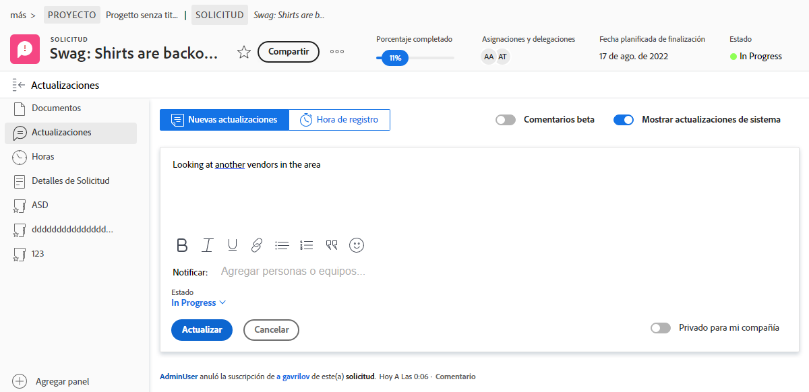
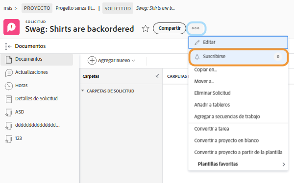
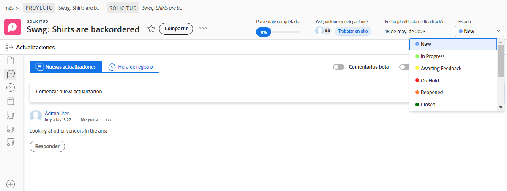
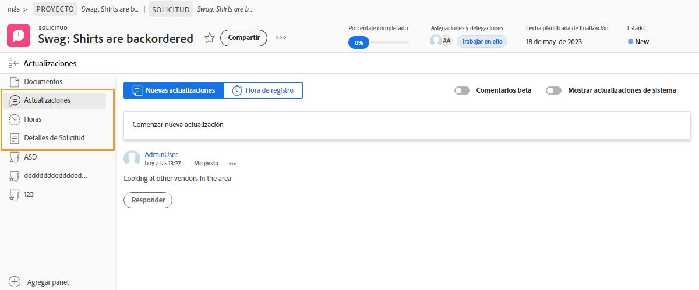

# Administrar asignaciones de problemas

## Asignación de un problema

Inicio de sesión en [!DNL Workfront] es el primer paso para resolver los problemas que surgen. El siguiente paso es asignar el problema a un usuario individual, varios usuarios o un equipo para que se pueda completar cualquier trabajo asociado y se resuelva el problema.

La asignación de un problema es igual que la asignación de una tarea: rellene el [!UICONTROL Asignaciones] campo . A continuación, el problema aparece en el informe del usuario asignado [!UICONTROL Lista de trabajo] en [!DNL Workfront] [!UICONTROL Página principal]. Si se asigna a un equipo, se muestra en la variable [!UICONTROL Solicitudes del equipo] de la sección [!UICONTROL Equipo] página.

Se puede acceder a todos los problemas relacionados con las tareas y al proyecto en sí desde la [!UICONTROL Problemas] en la página del proyecto. Esto permite a los administradores de proyectos, planificadores y otros una forma rápida de asignar problemas relacionados con el proyecto.

Existen varias formas de asignar problemas en [!DNL Workfront].

* Vaya a la [!UICONTROL Problema] del proyecto o la tarea. Haga clic en [!UICONTROL Asignaciones] para activar la edición en línea, introduzca el nombre del usuario, los usuarios o el equipo que deben completar el trabajo.
También puede utilizar la edición en línea cuando visualice problemas en un [!DNL Workfront] informe.

* Haga clic en el nombre del problema, ya sea en un informe o en el **[!UICONTROL Problemas]** del proyecto o la tarea. A continuación, haga clic en el **[!UICONTROL Asignaciones]** en el encabezado, en la parte superior derecha de la ventana. No olvide hacer clic en el **[!UICONTROL Guardar]** después de introducir un nombre de usuario o de equipo.

![Imagen de la opción de edición en línea al hacer clic en el [!UICONTROL Asignaciones] campo de un problema](assets/04-issue-assign-issue-list-assignments-field.png)

<!--
Learn more graphic and documentation article links
Assign issues
Edit user assignments for multiple issues
-->

## Recibir una asignación de problema

Encontrará problemas asignados a usted en la [!UICONTROL Lista de trabajo] en [!UICONTROL Página principal].

![Una imagen de una asignación de problemas en el [!UICONTROL Lista de trabajo] en [!UICONTROL Página principal]](assets/05-workfront-home-work-list.png)

Utilice la variable [!UICONTROL Filtro] para reducir la lista y ver solo los problemas, si lo desea.

![Una imagen del [!UICONTROL Filtro] en el [!UICONTROL Lista de trabajo] en [!UICONTROL Página principal]](assets/06-workfront-home-issue-filter.png)

Cuando se asigna un problema a un equipo, este aparece en la sección [!UICONTROL Solicitudes del equipo] de la sección [!UICONTROL Equipo] página. Un miembro del equipo puede hacer clic en el botón [!UICONTROL Trabajar En Él] para aceptar la asignación o un posible cliente del equipo puede hacer clic en el botón [!UICONTROL Reasignar] para dar la solicitud a una persona específica.

![Una imagen del [!UICONTROL Solicitudes del equipo] de la sección [!UICONTROL Equipo] página](assets/07-team-page-work-on-it.png)

Los problemas asignados al equipo también aparecen en la [!UICONTROL Programación] para obtener más información. Esto permite a los jefes de equipo y a otros usuarios ver en qué están trabajando los integrantes del equipo antes de asignar el trabajo. Arrastre y suelte la barra de problemas desde la [!UICONTROL No asignado] a un calendario de miembro del equipo para asignarlo.

![Una imagen de las asignaciones de equipo en la [!UICONTROL Programación] para obtener más información.](assets/08-issue-assignment-team-schedule.png)

Dependiendo de cómo tenga su organización [!DNL Workfront] también puede ver los problemas asignados a usted o a su equipo en un informe que forma parte de un tablero.

<!-- Learn more graphic and documentation article links

* Display items in the [!UICONTROL Work List] in the [!UICONTROL Home] area
* Manage work and team requests in the [!UICONTROL Home] area

-->

## Actualización del progreso en los problemas

Usted y los integrantes del equipo pueden publicar actualizaciones y registrar las horas en los problemas para dar visibilidad al trabajo que se está realizando y mantener a todos los implicados actualizados sobre el progreso del trabajo.

Porque hay varias formas de publicar actualizaciones en [!DNL Workfront], siga las instrucciones específicas de su equipo con respecto a la forma recomendada de trabajar con las configuraciones del sistema y los flujos de trabajo.

Se pueden publicar actualizaciones y horas en el problema desde [!UICONTROL Página principal]. Haga clic en **[!UICONTROL Nuevas actualizaciones]** para publicar un comentario.

![Imagen de publicación de una actualización en un problema desde [!UICONTROL Página principal].](assets/09-workfront-home-update.png)

Al comentar un problema, puede dirigir el mensaje a otros usuarios o equipos mediante la función @name, de forma muy parecida a como se hace en los medios sociales.

Haga clic en el **[!UICONTROL Tiempo de registro]** para registrar las horas trabajadas en el problema.

![Imagen de horas de registro en un problema de [!UICONTROL Página principal].](assets/10-workfront-home-log-hours.png)

O puede abrir el problema (haga clic en el nombre) y registrar su información allí.

## Suscripción a un problema

Cualquiera que tenga acceso al problema puede [!UICONTROL Suscribirse] , que les envía una notificación cada vez que se actualiza o comenta el problema. No recibe notificaciones cuando se registran horas, se realizan cambios de estado u otras ediciones.

La suscripción es una buena forma de que otros integrantes del equipo o administradores de proyectos rastreen el trabajo que les interesa pero no en el que trabajan activamente.

<!-- Learn more graphic and link to documentation article

* Update or edit a work item in the Home area

-->

## Actualizar el estado del problema

Además de publicar comentarios o registrar horas, no olvide cambiar el estado del problema para indicar que está trabajando en él. Y luego cambie de nuevo para indicar que el trabajo ha terminado.

Cambie el estado en el encabezado de [!UICONTROL Página principal] o cuando haya abierto la página del problema.

### Problemas no resueltos

Un problema se considera &quot;sin resolver&quot; cuando el estado no se ha actualizado para completarse o es equivalente.

Los problemas no resueltos impiden que la tarea con la que está asociado se marque como hecho, así como el estado del proyecto se establezca como completado.

<!-- Learn more graphic and documentation article link

* Mark a work item as done in the Home area

-->

## Funciones adicionales sobre problemas

La página del problema proporciona acceso a información y funciones adicionales que los integrantes del equipo y los jefes de proyecto pueden necesitar para registrar y administrar correctamente el problema para solucionarlo.

Además de [!UICONTROL Actualizaciones] y [!UICONTROL Horas], se puede acceder a otra información desde el menú del panel izquierdo después de abrir el problema.

* **[!UICONTROL Documentos]**: cargue y revise documentos relacionados con el problema.
* **[!UICONTROL Detalles del problema]**: cambie la información del problema, como la descripción, la prioridad, la gravedad y la fecha de finalización prevista.
* **[!UICONTROL Aprobaciones]**: configure un proceso de aprobación de un solo uso para el problema o aplique un proceso de aprobación global. También puede realizar un seguimiento del progreso de la aprobación en esta sección.

Busque las opciones para copiar, eliminar o compartir un problema en el menú de 3 puntos a la derecha del nombre del problema.

<!-- Learn more graphic and documentation article links

* Edit issues
* Copy issues
* Share an issue
* Move issues
* Grant access to an issue

-->
