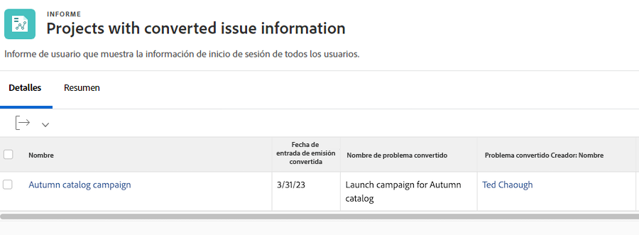

# Informe de problemas

Aprenda a centralizar problemas creando un informe.

## Centralización de problemas en un informe

Muchos administradores de tráfico y del proyecto crean un informe personalizado de [!UICONTROL Workfront] para centralizar todos los problemas que surjan. Esto facilita el seguimiento de las novedades y de las necesidades de atención.

A continuación, el informe se puede agregar a un panel, colocando todo lo necesario para realizar su trabajo en una ventana de [!UICONTROL Workfront].

![Una imagen de la columna [!UICONTROL Objeto de resolución] de un informe de problemas.](assets/18-resolving-object-report.png)

Para mostrar el nombre de la tarea o del proyecto al que se ha convertido el problema, incluya la columna “[!UICONTROL Objeto de resolución]” en la vista. Un “[!UICONTROL Objeto de resolución]” es la tarea o el proyecto que se crea al convertir un problema. Si no se ha convertido un problema, el campo [!UICONTROL Objeto de resolución] se deja en blanco. Este informe permite ver rápidamente qué problemas ya se han convertido para no tener duplicados. Simplemente, haga clic en el nombre del objeto de resolución para abrirlo y poder realizar un seguimiento del progreso en el trabajo realizado.

## Mostrar la información del problema original en los informes

Cuando un problema se convierte en un proyecto o tarea, se puede informar sobre muchos de los detalles originales del problema en los informes de proyectos o tareas. El problema original se conoce como el &quot;[!UICONTROL Problema convertido]&quot;.

Un informe de proyecto o tarea puede mostrar esta información mediante el objeto de [!UICONTROL Generador de problema convertido] junto con dos campos dedicados. Estas columnas se pueden agregar a una vista personalizada sin necesidad del modo de texto:

* [!UICONTROL Fecha de entrada de problema convertido]
* [!UICONTROL Nombre de problema convertido]
* [!UICONTROL Generador de problema convertido > Nombre]

>[!NOTE]
>
>Para obtener instrucciones sobre cómo crear una vista, consulte [Crear una vista básica](https://experienceleague.adobe.com/docs/workfront-learn/tutorials-workfront/reporting/basic-reporting/create-a-basic-view.html?lang=es).

