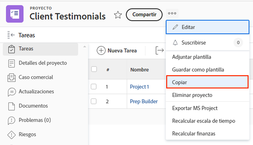
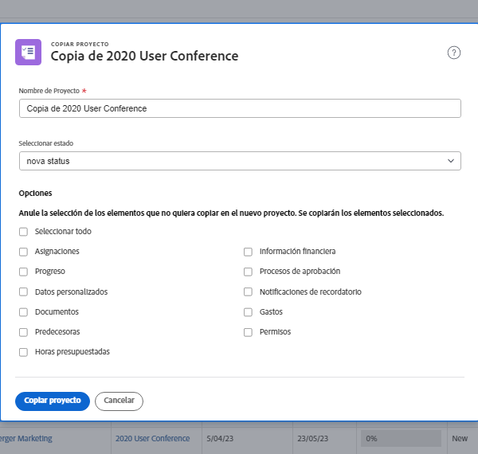

# Copiar un proyecto existente

A veces, en lugar de usar una plantilla para crear un proyecto, solo tiene que copiar un proyecto para otro uso único. Para ello, debe tener una licencia de Plan, con acceso a Editar y Crear a los proyectos.

Vaya al proyecto que desea copiar y haga clic en el menú de 3 puntos situado junto al nombre del proyecto. A continuación, seleccione Copiar.

La ventana Copiar proyecto permite cambiar el título y el estado, así como borrar una variedad de datos asociados con el proyecto: opciones como asignaciones, documentos y datos personalizados.

Si se selecciona Borrar asignaciones y/o se establece el estado en Planning, el proyecto copiado no envía notificaciones de asignación de tareas justo después de copiarlo.
