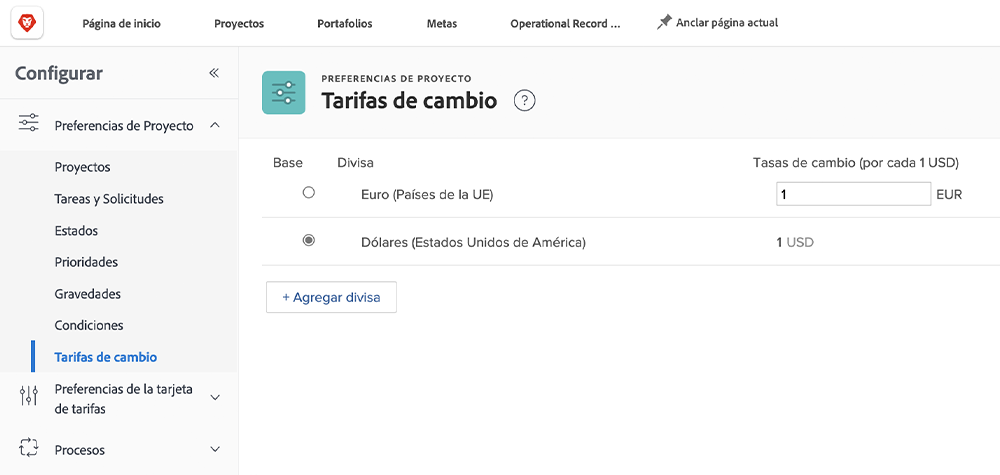
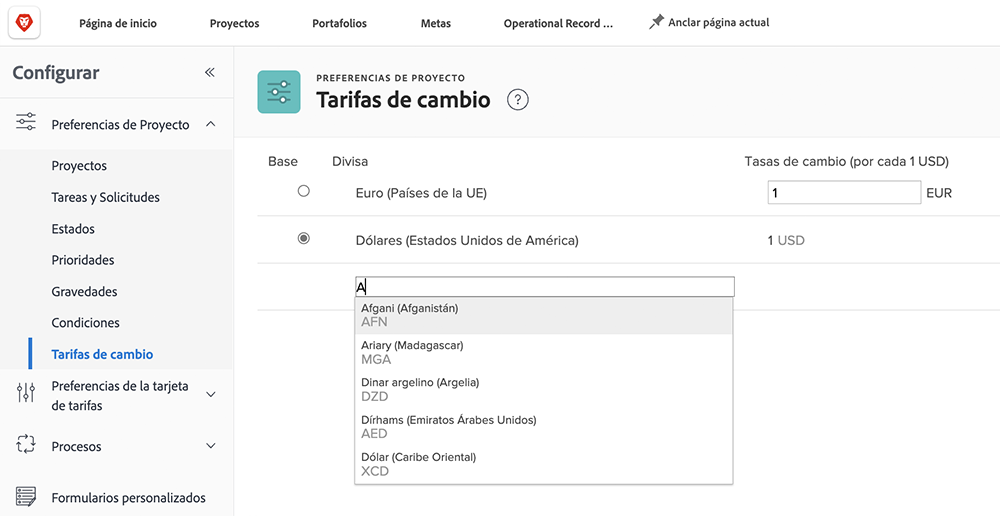

# Configuración de tipos de cambio

[!DNL Workfront] admite diferentes divisas para organizaciones de clientes que representan a empresas multinacionales. Los tipos de cambio pueden utilizarse en proyectos e informes para reflejar información financiera en distintas divisas de todo el mundo.

Los administradores del sistema gestionan los tipos de cambio. Se pueden configurar divisas adicionales según sea necesario para su organización.

La divisa base predeterminada de Workfront es el dólar estadounidense. Esta es la moneda en la que se calculará la información financiera de forma predeterminada. Este valor predeterminado se puede cambiar a nivel global y en proyectos individuales.

## Configuración de divisas y tipos de cambio

**Seleccione [!UICONTROL Configuración] en el menú principal.**

1. Expanda **[!UICONTROL Preferencias del proyecto]** en el panel de menú de la izquierda.
1. Haga clic en **[!UICONTROL Tipos de cambio]**.
1. Haga clic en el botón **[!UICONTROL Agregar divisa]**.
1. Seleccione la moneda del país en la lista desplegable.
1. Introduzca el tipo de cambio deseado para la divisa.
1. Si una moneda distinta al dólar estadounidense debe ser la [!DNL Workfront] moneda base del sistema (predeterminada), haga clic en el botón situado junto al nombre de la moneda.
1. Haga clic en **[!UICONTROL Guardar]** cuando se hayan agregado todas las divisas.

>[!NOTE]
>
>Workfront no actualiza ni sigue los valores de mercado actuales de los tipos de cambio. Las actualizaciones, si es necesario, deben realizarse manualmente.
