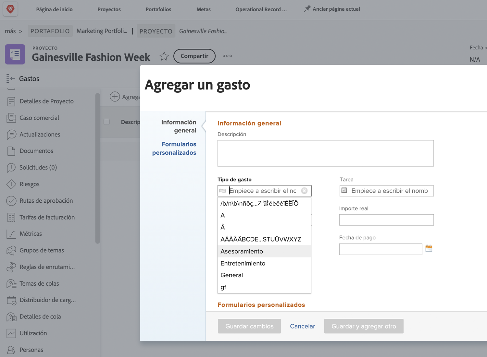

# Configurar tipos de gastos

Los gastos en [!DNL Workfront] representan costes no laborales asociados con proyectos y otros trabajos. Los gastos podrían ser, por ejemplo, gastos de viaje mientras se visita a un cliente o la compra de los suministros necesarios para completar una sesión fotográfica. Estos gastos deben registrarse dentro del proyecto para que los costes planificados y reales puedan calcularse y notificarse.

[!DNL Workfront] tiene tipos de gastos generados previamente que se pueden usar al introducir gastos. Los valores predeterminados no se pueden eliminar ni modificar, pero se pueden agregar otros nuevos.

* Publicidad
* Asesoramiento
* Entretenimiento
* General
* Materiales
* Impresión
* Envío
* Viaje

Un administrador del sistema puede añadir los tipos de gastos necesarios para su organización. Estos tipos de gastos adicionales se pueden modificar, ocultar o eliminar para que admita la creación de informes financieros necesarios en su organización.

Los administradores del proyecto, ejecutivos y otros pueden generar informes de gastos (agrupando los gastos individuales por tipo, si así lo desean) para tareas, proyectos, programas o portafolios dentro de [!DNL Workfront]. Las finanzas de los proyectos se vuelven mucho más manejables con los tipos de gastos.

## Creación de un tipo de gasto

**Seleccione [!UICONTROL Configuración] del menú principal**

1. Haga clic en **[!UICONTROL Tipos de gastos]** en el menú del panel izquierdo.
1. Haga clic en el botón **[!UICONTROL Nuevo tipo de gasto]**.
1. Asigne un nombre al tipo de gasto.
1. Añada una descripción si es necesario.
1. Haga clic en el botón **[!UICONTROL Guardar]**.

![Una imagen de la creación de un [!UICONTROL Tipo de gasto]](assets/setting-up-finances-6.png)

## Uso de tipos de gastos

Las opciones de gastos se muestran en el menú desplegable **[!UICONTROL Tipo de gasto]** cuando los usuarios crean un gasto en un proyecto o tarea en [!DNL Workfront].

