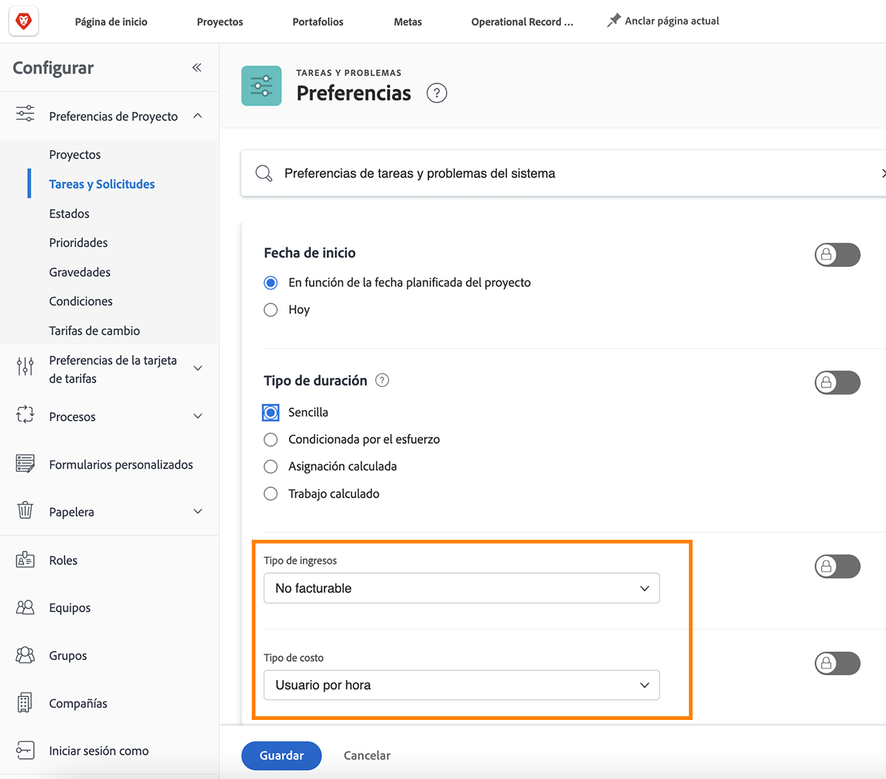

# Configurar valores predeterminados de ingresos y costos de tareas

El tipo de ingresos y el tipo de coste se utilizan para calcular la información financiera planificada y real de una tarea. La información predeterminada para cada uno de ellos se puede establecer en todo el sistema, por lo que se aplica a cada nueva tarea creada. La información se puede cambiar en proyectos individuales o establecer en plantillas de proyecto.

**Hay disponibles cinco tipos de ingresos predeterminados:**

* No facturable
* Usuario por hora
* Rol por hora
* Fijo por hora
* Ingresos fijos

**Y hay cuatro tipos de coste predeterminados disponibles:**

* Sin costo
* Fijo por hora
* Usuario por hora
* Rol por hora

>[!NOTE]
>
>Cuando los ingresos o los tipos de coste se establecen en No facturable o Sin coste, las estimaciones de ingresos y costes no se generan para la tarea. Por lo tanto, el trabajo en la tarea no contribuye a los ingresos ni a los costes en el nivel de proyecto.

## Establecer valores predeterminados de ingresos y costos

Seleccionar **[!UICONTROL Configurar]** en el menú principal.

1. Clic **[!UICONTROL Preferencias de proyecto]** en el menú del panel izquierdo.
1. Luego haga clic en **[!UICONTROL Tareas y problemas]**.
1. En el [!UICONTROL Nueva tarea predeterminada] , seleccione el que desee [!UICONTROL Tipo de ingresos] y [!UICONTROL Tipo de coste].
1. Haga clic en Guardar cuando termine.

