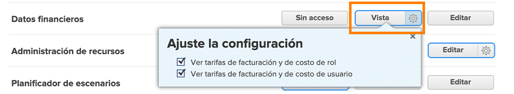
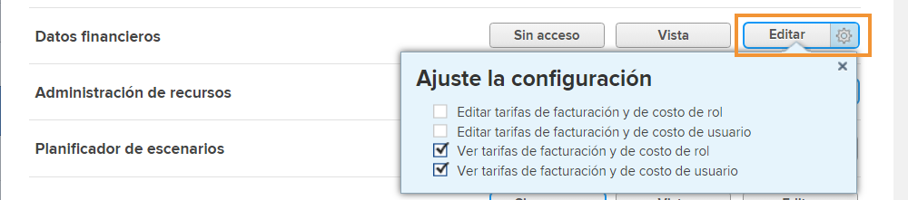

# Comprender el acceso financiero

Si su organización está capturando datos financieros con [!DNL Workfront], como administrador del sistema, es su responsabilidad proteger y administrar quién tiene acceso para ver y editar esa información.

Para que un usuario pueda ver o editar información financiera, es necesario realizar dos cosas:

1. Los derechos de acceso deben habilitarse en la variable [!UICONTROL Nivel de acceso].
2. El permiso para utilizar esos derechos de acceso debe concederse objeto por objeto.

Por ejemplo, se puede conceder a un usuario derechos para ver datos financieros en su nivel de acceso, pero solo puede ver datos financieros de una tarea que se comparte con él y la visualización financiera está habilitada para compartir esa tarea.

Por lo tanto, es posible para un usuario con [!UICONTROL Nivel de acceso] derechos para ver las finanzas para poder ver las finanzas de algunos objetos y no de otros, según las opciones de uso compartido de cada uno de ellos. Sin embargo, ningún usuario puede ver las finanzas de ningún objeto a menos que tenga el derecho asignado en su [!UICONTROL Nivel de acceso].

## [!UICONTROL Nivel de acceso] configuración

El acceso general a los datos financieros se concede en primer lugar mediante [!DNL Workfront] tipo de licencia.

**[!UICONTROL Plan] las licencias pueden:**

* Administrar registros de facturación
* Administrar y ver la facturación de funciones y las tasas de coste
* Administrar y ver la facturación y las tasas de coste de los usuarios
* Administrar gastos
* Ver y editar finanzas

**[!UICONTROL Trabajo] las licencias pueden:**

* Administrar gastos
* Ver finanzas

**[!UICONTROL Consulte] las licencias pueden:**

* Ver finanzas

**Los permisos los puede modificar el [!UICONTROL Nivel de acceso]. Las tres opciones para acceder a los datos financieros son:**

* [!UICONTROL Sin acceso] — El usuario no podrá ver información financiera.
* [!UICONTROL Ver] — El usuario puede revisar y compartir la información.
* [!UICONTROL Editar] — El usuario puede crear, editar, eliminar y compartir la información. (Solo disponible para una licencia de Plan).

Es importante tener en cuenta que la variable [!UICONTROL Ver] y [!UICONTROL Editar] las opciones tienen configuración adicional para un [!UICONTROL Plan] licencia. Haga clic en el engranaje en la [!UICONTROL Ver] para estas opciones:

**[!UICONTROL Vista]**

* Ver tarifas de facturación y de costo de rol
* Ver tarifas de facturación y de costo de usuario

**[!UICONTROL Editar]**

Estas dos opciones están disponibles en la sección [!UICONTROL Editar] junto con:

* Editar tarifas de facturación y de costo de rol
* Editar tarifas de facturación y de costo de usuario

>[!NOTE]
>
>Un usuario con acceso para añadir gastos también puede ver los gastos que agrega, así como los gastos añadidos por sus informes directos.
