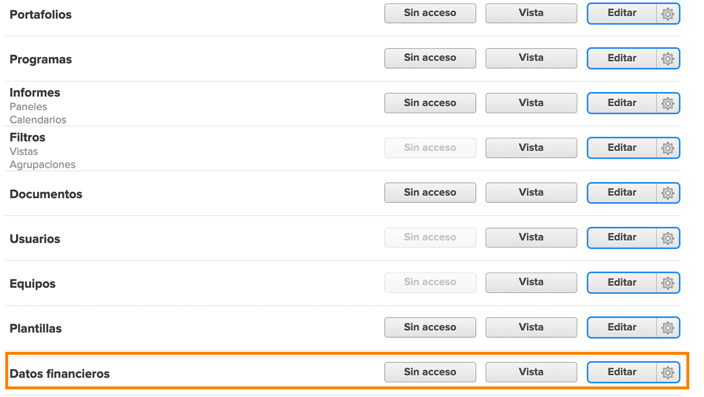

# Comprender el acceso financiero

Si su organización está capturando datos financieros con [!DNL Workfront], como administrador del sistema, es su responsabilidad proteger y administrar quién tiene acceso para ver y editar esa información.

Para que un usuario pueda ver o editar información financiera, es necesario realizar dos cosas:

1. Los derechos de acceso deben habilitarse en el [!UICONTROL Nivel de acceso].
2. El permiso para utilizar esos derechos de acceso debe concederse por objeto.

Por ejemplo, se puede conceder a un usuario derechos para ver datos financieros en su nivel de acceso, pero solo puede ver los datos financieros de una tarea que se le comparta y que la visualización financiera esté habilitada en la compartición de esa tarea.

Así, es posible que un usuario con [!UICONTROL Nivel de acceso] derechos para ver las finanzas pueda ver las finanzas de algunos objetos y no de otros, dependiendo de las opciones individuales de compartición de dichos objetos. Sin embargo, ningún usuario puede ver las finanzas de un objeto a menos que tenga el derecho asignado en su [!UICONTROL Nivel de acceso].

## Configuración de [!UICONTROL Nivel de acceso]

El acceso general a los datos financieros se concede en primer lugar mediante el tipo de licencia de [!DNL Workfront].

Las licencias de **[!UICONTROL Plan] pueden realizar lo siguiente:**

* Administrar registros de facturación
* Administrar y ver la facturación de funciones y las tasas de coste
* Administrar y ver la facturación y las tasas de coste de los usuarios
* Administrar gastos
* Ver y editar finanzas

Las licencias de **[!UICONTROL Trabajo] pueden realizar lo siguiente:**

* Administrar gastos
* Ver finanzas

Al **[!UICONTROL Consultar] licencias puede realizar lo siguiente:**

* Ver finanzas

**Los permisos los puede modificar el [!UICONTROL Nivel de acceso]. Las tres opciones para acceder a los datos financieros son los siguientes:**

* [!UICONTROL Sin acceso]: el usuario no podrá ver la información financiera.
* [!UICONTROL Ver]: el usuario puede revisar y compartir la información.
* [!UICONTROL Editar]: el usuario puede crear, editar, eliminar y compartir la información. (Solo está disponible para una licencia de Plan).

Es importante tener en cuenta que las opciones [!UICONTROL Ver] y [!UICONTROL Editar] tienen configuración adicional para una licencia de [!UICONTROL Plan]. Haga clic en el engranaje en el botón [!UICONTROL Ver] para estas opciones:

**[!UICONTROL Vista]**

* Ver tarifas de facturación y de coste de los roles
* Ver tarifas de facturación y de costes de usuario

**[!UICONTROL Editar]**

Estas dos opciones están disponibles en la opción [!UICONTROL Editar], junto con lo siguiente:

* Editar tarifas de facturación y de costes de roles
* Editar tarifas de facturación y de costes de usuario

>[!NOTE]
>
>Un usuario con acceso para añadir gastos también puede ver los gastos que agrega, así como los gastos añadidos en sus informes directos.
