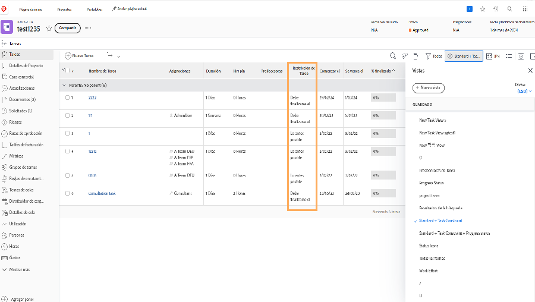

# Seguimiento del progreso desde la cronología del proyecto

Asegúrese de que las tareas progresan del modo adecuado para alcanzar los plazos del proyecto. A medida que explora el [!UICONTROL Tarea] lista, hay varias funciones en [!DNL  Workfront] que le ayudan a supervisar el progreso y el estado del trabajo.

## Porcentaje completado

El porcentaje completado de cada tarea se utiliza a veces para medir el progreso del trabajo. Es importante tener en cuenta... que este campo debe ajustarse manualmente, ya que es la estimación del usuario asignado de hasta dónde llegan.

![Lista de tareas de proyecto que muestra [!UICONTROL Porcentaje completado] columna](assets/planner-fund-task-percent-complete.png)

Hay dos ocasiones en que el porcentaje completado cambia automáticamente:

Cuando la tarea [!UICONTROL Estado] se establece en Completo, el porcentaje completado cambia a 100.
Si la tarea [!UICONTROL Estado] vuelve a Nuevo y el porcentaje completado se restablece en 0.

## Estado

Incluya el [!UICONTROL Estado] en una columna [!UICONTROL Ver] para ver rápidamente qué tareas se han iniciado, cuáles están en curso y cuáles se han completado. Incluso puede configurar un formato condicional en una [!UICONTROL Ver] para codificar con color cada estado, facilitando la descodificación de la información.

## Asignaciones de tareas

A medida que revise el proyecto, revise las asignaciones de tareas. Tal vez el trabajo se retrasó porque no se asignó a nadie a la tarea. O quizá la persona asignada no tenía las habilidades adecuadas para completar el trabajo. Agregar más personas a una tarea o reasignar tareas para asegurarse de que se realiza el trabajo.

## Restricción de tarea

A veces, las restricciones de tareas cambian y no se da cuenta. Las restricciones pueden afectar al comportamiento de la cronología, por lo que es posible que desee comprobar si están definidas como desea que lo estén.

Cree una vista personalizada que incluya [!UICONTROL Restricción de tarea] para ver esta información en la lista de tareas. Si planeó el proyecto desde una fecha de inicio, desea que las tareas tengan el [!UICONTROL Lo antes posible] ([!UICONTROL LAP]) restricción.
