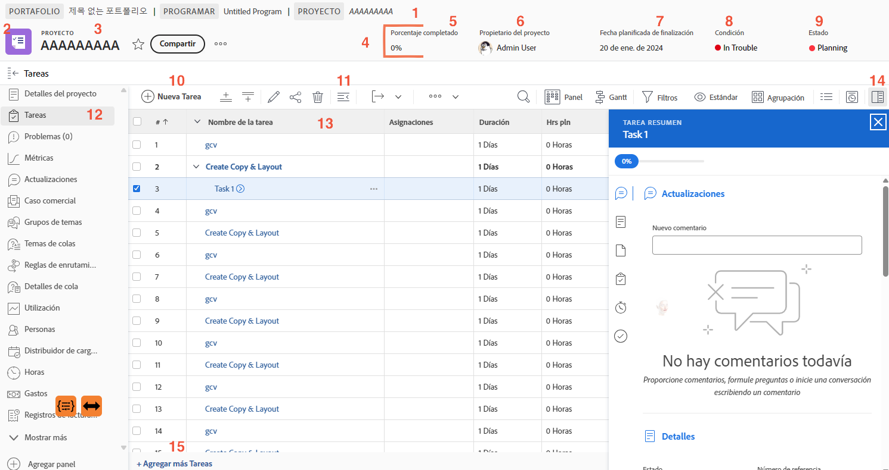

# Navegar por la página del proyecto

Este vídeo proporciona información general sobre cómo navegar y administrar la página del proyecto en Workfront. palo de golf Las características principales incluyen:

* **Encabezado del proyecto:** Muestra información esencial, como el porcentaje completado, el jefe de proyecto, la fecha planificada de finalización, la condición del proyecto y el estado. palo de golf El estado ayuda a rastrear las notificaciones de fase y déclencheur del proyecto. palo de golf
* **Navegación por ruta de exploración:** Muestra la ubicación del proyecto dentro del programa y el portafolio de la organización, con vínculos en los que se puede hacer clic para facilitar la navegación. palo de golf
* **Favoritos y menú:** El Inicio de favoritos marca el proyecto para obtener acceso rápido, mientras que el menú ofrece opciones como editar detalles, copiar el proyecto y recalcular las escalas de tiempo. palo de golf
* **Lista de tareas:** Representa pasos en el plan del proyecto. palo de golf Utilice filtros rápidos para localizar tareas, editar en línea para cambios rápidos y el panel de resumen de tareas para obtener información detallada. palo de golf Al hacer clic en el nombre de una tarea, se abre su página dedicada. palo de golf
* **Panel izquierdo:** Proporciona acceso a varias secciones del proyecto, como detalles, actualizaciones y documentos. palo de golf El administrador del sistema puede personalizar el panel. palo de golf
* **Sección de actualizaciones:** centraliza la comunicación sobre el proyecto, permitiendo etiquetar a los usuarios, responder a comentarios y ver actualizaciones resumidas de tareas, problemas y documentos. palo de golf
* **Sección de documentos:** Permite cargar y administrar archivos y pruebas relacionados con el proyecto. palo de golf Los documentos adjuntos a las tareas se acumulan en el nivel de proyecto para facilitar el acceso. palo de golf

>[!VIDEO](https://video.tv.adobe.com/v/335085/?quality=12&learn=on&enablevpops=1)

## Puntos clave

* **Información general sobre el encabezado del proyecto:** Acceda rápidamente a detalles clave del proyecto como porcentaje completado, jefe de proyecto, fecha de vencimiento, estado y condición. palo de golf El estado también controla las notificaciones y las fases del flujo de trabajo. palo de golf
* **Administración de tareas:** Use la lista de tareas para realizar un seguimiento de los pasos del proyecto, aplicar filtros rápidos para buscar tareas y realizar ediciones en línea. palo de golf Acceda a información detallada de las tareas a través del panel de resumen o de la página de tareas. palo de golf
* **Navegación de ruta de exploración:** Navegue por la jerarquía del proyecto dentro de la organización mediante vínculos en los que se puede hacer clic en la ruta de exploración. palo de golf
* **Actualizaciones centralizadas:** todas las actualizaciones de tareas, problemas y documentos se resumen en la sección de actualizaciones del proyecto, lo que simplifica la comunicación y el seguimiento. palo de golf
* **Organización del documento:** Cargue y administre archivos y pruebas relacionados con el proyecto en la sección de documentos, asegurándose de que los documentos relevantes se adjunten a las tareas para una colaboración optimizada. palo de golf

## Partes clave de la página del proyecto

[Haga clic aquí](/help/assets/key-parts-of-the-project-page.pdf) para descargar un PDF de esta página.

La página del proyecto está repleta de funciones que le ayudarán a administrar su trabajo. Póngase en contacto con el administrador del sistema si necesita una opción, pero no la ve en su instancia de [!DNL Workfront]. Estas son algunas de las funciones principales de la página del proyecto que deben tenerse en cuenta.

1. **Ruta de exploración:** navegue por la jerarquía de programas y portafolios detrás del proyecto.
2. **Tipo de objeto:** mostrar el tipo de objeto en la página de destino le ayuda a identificar lo que está viendo en [!DNL Workfront]. El término “proyecto” puede personalizarlo su administrador del sistema [!DNL Workfront].
3. **Nombre del proyecto:** nombre del proyecto que está viendo. Haga clic en el nombre para editarlo.
4. **Encabezado del proyecto:** información estándar disponible en todas las páginas del proyecto.
5. **[!UICONTROL Porcentaje completado]:** esto se actualiza automáticamente en función de las tareas completadas en el proyecto.
6. **[!UICONTROL Propietario del proyecto]:** en la mayoría de las organizaciones, este es el administrador del proyecto. Es la persona responsable de administrar el proyecto en [!DNL Workfront] y de garantizar que se complete.
7. **[!UICONTROL Fecha planificada de finalización]:** el administrador del proyecto fijará la fecha planificada de finalización en la cronología del proyecto.
8. **[!UICONTROL Condición]:** la [!UICONTROL Condición] es una representación visual del progreso del proyecto. [!DNL Workfront] puede configurar automáticamente la [!UICONTROL Condición] en función del estado de progreso de las tareas del proyecto. O la [!UICONTROL Condición] se puede configurar manualmente mediante los detalles del proyecto.
9. **[!UICONTROL Estado]:** el [!UICONTROL Estado] indica en qué parte del proceso se encuentra el proyecto. Si el proyecto aún está en fase de planificación, en curso o si se ha completado.
10. **[!UICONTROL Nueva tarea]:** haga clic para crear una nueva tarea en el proyecto. La tarea se genera en la parte inferior de la lista.
11. **[!UICONTROL Exportar]:** exporte la lista de tareas o tareas seleccionadas a un PDF, hoja de cálculo o archivo delimitado por tabuladores.
12. **Menú del panel izquierdo:** vaya a información diversa sobre el proyecto con el panel izquierdo. Haga clic en el icono de Tarea para contraer el panel si necesita un poco más de espacio en la pantalla. Arrastre y suelte los iconos para que el orden le ayude a trabajar de forma eficaz. Las opciones que ve las establece el administrador del sistema de [!DNL Workfront].
13. **Lista de tareas:** muestra todas las tareas que conforman el plan del proyecto. La información visible sobre cada tarea viene determinada por la vista seleccionada.
14. **Panel de resumen:** el panel de resumen proporciona un vistazo rápido a la información sobre la tarea seleccionada. Haga clic en el icono de panel de resumen para abrir o cerrar.
15. **Añadir más tareas** Haga clic aquí para añadir otra tarea al final de la lista de tareas mediante la edición en línea.

## Tutoriales recomendados sobre este tema

* [Información sobre la creación básica del proyecto](/help/manage-work/projects/understand-basic-project-creation.md)
* [Descubra cuatro formas para crear un proyecto](/help/manage-work/projects/understand-other-ways-to-create-projects.md)
* [Rellene los detalles del proyecto](/help/manage-work/projects/fill-in-the-project-details.md)

