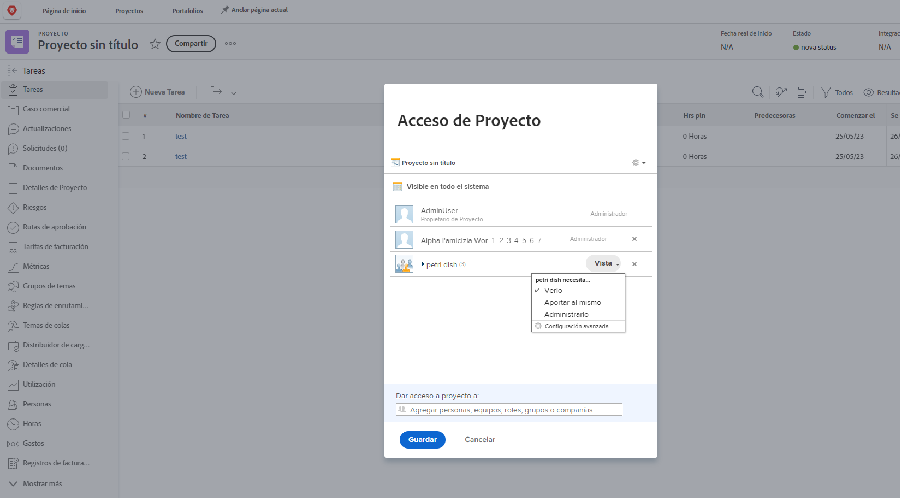

# Compartir un proyecto

Proporcionar visibilidad a las partes interesadas y a los colaboradores del proyecto es una parte importante de la gestión de un proyecto.

Asegúrese de que todos puedan ver la información que necesitan compartiendo el proyecto. En Workfront, esto se hace con la variable [!UICONTROL Compartir] . Puede hacerlo desde el proyecto individual, desde el [!UICONTROL Más] en el encabezado.

O puede compartir varios proyectos a la vez desde la lista de proyectos de la [!UICONTROL Proyectos] seleccionando los proyectos y haciendo clic en el botón [!UICONTROL Compartir] botón.

Al compartir el proyecto, todos los interesados pueden ver la información del proyecto cuando la necesitan.

<!---
Learn More Icon
Share permissions on objects
Share a project
--->
