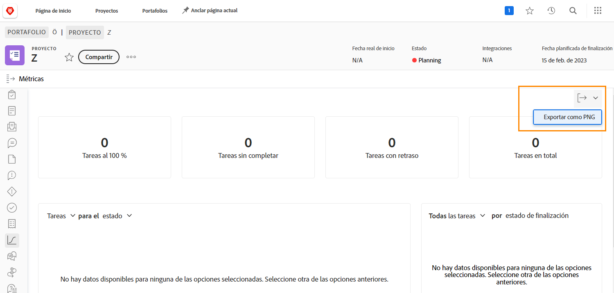

# Seguimiento del progreso del trabajo con métricas del proyecto

En este vídeo, aprenderá a:

* Acceso a los gráficos de métricas del proyecto
* Personalización de la información de los gráficos

>[!VIDEO](https://video.tv.adobe.com/v/336667/?quality=12)

Puede exportar todo el panel de métricas del proyecto como un archivo .png con la variable [!UICONTROL Exportar] botón. Esto facilita el uso compartido de los datos con otras personas a través de correos electrónicos o presentaciones.

<!---
Overview of project metrics
--->
