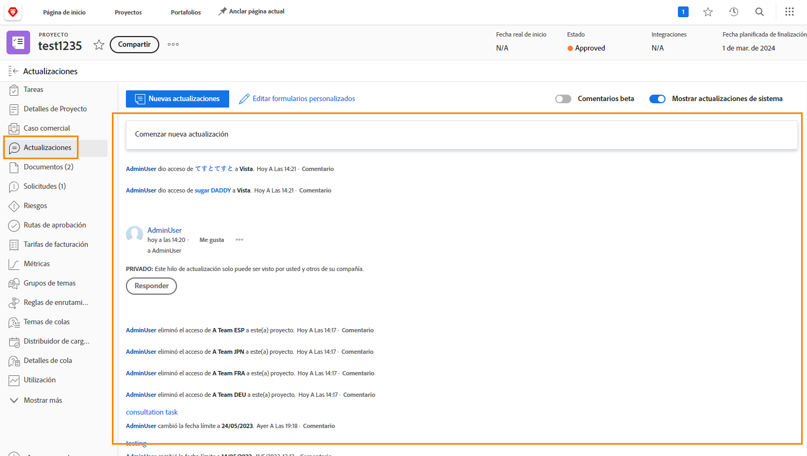

# Comprender la comunicación del proyecto

Como dice el dicho, el 90 por ciento de la gestión de un proyecto es comunicación. Comunicación con el equipo del proyecto, sus administradores y las partes interesadas del proyecto.

Pero cuando los equipos de proyectos utilizan el correo electrónico, los mensajes instantáneos, las reuniones y las notas adhesivas para la comunicación de proyectos, la información se dispersa... o peor, se olvida. Mantener la comunicación sobre el trabajo del proyecto en el propio proyecto [!DNL Workfront] usar actualizaciones.

Como los integrantes del equipo del proyecto están trabajando en asignaciones, pueden realizar actualizaciones desde [!DNL Workfront] [!UICONTROL Página principal] sobre las tareas asignadas a ellas.

Las actualizaciones de tareas, problemas y documentos se resumen en el nivel de proyecto [!UICONTROL Actualizaciones] , para que la información sea rápida y fácil de ver.

A continuación, puede responder a las actualizaciones haciendo clic en el botón . Esto mantiene toda la conversación en un solo lugar, lo que le permite volver a consultarla más tarde.

<!---
learn more urls
Communicate about work in Home
Subscribe to items in Workfront
Update work
--->
