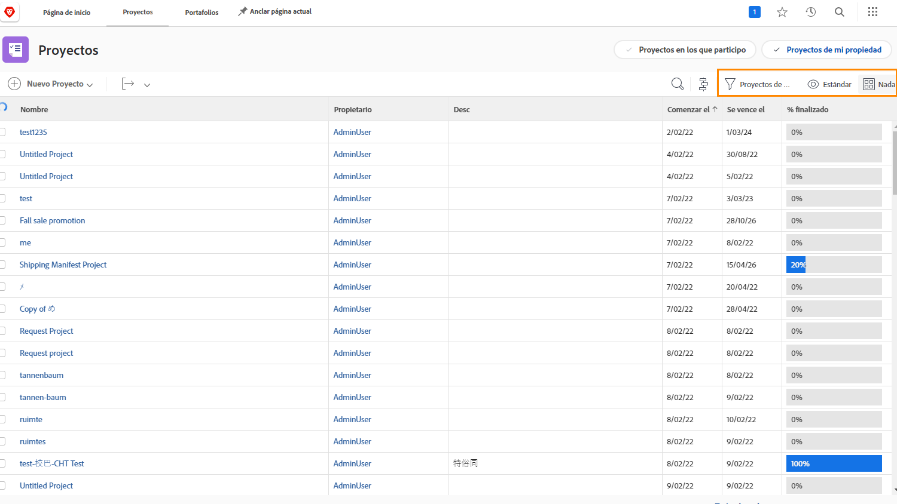
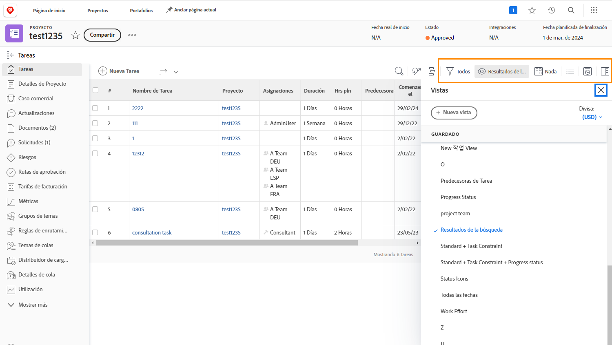

# Ver información del proyecto

Si está viendo la página principal de los [!UICONTROL Proyectos] o un proyecto individual, ajuste la lista para ver la información que necesita con [!UICONTROL Filtros], [!UICONTROL Vistas] y [!UICONTROL Agrupaciones].

Puede obtener una vista de alto nivel del progreso de todos sus proyectos en la página [!UICONTROL Proyectos].

Utilice los [!UICONTROL Filtros] para reducir la lista según ciertos criterios. A continuación, seleccione una [!UICONTROL Vista] para mostrar las columnas de información que son relevantes para sus proyectos. Finalmente, seleccione una [!UICONTROL Agrupación] para organizar los proyectos de una manera que tenga sentido para usted.

Cuando esté en la sección [!UICONTROL Tareas] de un proyecto, utilice [!UICONTROL Filtros], [!UICONTROL Vistas] y [!UICONTROL Agrupaciones] para supervisar el trabajo realizado. Como está mirando las tareas en lugar de los proyectos, tiene un conjunto de opciones totalmente diferente.

Muchos clientes de [!DNL Workfront] crean vistas personalizadas que exponen información de formulario personalizada y otros campos relevantes para el trabajo realizado.

## Obtenga información sobre cómo crear filtros, vistas y agrupaciones personalizados

[Crear un filtro básico](https://experienceleague.adobe.com/docs/workfront-learn/tutorials-workfront/reporting/basic-reporting/create-a-basic-filter.html?lang=es)

[Crear una vista básica](https://experienceleague.adobe.com/docs/workfront-learn/tutorials-workfront/reporting/basic-reporting/create-a-basic-view.html?lang=es)

[Crear una agrupación básica](https://experienceleague.adobe.com/docs/workfront-learn/tutorials-workfront/reporting/basic-reporting/create-a-basic-grouping.html?lang=es)
