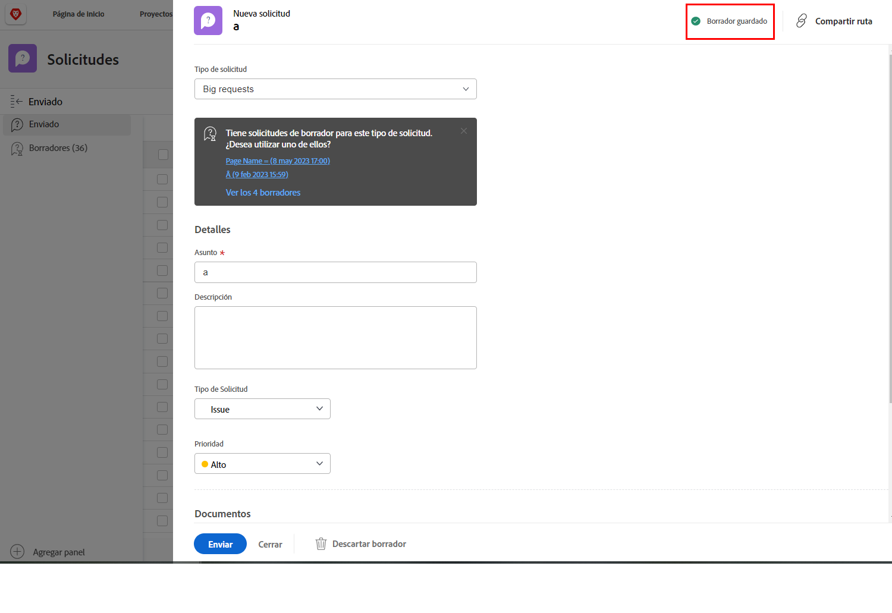

# Explicación de las colas de solicitud

En este vídeo, aprenderá:

* Cómo enviar una solicitud a través de un [!DNL  Workfront] cola de solicitud
* Cómo se estructuran las colas de solicitud

>[!VIDEO](https://video.tv.adobe.com/v/335220/?quality=12&learn=on)

## Solicitar borradores guardar automáticamente

Cuando se empieza a rellenar un formulario de solicitud, [!DNL Workfront] guarda un borrador automáticamente después de rellenar el [!UICONTROL Asunto] campo . Esto significa que no perderá datos si necesita alejarse del [!UICONTROL Solicitudes] para hacer otra cosa o si necesita pausarse en medio de la solicitud para recopilar más información.

Verá una indicación de que el borrador se ha guardado en la parte superior de la ventana. [!DNL Workfront] guardará un borrador de la solicitud, incluso si los campos obligatorios aún no se han rellenado.

Cuando esté listo para enviar la solicitud, localícela en la sección [!UICONTROL Borradores] pestaña . Haga clic en el nombre para abrirlo y terminar de rellenar el formulario. A continuación, haga clic en [!UICONTROL Enviar solicitud] cuando haya terminado.

## Su turno

Tomemos un minuto para revisar la información que acaba de presentar.

**Pregunta:** ¿Cómo se realiza una solicitud en Workfront? Enumere los pasos en orden.

* Elija el tipo de solicitud que debe realizar
* Haga clic en Enviar solicitud
* Rellene la información del formulario
* Haga clic en &quot;Nueva solicitud&quot;
* Navegar al área de solicitud

**Respuesta:** Vaya al área de solicitud > Haga clic en Nueva solicitud > Elija el tipo de solicitud que debe realizar > Rellene la información del formulario > Haga clic en Enviar solicitud

**Pregunta:** Una solicitud es realmente un ...

**Respuesta:** Problema

<!---
You can also access request drafts from the [!UICONTROL Select a Request Type] menu at the top of the window. Select an option from the [!UICONTROL Recent Drafts] section, or start a new request by picking a queue from the [!UICONTROL New Requests] section. Fill everything out like normal, then submit the request.

<!---
image
--->

<!---
Let's take a minute to review the information you were just presented.

How do you make a request in Workfront? List the steps in order.
Choose the request type you need to make
Click Submit request
Fill out the information on the form
Click "New Request"
Navigate to the request area

Answer: Navigate to the request area>Click New Request>Choose the request type you need to make>Fill out the information on the form>Click Submit request

A request is really an......

Answer: Issue
--->
