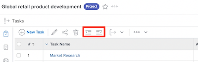
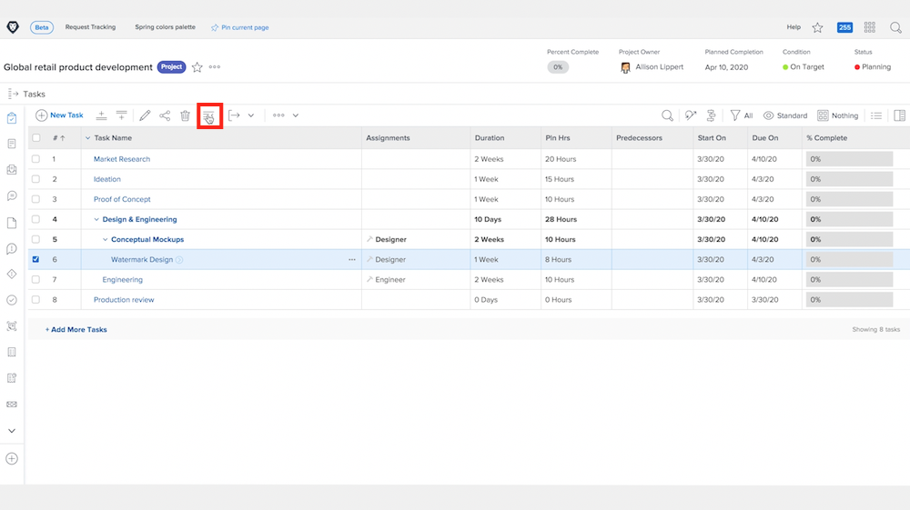

# Comprender las tareas principales y secundarias

Este vídeo contiene información sobre:

* Cómo se estructuran las tareas en un proyecto de [!DNL Workfront]

>[!VIDEO](https://video.tv.adobe.com/v/335087/?quality=12&learn=on)

## Cambiar una tarea a una subtarea y volver

El **sangría** y **anular sangría** Los botones se utilizan para cambiar una tarea a una subtarea o de una subtarea a una no subtarea.

Seleccione &quot;[!UICONTROL Diseño de filigrana]&quot; y haga clic en **sangría** botón. &quot;[!UICONTROL Diseño de filigrana]&quot; se convertirá en una subtarea en &quot;[!UICONTROL Mockups conceptuales]&quot;, que se convertirá en una tarea principal.

Seleccione &quot;[!UICONTROL Diseño de filigrana]&quot; cuando sea una subtarea y haga clic en **anular sangría** botón. &quot;[!UICONTROL Diseño de filigrana]&quot; se convertirá en una tarea normal en el mismo nivel que &quot;[!UICONTROL Mockups conceptuales]&quot;.

