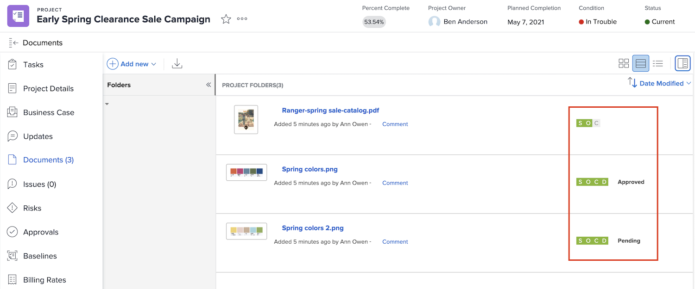

# Cargar recursos

Antes de cerrar un proyecto de [!DNL Workfront], compruebe que todos los archivos relevantes se encuentran adjuntos en la sección [!UICONTROL Documentos]. Cargue estos archivos como documento o prueba, según las directrices de su organización.

Es posible que deba cargar el documento o la prueba como una versión de un archivo existente.

Si su organización usa aprobaciones de pruebas, asegúrese de que todas ellas se completan con un rápido vistazo a los iconos de progreso.

Y, si su organización emplea aprobaciones de documentos, seleccione cada elemento de la lista y consulte los detalles para ver si las aprobaciones han finalizado.

<!---
learn more urls
Create proofs
Add new documents to Workfront
--->
