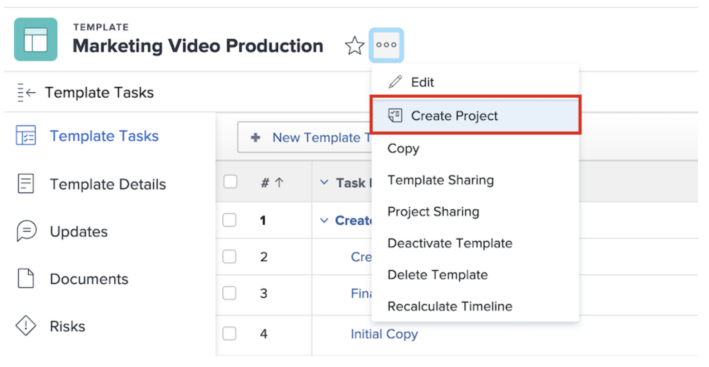

# Creación de un proyecto directamente a partir de una plantilla

Si está trabajando en una plantilla y necesita crear un proyecto utilizándola, haga clic en el menú de 3 puntos situado junto al nombre de la plantilla. A continuación, seleccione Crear proyecto.

La ventana de detalles permite realizar cambios en la configuración del nuevo proyecto.

>[!NOTE]
>
>Para crear un proyecto con este método, debe acceder al área Plantillas de Workfront. Si no puede acceder a las plantillas, puede seguir utilizando una plantilla para crear un proyecto desde el área Proyectos o al convertir un problema o una tarea.

>[!TIP]
>
>Si hay una plantilla que use con frecuencia, guárdela como favorita. Verá la plantilla en el menú Nuevo proyecto, y además aparecerá en el menú Favoritos de la barra de navegación.

## Tutoriales recomendados sobre este tema

* [Crear una plantilla de proyecto y obtener más información acerca de los Modelos](/help/manage-work/create-and-manage-project-templates/create-a-project-template.md)
* [Compartir una plantilla de proyecto](/help/manage-work/create-and-manage-project-templates/share-a-project-template.md)
* [Copiar un proyecto existente](/help/manage-work/manage-projects/copy-an-existing-project.md)
* [Desactivar una plantilla de proyecto](/help/manage-work/create-and-manage-project-templates/deactivate-a-project-template.md)
* [Editar el equipo del proyecto en una plantilla de proyecto](/help/manage-work/create-and-manage-project-templates/edit-the-project-team-in-a-project-template.md)

