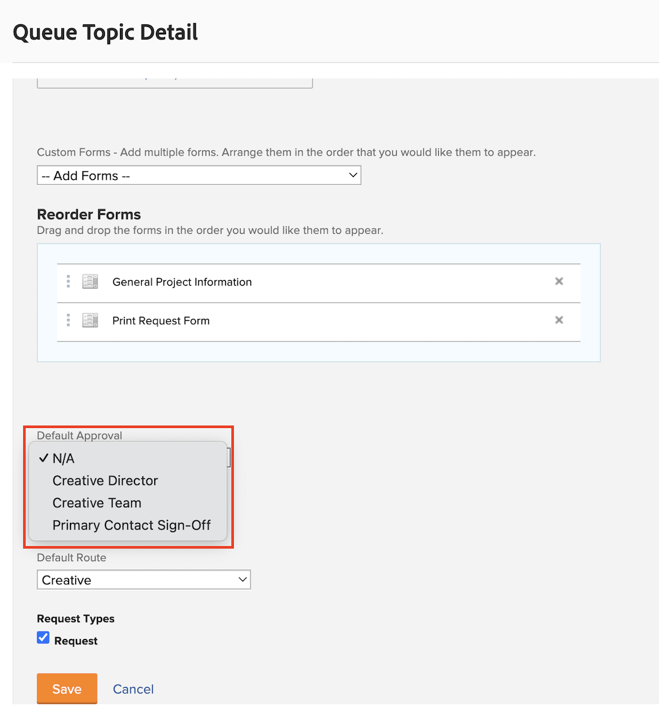

# Crear un proceso de aprobación global y de un solo uso

Los procesos de aprobación de proyectos, tareas y problemas permiten al administrador de proyectos obtener la confirmación por parte de los expertos de que el trabajo se ha realizado justo antes de continuar. El administrador del proyecto puede crear un proceso de aprobación para cada situación (lo que se conoce como proceso de aprobación de un solo uso) o elegir de una lista de, posiblemente, muchos procesos de aprobación que se hayan creado previamente para satisfacer necesidades comunes (se conocen como procesos de aprobación globales).

En cualquier caso, cuando el estado del objeto cambia a uno especificado en el proceso de aprobación, se notifica al aprobador de varias formas para que revise el trabajo y lo apruebe o rechace. Dado que todo el proyecto puede estar en pausa a la espera de una aprobación, los aprobadores deben saber de antemano que se les puede pedir una aprobación. Si un aprobador se encuentra fuera de la oficina por cualquier motivo, puede delegar sus aprobaciones a un sustituto cualificado. Consulte [Delegar tareas, problemas y aprobaciones](/help/manage-work/approval-processes-and-milestone-paths/delegate-approvals.md) para obtener más información.

En este vídeo, aprenderá a crear un proceso de aprobación global y un proceso de aprobación de un solo uso en un proyecto, tarea o problema.

>[!VIDEO](https://video.tv.adobe.com/v/335225/?quality=12&learn=on&enablevpops)

>[!TIP]
>
>Puede añadir un proceso de aprobación de un solo uso a una plantilla de proyecto.

>[!NOTE]
>
>Puede configurar una aprobación de un solo uso en proyectos y problemas del mismo modo que se describe para las tareas en el vídeo.

## Cómo aplicar aprobaciones automáticas de problemas en una cola de solicitudes

Si quiere configurar aprobaciones automáticas de problemas en una cola de solicitudes, estas solo pueden realizarse mediante un proceso de aprobación global de problemas y aplicarse en un [!UICONTROL tema de la cola].

Al crear o editar un [!UICONTROL tema de la cola], seleccione el proceso de aprobación global en el campo **[!UICONTROL Aprobación predeterminada]**.

Es posible que necesite editar el proceso de aprobación del problema para asegurarse de que el **[!UICONTROL Estado anterior]** no corresponde al del problema establecido cuando se rechaza la aprobación. Esto se debe a que el estado anterior es **[!UICONTROL Nuevo]** y este también es el estado que acciona el proceso de aprobación, por lo que es el estado que se establecerá cuando se apruebe. Para evitar confusiones cuando se rechaza la aprobación del problema, es mejor establecer un estado como **[!UICONTROL No se puede resolver]** o un estado personalizado creado para este fin.

## Tutoriales recomendados sobre este tema

* [Delegar tareas, problemas y aprobaciones](/help/manage-work/approval-processes-and-milestone-paths/delegate-approvals.md)
* [Explicación de los procesos de aprobación específicos del grupo](/help/administration-and-setup/approval-processes-and-milestone-paths/group-specific-approval-processes.md)
* [Crear un flujo de solicitud](/help/manage-work/request-queues/create-a-request-flow.md)

