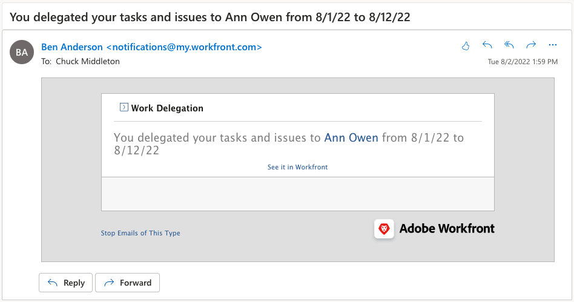

# Delegar tareas, problemas y aprobaciones

Obtenga información sobre cómo delegar aprobaciones para proyectos, tareas, problemas y tarjetas de horas trabajadas a otro usuario de Workfront. Aprenda también a delegar tareas y asignaciones de problemas.

## Delegar aprobaciones

Obtenga información sobre cómo delegar aprobaciones para proyectos, tareas, problemas y tarjetas de horas trabajadas a otro usuario.

Este vídeo contiene información sobre:

* Asignación de aprobaciones a otra persona
* Finalización del período de delegación
* Búsqueda de aprobaciones delegadas

>[!VIDEO](https://video.tv.adobe.com/v/336094/?quality=12&learn=on)

<!---
learn more URLS
Delegate approval request
--->

## Delegación de tareas y asignaciones de problemas

Puede delegar las tareas y los problemas asignados a otros usuarios cuando tenga pensado estar fuera de la oficina.

### Cómo habilitar la delegación de tareas y asignaciones de problemas

Para poder utilizarlo, un administrador de grupo o del sistema debe habilitar la delegación de tareas y problemas. Esto se hace en [!UICONTROL Configuración > Preferencias del proyecto > Tareas y problemas > Delegación]. Habilitar esto permitirá a todos los usuarios con una licencia de revisión o superior delegar sus tareas y problemas asignados.

![Captura de pantalla que muestra la [!UICONTROL Configuración] de preferencias de delegación](assets/delegation-1.png)

### Cómo delegar tareas y asignaciones de problemas

Vaya a [!UICONTROL Página principal] y haga clic en [!UICONTROL Delegar] y, a continuación, especifique el usuario al que delega todas las tareas asignadas y el intervalo de fechas. Puede designar cualquier usuario con una licencia de revisión o superior.

![Captura de pantalla que muestra la pestaña delegación en la [!UICONTROL Página principal]](assets/delegation-2.png)

### Cómo saber si se ha delegado una tarea o un problema

Puede ver cuándo se han delegado tareas o problemas en la [!UICONTROL Página principal] o en la vista de problemas o tareas.

![Captura de pantalla que muestra la asignación de tareas delegadas en el [!UICONTROL Inicio]](assets/delegation-4.png)

### Notificaciones por correo electrónico que se aplican al trabajo delegado

El administrador del grupo o del sistema puede habilitar las notificaciones por correo electrónico que le informarán cuando haya delegado sus tareas y problemas y cuando las tareas y los problemas de alguien se hayan delegado a usted.

![Captura de pantalla que muestra las opciones de [!UICONTROL Configuración] de notificación por correo electrónico para la delegación](assets/delegation-5.png)

