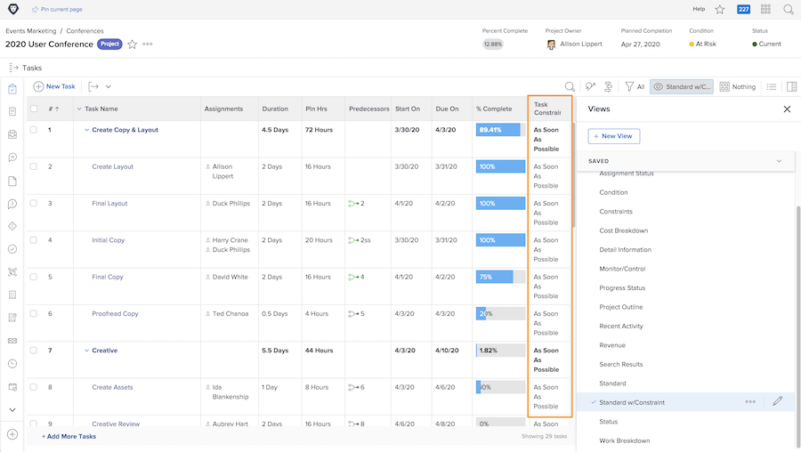

# Seguimiento del progreso desde la cronología del proyecto

Asegúrese de que las tareas avancen de la forma en que deberían para lograr los plazos de los proyectos. A medida que explora la lista de [!UICONTROL Tareas], hay varias funciones en [!DNL  Workfront] que le ayudan a controlar el progreso y el estado del trabajo.

## Porcentaje completado

El porcentaje completado de cada tarea a veces se utiliza para medir cómo progresa el trabajo. Es importante tener en cuenta que este campo tiene que ajustarse manualmente, ya que es la estimación que hace la persona asignada de cuánto ha avanzado.

>[!TIP]
>
>Aunque el porcentaje completado de las tareas de trabajo debe actualizarse manualmente, Workfront calcula el porcentaje completado de una tarea principal basándose en el porcentaje completado y en la duración o las horas planificadas de cada tarea secundaria. Esto significa que obtendrá un porcentaje completado más preciso si divide las tareas grandes en subtareas más pequeñas.

![La lista de tareas del proyecto muestra la columna de [!UICONTROL Porcentaje completado] ](assets/planner-fund-task-percent-complete.png)

Hay tres ocasiones en las que el porcentaje completado cambia automáticamente:

* Cuando el [!UICONTROL estado] de la tarea se establece en Completo, el porcentaje completado cambia a 100.
* Si el [!UICONTROL estado] de la tarea vuelve a ser Nuevo, el porcentaje completado se restablece a 0.
* En una tarea principal, cuando cambia el porcentaje completado de una tarea secundaria.

## Estado

Incluya la variable [!UICONTROL estado] en una columna [!UICONTROL Ver] para ver rápidamente qué tareas se han iniciado, cuáles están en curso y cuáles se han completado. Incluso puede configurar el formato condicional en una [!UICONTROL Vista] para colorear el código de cada estado, lo que facilita el entendimiento de la información.

## Asignaciones de tareas

Al revisar el proyecto, revise las asignaciones de las tareas. Tal vez el trabajo se retrasó porque a nadie se le asignó la tarea. O tal vez la persona asignada no tenía las habilidades adecuadas para completar el trabajo. Añada más personas a la tarea o reasígnela para asegurarse de que se realice el trabajo.

## Restricción de tarea

A veces las restricciones de las tareas cambian y no se da cuenta. Las restricciones pueden afectar al comportamiento de la cronología, por lo que debe asegurarse de que están establecidas como desee.

Cree una vista personalizada que incluya la columna [!UICONTROL Restricción de tareas] para ver esta información en la lista de tareas. Si planificó el proyecto con una fecha de inicio, querrá que sus tareas tengan la restricción [!UICONTROL Lo antes posible] ([!UICONTROL ASAP]).

Para obtener más información sobre las restricciones de tareas, consulte [Explicación y administración de los tipos de duración y las restricciones de tareas](https://experienceleague.adobe.com/docs/workfront-learn/tutorials-workfront/manage-work/intermediate-projects/understand-and-manage-duration-types-and-task-constraints.html?lang=es).
