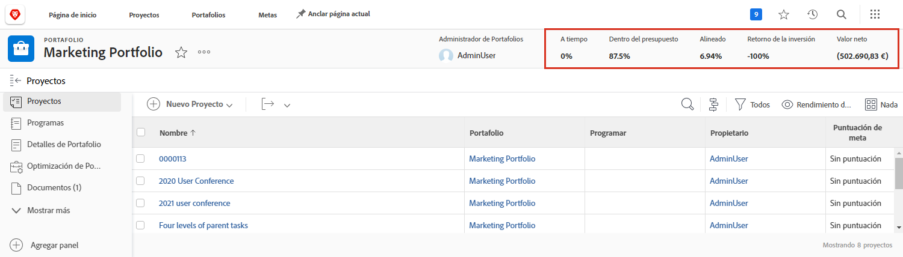
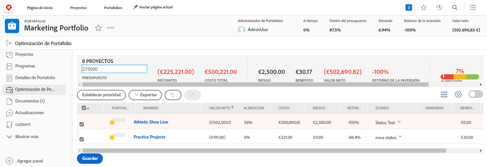

# Descripción general de portafolios

Los administradores suelen tener la difícil tarea de averiguar qué proyectos ayudarían a su empresa a alcanzar sus metas y objetivos. Esto significa juzgar un proyecto actual o potencial basándose en criterios que son importantes para esos objetivos. Estos criterios pueden incluir elementos como la cantidad de recursos necesarios, cuánto dinero costará el proyecto en comparación con lo que aportará y conocer los riesgos que conlleva. Con esta información, cada gerente puede decidir qué proyectos se deben realizar y cuándo.

Pensar y planificar proyectos no es una tarea demasiado difícil; es un proceso al que se han habituado la mayoría de gerentes. La verdadera lucha viene con la comparación de proyectos entre sí. Revisar una lista larga y detallada de proyectos lleva mucho tiempo. Ahí es donde los portafolios de Workfront pueden ayudar.

## ¿Qué es un portafolio?

Un portafolio es una colección de proyectos que se completan para los mismos recursos, presupuesto, programación y prioridad. Por ejemplo, una agencia de marketing puede usar un portafolio para agrupar todos los proyectos para un cliente en particular.

Vaya a la sección **[!UICONTROL Portafolios]** en el [!UICONTROL Menú principal] y, a continuación, haga clic en un nombre de portafolio para abrirlo.

Puede usar la variable **[!UICONTROL Nuevo proyecto]** para añadir fácilmente un proyecto existente al portafolio. O puede crear un nuevo proyecto directamente en el portafolio.

![Imagen del menú desplegable del botón [!UICONTROL Nuevo proyecto]](assets/01-portfolio-management3.png)

Una vez que los proyectos se han añadido al portafolio, puede utilizar la información de resumen del encabezado de página para obtener una vista de alto nivel de cómo esta recopilación de proyectos contribuye, ya sea positiva o negativamente, a las metas generales del portafolio.

Puede utilizar la herramienta de optimización de portafolios (también conocida como [!UICONTROL Optimizador de portafolios]) para priorizar proyectos en función del valor neto, la alineación, el coste, el riesgo y el retorno de la inversión.

## Acceso a los portafolios

Para trabajar con portafolios, debe tener asignada una licencia de Plan en Workfront y un nivel de acceso que le proporcione permisos para trabajar con los portafolios.

Cuando se crea un portafolio, solo el creador o administrador del portafolio tiene acceso a él. Puede permitir que otras personas accedan al portafolio compartiéndolo. Esto también proporciona acceso a todos los programas y proyectos del portafolio.

Abra el portafolio, haga clic en el menú de tres puntos y, a continuación, seleccione **[!UICONTROL Uso compartido]**. Añada las personas, los equipos, las funciones de trabajo, los grupos o las empresas a las que debe tener acceso. A continuación, determine qué tipo de acceso debe tener cada uno: administrar o visualizar.

![Imagen del [!UICONTROL Uso compartido] en un [!DNL Workfront] portafolio](assets/04-portfolio-management11.png)

<!--
Pro-tips graphic
If a user can't access a specific portfolio, make sure it's shared with them. The Workfront access level determines that a user can access portfolios in general, but sharing makes sure they can see specific portfolios. 
-->

<!--
Learn more graphic and links to documentation articles
* Portfolio overview   
* Create a portfolio 
* Create and manage portfolios 
* Navigate within a portfolio 
* Share a portfolio   
-->
