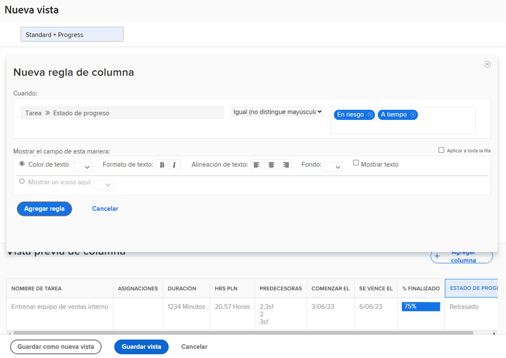

# Añadir un formato condicional básico a una vista

En este vídeo, aprenderá:

* ¿Qué formato condicional hay en una vista?
* Cómo crear y modificar el formato condicional

>[!VIDEO](https://video.tv.adobe.com/v/335149/?quality=12)

## Actividad: Añadir formato condicional a una vista

Cree una vista de tarea denominada &quot;Estándar + Progreso&quot; utilizando la vista Estándar existente y añadiendo este formato condicional en la [!UICONTROL Nombre] para abrir el Navegador.

1. Añada una regla de columna que ponga el campo en segundo plano en rojo cuando el estado de progreso de la tarea sea Late.
1. Agregue una regla de columna que haga que el fondo del campo aparezca de color amarillo cuando el estado del progreso sea Detrás o En riesgo.

Esto le ayudará a identificar las tareas con problemas sin incluir la columna para el estado de progreso como parte de la vista.

## Respuesta

1. En un informe de lista de tareas, vaya a la **[!UICONTROL Ver]** menú desplegable y seleccione **[!UICONTROL Nueva vista]**.
1. Asigne un nombre a la vista &quot;Estándar + Progreso&quot;.
1. Utilice las columnas predeterminadas proporcionadas.
1. Seleccione el [!UICONTROL Nombre de la tarea] para abrir el Navegador. Esta es la columna a la que desea aplicar el formato condicional, por lo que aparece en rojo o amarillo si el estado de progreso de la tarea no es Tiempo activo.
1. Haga clic en **[!UICONTROL Opciones avanzadas]** en la esquina superior derecha de la ventana del Creador de informes.
1. Haga clic en **[!UICONTROL Agregar una regla para esta columna]**.
1. Inicie la regla de columna cambiando [!UICONTROL Tarea] > [!UICONTROL Nombre] en la parte superior de la ventana para [!UICONTROL Tarea] > [!UICONTROL Estado de progreso]. Haga clic en el botón **[!UICONTROL X]** junto a [!UICONTROL Tarea] > [!UICONTROL Nombre] para eliminarlo del campo .
1. Escriba &quot;progress&quot; en el campo y, a continuación, seleccione [!UICONTROL Estado de progreso] en el [!UICONTROL Tarea] fuente del campo.
1. Select **[!UICONTROL Late]** en el campo a la derecha del [!UICONTROL Igual] calificador.
1. Elija un fondo de rojo en la variable [!UICONTROL Color del texto] fila.
1. Haga clic en **[!UICONTROL Agregar regla]** para guardar la regla de columna.
1. Ahora haga clic en **[!UICONTROL Agregar regla de columna]** para agregar otra regla.
1. Igual que antes, elimine [!UICONTROL Tarea] > [!UICONTROL Nombre] del campo criterios . Sustitúyalo por [!UICONTROL Estado de progreso] en el [!UICONTROL Tarea] fuente del campo.
1. Seleccione ambas [!UICONTROL En riesgo] y [!UICONTROL Detrás] en el campo a la derecha del calificador Equal .
1. Elija un fondo amarillo en la variable [!UICONTROL Color del texto] fila.
1. Haga clic en **[!UICONTROL Agregar regla]** para guardar la regla de columna.
1. Haga clic en **[!UICONTROL Guardar vista]** para guardar la vista.
