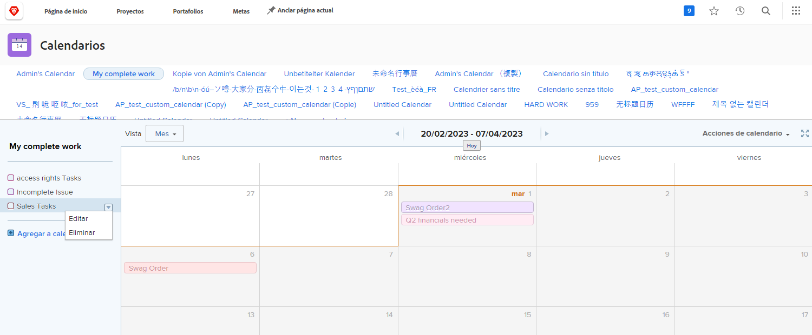

# Comprender las opciones de calendario adicionales

En esta sección aprenderá a:

* Editar una agrupación de calendario
* Eliminar una agrupación de calendario
* Compartir un calendario

## Editar una agrupación de calendario

Para editar una agrupación, pase el ratón sobre el nombre en el calendario. Haga clic en la flecha hacia abajo que aparece a la derecha y seleccione **[!UICONTROL Editar]**.

## Eliminar una agrupación de calendario

Para eliminar una agrupación, pase el ratón sobre el nombre en el calendario. Haga clic en la flecha hacia abajo que aparece a la derecha y seleccione **[!UICONTROL Eliminar]**.

## Uso compartido de un calendario

Como administrador de proyectos, puede crear un calendario que desee compartir con otros, como jefes de proyecto, integrantes del equipo, etc.

1. En el **[!UICONTROL Menú principal]**, seleccione un **[!UICONTROL Calendarios]** .
1. Seleccione el calendario que desee compartir.
1. Select **[!UICONTROL Uso compartido]** de la variable **[!UICONTROL Acciones de calendario]** menú desplegable.
1. Introduzca los nombres de los usuarios, funciones, equipos, grupos o empresas con los que desea compartir el calendario.
1. Seleccione si los usuarios obtienen [!UICONTROL Ver] o [!UICONTROL Administrar] acceso al informe de calendario.
1. Haga clic en **[!UICONTROL Guardar]**.

A medida que comparte calendarios, hay que tener en cuenta lo siguiente:

* Haga clic en el **[!UICONTROL icono de engranaje]** en la esquina superior derecha de la ventana Compartir para que el calendario sea visible en todo el sistema o para que sea público para usuarios externos.
* [!UICONTROL Ver] el acceso permite a los usuarios ver el calendario, pero no cambiar los filtros que controlan las agrupaciones.
* [!UICONTROL Administrar] el acceso permite a los usuarios ver el calendario y cambiar los filtros que controlan las agrupaciones.

## Vínculo compartible

Puede compartir un calendario con otros [!DNL Workfront] usuarios a través de un vínculo privado. Esto los lleva directamente al calendario de [!DNL Workfront].

Puede hacerlo desde la **[!UICONTROL Acciones de calendario]** seleccionando **[!UICONTROL Obtener vínculo que se puede compartir]**. Desde allí, haga clic en el **[!UICONTROL Copiar vínculo]** y pegue la dirección URL en un mensaje de correo electrónico o instantáneo con otra persona.

![Una imagen de un [!UICONTROL Obtener vínculo que se puede compartir] pantalla](assets/calendar-3-1.png)
