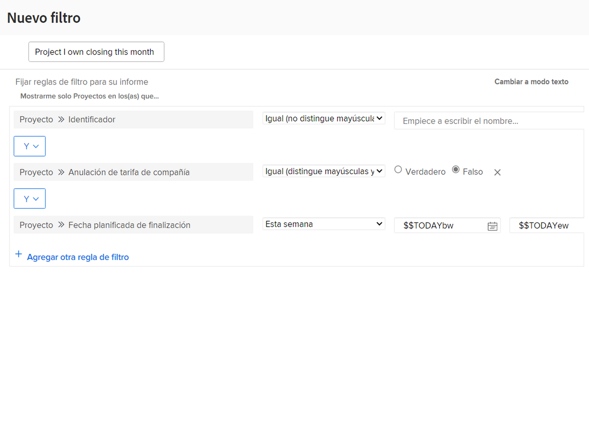

# Crear una actividad de filtro básica

En este vídeo, creará un filtro de proyecto llamado &quot;Proyectos que tengo cerrando este mes&quot;. Si está vigilando muchos proyectos, este filtro puede ayudarle a acercar los que tiene previsto cerrar próximamente.

A continuación se incluyen instrucciones paso a paso.

>[!VIDEO](https://video.tv.adobe.com/v/336807/?quality=12)

## Respuesta

1. Vaya a la [!UICONTROL Proyectos] del [!UICONTROL Menú principal]. Muestra una lista de proyectos.
1. Haga clic en el **[!UICONTROL Filtro]** y seleccione **[!UICONTROL Nuevo filtro]**.
1. Asigne un nombre al filtro &quot;Proyectos que tengo cerrados este mes&quot;.
1. Haga clic en **[!UICONTROL Agregar regla de filtro]**.
1. En el [!UICONTROL Empezar a escribir el nombre del campo] , escriba &quot;owner&quot;. A continuación, seleccione [!UICONTROL ID de propietario] en el [!UICONTROL Proyecto] fuente del campo.
1. Deje el [!UICONTROL Igual] operador tal como está.
1. Escriba &quot;$$&quot; en el campo Iniciar escritura de nombre .
1. Select [!UICONTROL $$USER.ID]. Este es el comodín del usuario que ha iniciado sesión.
1. Haga clic en [!UICONTROL Agregar regla de filtro] de nuevo.
1. En el [!UICONTROL Empezar a escribir el nombre del campo] , empiece a escribir &quot;Se ha completado&quot;. A continuación, seleccione [!UICONTROL Is Complete] en el origen del campo Proyecto.
1. Deje el [!UICONTROL Igual] operador tal como está.
1. Seleccione &quot;False&quot;.
1. Haga clic en [!UICONTROL Agregar regla de filtro] de nuevo.
1. En el [!UICONTROL Empezar a escribir el nombre del campo] tipo de campo &quot;planificado&quot; y, a continuación, seleccione [!UICONTROL Fecha de finalización planeada] en el [!UICONTROL Proyecto] fuente del campo.
1. Cambie el [!UICONTROL Igual] operador a [!UICONTROL Este mes].
1. Haga clic en **[!UICONTROL Guardar filtro]**
