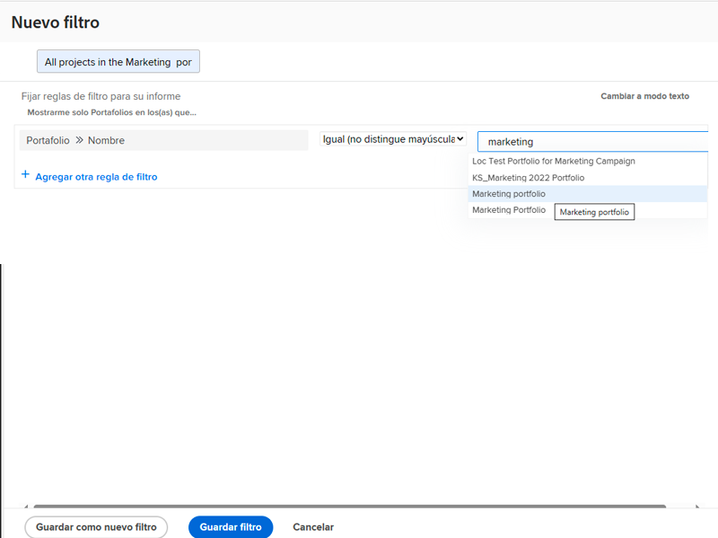

# Creación de actividades de filtro básicas

## Actividad 1: todos los proyectos del portafolio de marketing

En esta actividad creará un filtro de proyecto denominado “Todos los proyectos del portafolio de marketing” en la experiencia de [!UICONTROL Filtro heredado]. Esto le mostrará todos los proyectos del portafolio denominados “Portafolio de marketing” independientemente de su estado.

A continuación se incluyen las instrucciones paso a paso.

### Respuesta a la actividad 1

1. Vaya al área de [!UICONTROL Proyectos] del [!UICONTROL Menú principal]. Muestra una lista de proyectos.
1. Haga clic en el menú **[!UICONTROL Filtro]** y seleccione [!UICONTROL Filtros heredados].
1. Seleccione **[!UICONTROL Nuevo filtro]**.
1. Asigne un nombre al filtro “Todos los proyectos del portafolio de marketing”.
1. Haga clic en **[!UICONTROL Agregar regla de filtro]**.
1. En el campo [!UICONTROL Empezar a escribir el nombre], escriba “[!UICONTROL nombre del portafolio]”. A continuación, seleccione [!UICONTROL Nombre] en el origen del campo [!UICONTROL Proyecto].
1. Deje el operador [!UICONTROL Igual] tal como está.
1. Escriba “[!UICONTROL marketing]” en el campo [!UICONTROL Empezar a escribir el nombre].
1. Seleccione [!UICONTROL portafolio de marketing] en el supuesto que tenga un portafolio con ese nombre por el que desee filtrar. Si no, utilice simplemente la función de escritura anticipada para encontrar el portafolio que desea.
1. Haga clic en **[!UICONTROL Guardar filtro]**.

## Actividad 2: proyectos que tengo que se cierran este mes

En este vídeo, creará un filtro de proyecto denominado “Proyectos que tengo que se cierran este mes” en la experiencia de [!UICONTROL Filtro heredado]. Si está pendiente de muchos proyectos, este filtro puede ayudarle a centrarse en los que tiene previsto cerrar próximamente.

A continuación se incluyen las instrucciones paso a paso.

>[!VIDEO](https://video.tv.adobe.com/v/336807/?quality=12&learn=on)

### Respuesta a la actividad 2

1. Vaya al área de [!UICONTROL Proyectos] del [!UICONTROL Menú principal]. Muestra una lista de proyectos.
1. Haga clic en el menú **[!UICONTROL Filtro]** y seleccione [!UICONTROL Filtros heredados].
1. Seleccione **[!UICONTROL Nuevo filtro]**.
1. Asigne un nombre al filtro “Proyectos que tengo que se cierran este mes”.
1. Haga clic en **[!UICONTROL Agregar regla de filtro]**.
1. En el campo [!UICONTROL Empezar a escribir el nombre], escriba “propietario”.  A continuación, seleccione [!UICONTROL ID de propietario] en el origen del campo [!UICONTROL Proyecto].
1. Deje el operador [!UICONTROL Igual] tal como está.
1. Escriba “$$” en el campo [!UICONTROL Empezar a escribir el nombre].
1. Seleccione [!UICONTROL $$USER.ID]. Este es el carácter comodín del usuario que ha iniciado sesión.
1. Haga clic en [!UICONTROL Agregar regla de filtro] de nuevo.
1. En el campo [!UICONTROL Empezar a escribir el nombre del campo], empiece a escribir “Está completado”. A continuación, seleccione [!UICONTROL Se ha completado] en el origen del campo Proyecto.
1. Deje el operador [!UICONTROL Igual] tal como está.
1. Seleccione “Falso”.
1. Haga clic en [!UICONTROL Agregar regla de filtro] de nuevo.
1. En el tipo de campo [!UICONTROL Empezar a escribir el nombre del campo] escriba “planificado”, a continuación, seleccione [!UICONTROL Fecha planificada de finalización] en el origen del campo [!UICONTROL Proyecto].
1. Cambie el operador [!UICONTROL Igual] a [!UICONTROL Este mes].
1. Haga clic en **[!UICONTROL Guardar filtro]**.
