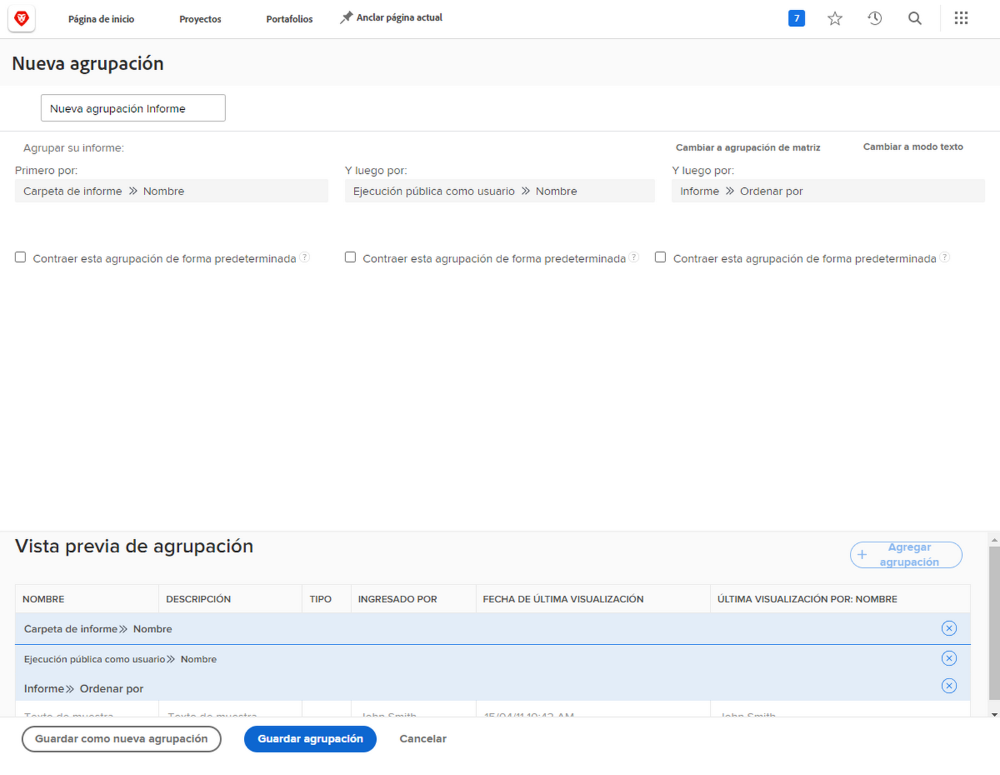

# Crear una agrupación básica

En este vídeo, aprenderá lo siguiente:

* Qué es una agrupación en Workfront
* Cómo crear una agrupación
* Y cómo compartir una agrupación con otros usuarios de Workfront

>[!VIDEO](https://video.tv.adobe.com/v/335147/?quality=12)

## Actividad: Crear una agrupación básica

Cree una agrupación de problemas que se utilizará en un informe para realizar el seguimiento de las solicitudes que pasan a través de una cola de solicitudes. Esta agrupación facilitará la visualización de tipos similares de problemas/solicitudes agrupados por su prioridad. Asigne un nombre a la agrupación &quot;Cola de solicitudes, Tema de cola, Prioridad&quot;.

Agrupar el informe de problemas en función de:

1. Nombre de la cola de solicitudes (será el nombre del proyecto)
1. Tema de la cola
1. La prioridad de la solicitud

## Respuesta

1. En un informe de lista de problemas, vaya a **[!UICONTROL Agrupación]** y seleccione **[!UICONTROL Nueva agrupación]**.
1. Asigne un nombre a la agrupación &quot;Cola de solicitudes, Tema de cola, Prioridad&quot;.
1. Clic **[!UICONTROL Agregar agrupación]**.
1. En el [!UICONTROL Primero por] field. escriba &quot;nombre del proyecto&quot; y seleccione **[!UICONTROL Nombre]** en el origen del campo Proyecto.
1. Clic **[!UICONTROL Añadir otra agrupación]**.
1. En el [!UICONTROL Y luego por] , escriba &quot;queue&quot; y seleccione **[!UICONTROL Nombre]** en el [!UICONTROL Tema de cola] origen del campo.
1. Clic **[!UICONTROL Añadir otra agrupación]**.
1. En el [!UICONTROL Y luego por] , escriba &quot;prioridad&quot; y seleccione **[!UICONTROL Prioridad]** en el [!UICONTROL Problema] origen del campo.
1. Clic **[!UICONTROL Guardar agrupación]**
