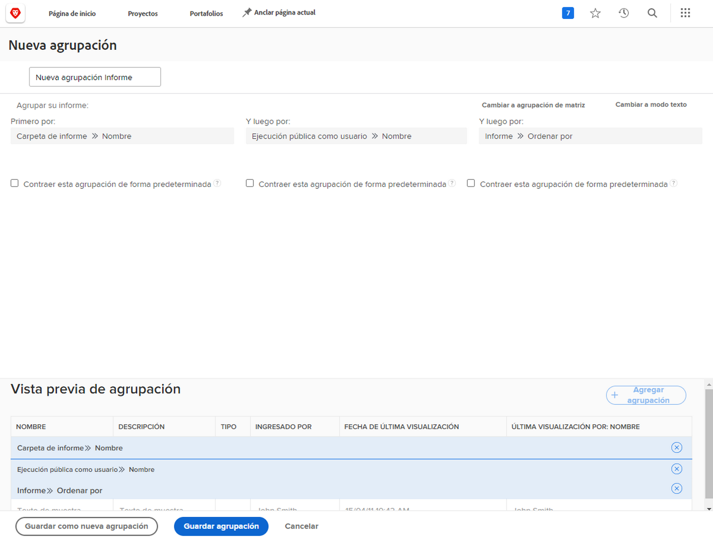

# Creación de una agrupación básica

En este vídeo se explica cómo crear y administrar agrupaciones en Workfront para organizar las listas de proyectos de forma eficaz. Las agrupaciones son uno de los tres elementos principales de los informes, junto con los filtros y las vistas, y ayudan a organizar los resultados en función de la información compartida. &#x200B;
Este tutorial proporciona pasos prácticos para organizar listas de proyectos con el fin de racionalizar el trabajo diario y la colaboración. &#x200B;

>[!VIDEO](https://video.tv.adobe.com/v/335147/?quality=12&learn=on&enablevpops=0)

## Principales conclusiones

* **Propósito de las agrupaciones:** las agrupaciones son un elemento de informes clave en Workfront que organizan listas de proyectos basadas en información compartida, como fechas de finalización, portafolios o programas. &#x200B;
* **Creación de agrupaciones:** Puede crear agrupaciones personalizadas con hasta tres niveles de criterios. Por ejemplo, los proyectos se pueden agrupar primero por portafolio y luego por programa para una mejor organización. &#x200B;
* **Editar y guardar agrupaciones:** Las agrupaciones integradas no se pueden sobrescribir, pero las ediciones se pueden guardar como una agrupación nueva. Las agrupaciones personalizadas deben tener nombres claros y descriptivos para facilitar la identificación. &#x200B;
* **Compartir agrupaciones:** las agrupaciones se pueden compartir con otros usuarios, con permisos de &quot;vista&quot; predeterminados que les permiten usar y compartir la agrupación pero no editarla. Los permisos de &quot;Administrar&quot; permiten editar y eliminar. &#x200B;
* **Quitar agrupaciones:** Si elimina una agrupación que creó, también se eliminará de las listas de usuarios con los que la compartió. Las agrupaciones compartidas aparecen en la sección &quot;Compartido conmigo&quot; para otros usuarios. &#x200B;

## Actividades &quot;Crear una agrupación básica&quot;

### Actividad 1: Crear una agrupación básica

Cree una agrupación de problemas que se utilizará en un informe para rastrear las solicitudes que llegan a través de una cola de solicitudes. Esta agrupación facilitará la visualización de tipos similares de problemas/solicitudes agrupados por su prioridad. Asigne un nombre a la agrupación &quot;Cola de solicitudes, Tema de cola, Prioridad&quot;.

Agrupe el informe de problemas en función de lo siguiente:

1. El nombre de la cola de solicitudes (será el nombre del proyecto)
1. El tema de la cola
1. Prioridad de la solicitud

### Respuesta 1

1. En un informe de lista de problemas, vaya al menú **[!UICONTROL Agrupación]** y seleccione **[!UICONTROL Nuevo grupo]**.
1. Asigne un nombre a la agrupación &quot;Cola de solicitudes, Tema de cola, Prioridad&quot;.
1. Haga clic en **[!UICONTROL Agregar agrupación]**.
1. En el campo [!UICONTROL Agrupar por]. escriba &quot;nombre de proyecto&quot; y, a continuación, seleccione **[!UICONTROL Nombre]** en el origen del campo Proyecto.
1. Haga clic en **[!UICONTROL Agregar otra agrupación]**, luego escriba &quot;cola&quot; y seleccione **[!UICONTROL Nombre]** en el origen del campo [!UICONTROL Tema de la cola].
1. Haga clic en **[!UICONTROL Agregar otra agrupación]**, luego escriba &quot;prioridad&quot; y seleccione **[!UICONTROL Prioridad]** en el origen del campo [!UICONTROL Problema].
1. Haga clic en **[!UICONTROL Guardar agrupación]**
