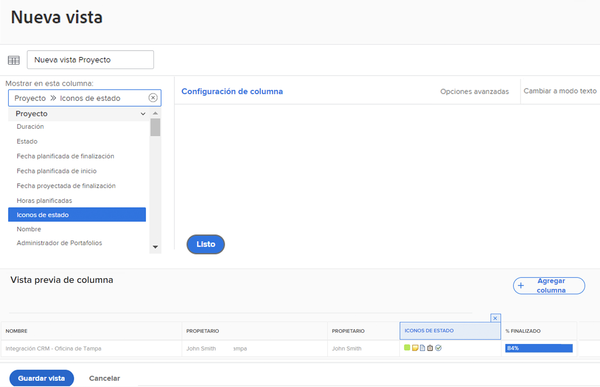
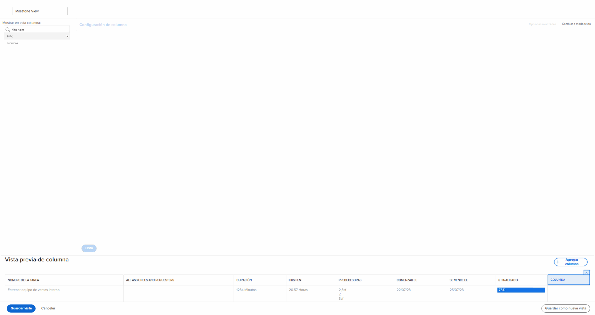
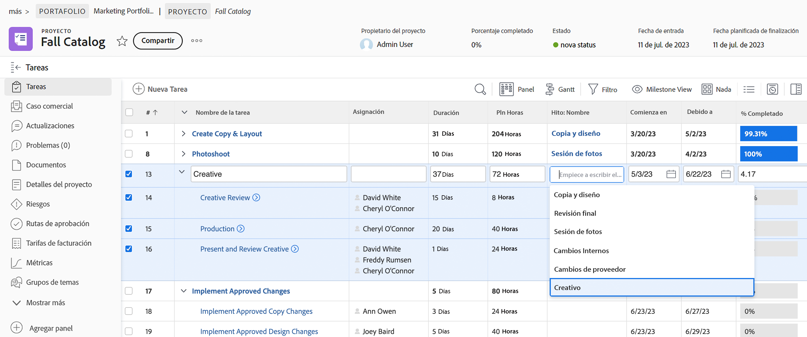
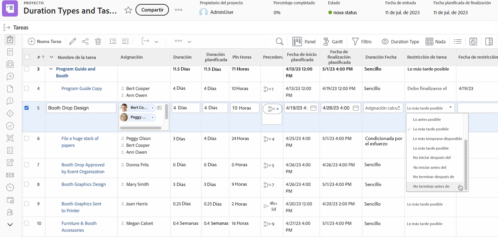
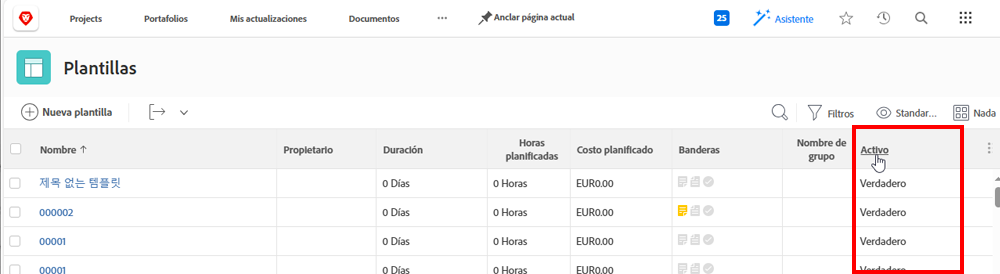

# Creación de una vista básica

En el vídeo se explica cómo crear y personalizar vistas en Workfront para mostrar información específica sobre los elementos de una lista, como proyectos, tareas, problemas y documentos. palo de golf Las vistas permiten a los usuarios ver detalles como nombre, descripción, estado y otros campos relevantes para los elementos. palo de golf

El vídeo destaca la flexibilidad de las vistas en Workfront y proporciona instrucciones paso a paso para crearlas, personalizarlas y administrarlas.

>[!VIDEO](https://video.tv.adobe.com/v/3450241/?quality=12&learn=on&captions=spa)

## Puntos clave

* **Personalización de vistas**: los usuarios pueden editar las vistas existentes o crear otras nuevas agregando, quitando o reorganizando columnas para mostrar información específica, como el estado del proyecto o el presupuesto.
* **Edición en línea**: algunos campos de una vista de lista se pueden actualizar directamente sin abrir elementos individuales, por lo que los cambios se realizan con mayor rapidez. palo de golf
* **Creación de vistas desde cero**: los usuarios pueden diseñar vistas para satisfacer necesidades específicas, como el seguimiento del estado del proyecto, agregando columnas relevantes como el presupuesto, el costo real y el estado de progreso. palo de golf
* **Compartir y administrar vistas**: las vistas personalizadas se pueden compartir con los integrantes del equipo para colaborar o se pueden quitar cuando ya no sean necesarias.

## Actividades &quot;Crear una vista básica&quot;

### Actividad 1: crear una vista de estado de tareas

Como administrador del proyecto, jefe de equipo o administrador de recursos, debe seguir el progreso del trabajo de las tareas. Con esta vista, se obtienen varios indicadores de estado de una tarea en una fila de la lista o del informe.

Cree una vista de tarea denominada “Vista de estado de tarea” con las siguientes columnas:

* [!UICONTROL Nombre de la tarea]
* [!UICONTROL Asignaciones]
* [!UICONTROL Duración]
* [!UICONTROL Porcentaje completado]
* [!UICONTROL Estado]
* [!UICONTROL Estado de progreso]
* [!UICONTROL Iconos de estado]

### Respuesta 1

1. En un informe de lista de tareas, vaya al menú desplegable **[!UICONTROL Ver]** y seleccione **[!UICONTROL Nueva vista]**.
1. Asigne el nombre de su vista como “Vista de estado de la tarea”.
1. Quite estas columnas: [!UICONTROL Horas plan.], [!UICONTROL Predecesores], [!UICONTROL Iniciar en] y [!UICONTROL Vence el].
1. Haga clic en **[!UICONTROL Añadir columna]**.
1. En el campo [!UICONTROL Mostrar en esta columna], escriba “estado” y, a continuación, seleccione “Estado” en la fuente del campo [!UICONTROL Tarea].
1. Haga clic en **[!UICONTROL Añadir columna]** de nuevo.
1. En el campo [!UICONTROL Mostrar en esta columna], escriba “estado” y, a continuación, seleccione “Estado de progreso” en la fuente del campo [!UICONTROL Tarea].
1. Haga clic en **[!UICONTROL Añadir columna]** de nuevo.
1. En el campo [!UICONTROL Mostrar en esta columna], escriba “estado” y, a continuación, seleccione “Iconos de estado” en la fuente del campo Tarea.
1. Haga clic en **[!UICONTROL Guardar]**.

Pase el puntero por encima de cada uno de los iconos de la columna [!UICONTROL Iconos de estado] para ver lo que representan. Si aparecen en gris, significa que la tarea no tiene notas, documentos, procesos de aprobación, etc. Si un icono aparece en color, hay al menos uno de los elementos asociados a la tarea. Puede hacer clic en los iconos de nota o documento para ir a ese elemento.

### Actividad 2: Crear una vista hito

Si utiliza hitos, esta vista es la forma más sencilla de ver los hitos por nombre en la lista de tareas y agregarlos o quitarlos de una tarea mediante la edición en línea.

Cree una vista de tarea denominada “Vista de hito” con las columnas siguientes:

* [!UICONTROL Nombre de la tarea]
* [!UICONTROL Asignaciones]
* [!UICONTROL Duración]
* [!UICONTROL Hrs pln]
* [!UICONTROL Hito: Nombre]
* [!UICONTROL Comenzar el]
* [!UICONTROL Se vence el]
* [!UICONTROL Porcentaje completado]

### Respuesta 2

1. En una lista de tareas de proyecto, vaya al menú desplegable **[!UICONTROL Vista]** y seleccione **[!UICONTROL Nueva vista]**.
1. Asigne un nombre a la vista &quot;Vista de hito&quot;.
1. Haga clic en la columna [!UICONTROL Predecesoras] para seleccionarla.
1. En el campo [!UICONTROL Mostrar en esta columna], haga clic en el icono &quot;menos&quot; en el campo [!UICONTROL Tarea >> Predecesoras], luego escriba &quot;[!UICONTROL nombre de hito]&quot; y haga clic en &quot;[!UICONTROL Nombre]&quot; en la lista.
1. Haga clic en **[!UICONTROL Guardar]**.

### Actividad 3: crear una vista de tipos de duración y restricciones de tarea

Esta vista le permitirá examinar y editar todos los tipos de duración y las restricciones de tareas del proyecto.

Cree una vista de tareas denominada &quot;Vista de tipos de duración y restricciones de tareas&quot; con las columnas siguientes:

* [!UICONTROL Nombre de la tarea]
* [!UICONTROL Asignaciones]
* [!UICONTROL Duración]
* [!UICONTROL Duración planificada]
* [!UICONTROL Hrs pln]
* [!UICONTROL Predecesoras]
* [!UICONTROL Comenzar el]
* [!UICONTROL Se vence el]
* [!UICONTROL Tipo de duración]
* [!UICONTROL Restricción de tarea]
* [!UICONTROL Fecha de restricción]

Cambie el [!UICONTROL Formato de campo] en las columnas [!UICONTROL Comenzar el] y [!UICONTROL Vence el] para mostrar tanto la fecha como la hora.

### Respuesta 3

1. En un informe de lista de tareas, vaya al menú desplegable **[!UICONTROL Vista]** y seleccione **[!UICONTROL Nueva vista]**.
1. Asigne un nombre a la vista &quot;Vista de tipos de duración y restricciones de tareas&quot;.
1. Quite la columna del [!UICONTROL % completado].
1. Haga clic en **[!UICONTROL Añadir columna]**.
1. En el campo [!UICONTROL Mostrar en esta columna], escriba [!UICONTROL &quot;duración&quot;] y, a continuación, seleccione [!UICONTROL “Duración planificada&quot;] en la fuente del campo [!UICONTROL Tarea].
1. Mueva esta columna entre las columnas de [!UICONTROL Duración] y el [!UICONTROL Pln Hrs].
1. Haga clic en **[!UICONTROL Añadir columna]** de nuevo.
1. En el campo [!UICONTROL Mostrar en esta columna], escriba [!UICONTROL “tipo de duración”] y, a continuación, seleccione [!UICONTROL &quot;Tipo de duración&quot;] en la fuente del campo [!UICONTROL Tarea].
1. Haga clic en **[!UICONTROL Añadir columna]** de nuevo.
1. En el campo [!UICONTROL Mostrar en esta columna], escriba [!UICONTROL “restricción”] y, a continuación, seleccione [!UICONTROL “Restricción de tarea”] en la fuente del campo Tarea.
1. Haga clic en **[!UICONTROL Añadir columna]** de nuevo.
1. En el campo [!UICONTROL Mostrar en esta columna], escriba [!UICONTROL “restricción”] y, a continuación, seleccione [!UICONTROL “fecha de restricción”] en la fuente del campo Tarea.
1. Seleccione la columna de [!UICONTROL Comenzar el] y luego haga clic en [!UICONTROL Opciones avanzadas].
1. En la lista desplegable [!UICONTROL Formato de campo], seleccione [!UICONTROL &quot;10/17/60 3:00 AM&quot;].
1. Seleccione la columna de [!UICONTROL Vence el] y seguidamente haga clic en [!UICONTROL Opciones avanzadas].
1. En la lista desplegable [!UICONTROL Formato de campo], seleccione [!UICONTROL &quot;10/17/60 3:00 AM&quot;].
1. Haga clic en **[!UICONTROL Guardar]**.

### Actividad 4: Crear una vista del estado activo de las plantillas de proyecto

Cualquiera que administre plantillas de proyecto apreciará ver el estado activo (verdadero o falso) de cada plantilla en la lista. Todavía mejor, el campo se puede editar en línea.

Cree una vista de plantilla de proyecto denominada “Estándar+estado activo” con las siguientes columnas:

* [!UICONTROL Nombre]
* [!UICONTROL Propietario]
* [!UICONTROL Duración]
* [!UICONTROL Horas planificadas]
* [!UICONTROL Coste planificado]
* [!UICONTROL Indicadores]
* [!UICONTROL Nombre del grupo &#x200B;]
* [!UICONTROL Está activo]

### Respuesta 4

1. En una lista de plantillas del proyecto, vaya al menú desplegable **[!UICONTROL Vista]** y seleccione **[!UICONTROL Nueva vista]**.
1. Asigne un nombre a la vista “Estándar + estado activo”.
1. Haga clic en **[!UICONTROL Añadir columna]**.
1. En el campo [!UICONTROL Mostrar en esta columna], escriba “está” y, a continuación, seleccione “Está activo” en la fuente del campo [!UICONTROL Plantilla].
1. Haga clic en **[!UICONTROL Guardar vista]**.
