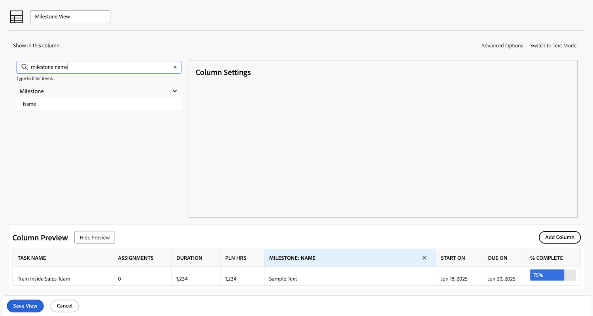

# Crear una vista básica

En este vídeo, aprenderá lo siguiente:

* Qué es una vista en Workfront
* Creación y modificación de una vista
* Cómo compartir una vista con otros usuarios de Workfront

>[!VIDEO](https://video.tv.adobe.com/v/335148/?quality=12&learn=on)

## Actividad 1: crear una vista de estado de tareas

Como jefe de proyecto, jefe de equipo o jefe de recursos, desea realizar un seguimiento del progreso del trabajo de las tareas. Con esta vista, se obtienen varios indicadores de estado de una tarea, todos en una fila de la lista o del informe.

Cree una vista de tareas denominada &quot;Vista de estado de tareas&quot; con las siguientes columnas:

* [!UICONTROL Nombre de la tarea]
* [!UICONTROL Asignaciones]
* [!UICONTROL Duración]
* [!UICONTROL Porcentaje completado]
* [!UICONTROL Estado]
* [!UICONTROL Estado de progreso]
* [!UICONTROL Iconos de estado]

## Respuesta de actividad 1

1. En un informe de lista de tareas, vaya a **[!UICONTROL Ver]** menú desplegable y seleccione **[!UICONTROL Nueva vista]**.
1. Asigne a la vista el nombre &quot;Vista de estado de la tarea&quot;.
1. Elimine estas columnas: [!UICONTROL Hrs pln], [!UICONTROL Predecesoras], [!UICONTROL Comenzar el], y [!UICONTROL Vence el].
1. Clic **[!UICONTROL Agregar columna]**.
1. En el [!UICONTROL Mostrar en esta columna] , escriba &quot;status&quot; y seleccione &quot;Status&quot; en la [!UICONTROL Tarea] origen del campo.
1. Clic **[!UICONTROL Agregar columna]** otra vez.
1. En el [!UICONTROL Mostrar en esta columna] , escriba &quot;estado&quot; y seleccione &quot;Estado de progreso&quot; en el campo [!UICONTROL Tarea] origen del campo.
1. Clic **[!UICONTROL Agregar columna]** otra vez.
1. En el [!UICONTROL Mostrar en esta columna] , escriba &quot;status&quot; y, a continuación, seleccione &quot;Status Icons&quot; en el origen del campo Task.
1. Haga clic en **[!UICONTROL Guardar]**.

Pase el ratón sobre cada uno de los iconos de la [!UICONTROL Iconos de estado] para ver lo que representan. Si aparece en gris, significa que la tarea no tiene notas, documentos, procesos de aprobación, etc. Si aparece un icono en color, hay al menos uno de ese elemento asociado con la tarea. Puede hacer clic en los iconos de la nota o del documento para ir a ese elemento.

## Actividad 2: crear una vista de hito

Si utiliza hitos, esta vista es la forma más sencilla de ver los hitos por nombre y agregarlos o editarlos mediante la edición en línea.

Cree una vista de tareas denominada &quot;Vista de hito&quot; con las columnas siguientes:

* [!UICONTROL Nombre de la tarea]
* [!UICONTROL Asignaciones]
* [!UICONTROL Duración]
* [!UICONTROL Hrs pln]
* [!UICONTROL Hito: Nombre]
* [!UICONTROL Comenzar el]
* [!UICONTROL Se vence el]
* [!UICONTROL Porcentaje completado]

## Respuesta de actividad 2

1. En la lista de tareas de un proyecto, vaya a **[!UICONTROL Ver]** menú desplegable y seleccione **[!UICONTROL Nueva vista]**.
1. Asigne un nombre a la vista &quot;Vista de hito&quot;.
1. Haga clic en [!UICONTROL Predecesoras] para seleccionarla.
1. En el [!UICONTROL Mostrar en esta columna] , haga clic en el icono X de la [!UICONTROL Tarea > Predecesoras] , luego escriba &quot;[!UICONTROL nombre de hito]&quot; y haga clic en &quot;[!UICONTROL Nombre]&quot; en la lista.
1. Haga clic en **[!UICONTROL Guardar]**.

## Actividad 3: crear una vista de tipos de duración y restricciones de tarea

Esta vista le permitirá examinar y editar todos los tipos de duración y las restricciones de tareas del proyecto.

Cree una vista de tareas denominada &quot;Vista de tipos de duración y restricciones de tareas&quot; con las columnas siguientes:

* [!UICONTROL Nombre de la tarea]
* [!UICONTROL Asignaciones]
* [!UICONTROL Duración]
* [!UICONTROL Duración planificada]
* [!UICONTROL Hrs pln]
* [!UICONTROL Predecesoras]
* [!UICONTROL Comenzar el]
* [!UICONTROL Se vence el]
* [!UICONTROL Tipo de duración]
* [!UICONTROL Restricción de tarea]
* [!UICONTROL Fecha de restricción]

Cambie el [!UICONTROL Formato de campo] en el [!UICONTROL Comenzar el] y [!UICONTROL Vence el] para mostrar tanto la fecha como la hora.

## Respuesta de actividad 3

1. En la lista de tareas de un proyecto, vaya a **[!UICONTROL Ver]** menú desplegable y seleccione **[!UICONTROL Nueva vista]**.
1. Asigne un nombre a la vista &quot;Vista de tipos de duración y restricciones de tareas&quot;.
1. Retire el [!UICONTROL % completado] columna.
1. Clic **[!UICONTROL Agregar columna]**.
1. En el [!UICONTROL Mostrar en esta columna] campo, tipo [!UICONTROL &quot;duration&quot;] luego seleccione [!UICONTROL &quot;Duración planificada&quot;] en el [!UICONTROL Tarea] origen del campo.
1. Mueva esta columna entre las [!UICONTROL Duración] y el [!UICONTROL Hrs pln] columnas.
1. Clic **[!UICONTROL Agregar columna]** otra vez.
1. En el [!UICONTROL Mostrar en esta columna] campo, tipo [!UICONTROL &quot;tipo de duración&quot;] luego seleccione [!UICONTROL &quot;Tipo de duración&quot;] en el [!UICONTROL Tarea] origen del campo.
1. Clic **[!UICONTROL Agregar columna]** otra vez.
1. En el [!UICONTROL Mostrar en esta columna] campo, tipo [!UICONTROL &quot;restricción&quot;] luego seleccione [!UICONTROL &quot;Restricción de tarea&quot;] en el origen del campo Tarea.
1. Clic **[!UICONTROL Agregar columna]** otra vez.
1. En el [!UICONTROL Mostrar en esta columna] campo, tipo [!UICONTROL &quot;restricción&quot;] luego seleccione [!UICONTROL &quot;Fecha de restricción&quot;] en el origen del campo Tarea.
1. Seleccione el [!UICONTROL Comenzar el] y luego haga clic en [!UICONTROL Opciones avanzadas].
1. En el [!UICONTROL Formato de campo] selección desplegable [!UICONTROL &quot;10/17/60 3:00 AM&quot;].
1. Seleccione el [!UICONTROL Vence el] y luego haga clic en [!UICONTROL Opciones avanzadas].
1. En el [!UICONTROL Formato de campo] selección desplegable [!UICONTROL &quot;10/17/60 3:00 AM&quot;].
1. Haga clic en **[!UICONTROL Guardar]**.
