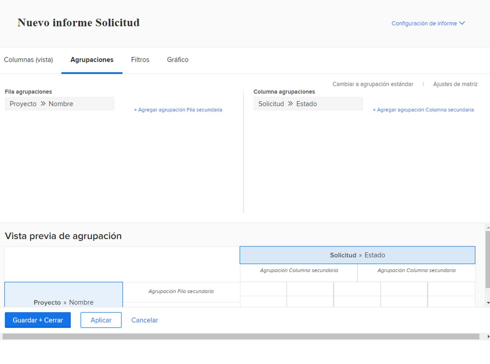
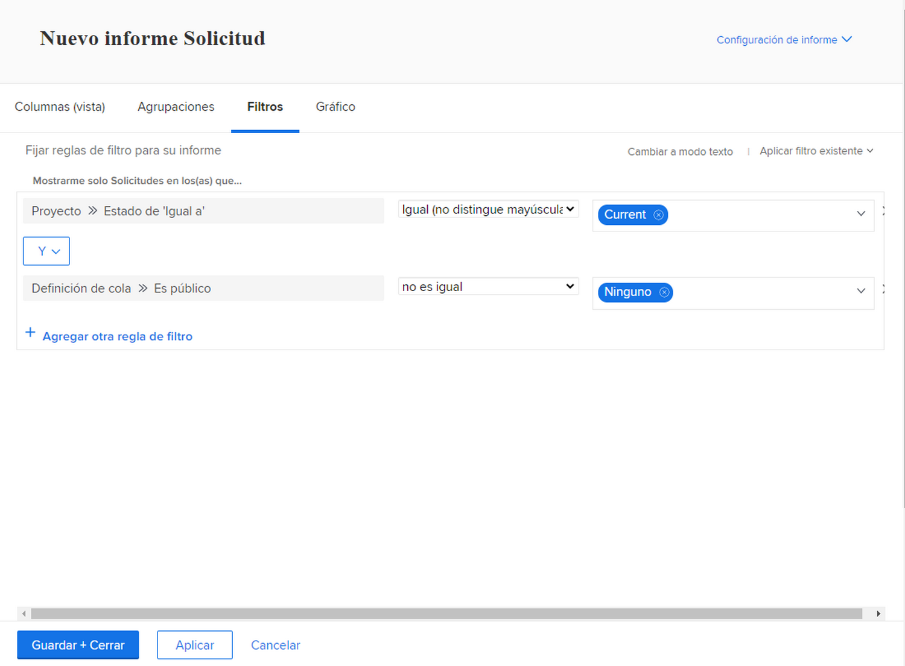

# Crear un informe de matriz

En este vídeo, aprenderá:

* Cuando un informe de matriz puede resultar útil
* Y cómo crear un informe de matriz

>[!VIDEO](https://video.tv.adobe.com/v/335156/?quality=12)

## Actividad: Crear un informe de matriz

Cree un informe de matriz que muestre cuántas solicitudes hay en cada estado, ordenadas por cola de solicitud. Esto le ofrece una instantánea rápida de la cantidad de trabajo que ingresa y de lo bien que se está manteniendo al día con él.

Desea que las colas de solicitud aparezcan en las agrupaciones de filas. El estado aparece como las agrupaciones de columnas. Asigne un nombre al informe &quot;Solicitudes por estado y cola de solicitud&quot;.

## Respuesta

1. Select **[!UICONTROL Informes]** de la variable **[!UICONTROL Menú principal]**.
1. Haga clic en el **[!UICONTROL Nuevo informe]** y seleccione **[!UICONTROL Problema]**.
1. Vaya a la **[!UICONTROL Agrupaciones]** y haga clic en **[!UICONTROL Cambiar a agrupación en matriz]**.
1. Para [!UICONTROL Agrupaciones de filas], seleccione **[!UICONTROL Proyecto]** > **[!UICONTROL Nombre]**.
1. Para [!UICONTROL Agrupación de columnas], seleccione **[!UICONTROL Problema]** > **[!UICONTROL Estado]**.

   

1. Vaya a la **[!UICONTROL Filtros]** pestaña .
1. Para asegurarse de que solo ve solicitudes en colas de solicitudes activas, agregue las siguientes reglas de filtro:

   * [!UICONTROL Proyecto] > [!UICONTROL Estado es igual a con] > [!UICONTROL Igual] > [!UICONTROL Actual]
   * [!UICONTROL Definición de cola] > [!UICONTROL Es público] > [!UICONTROL Distinto a] > [!UICONTROL Ninguna] (así sabemos que un proyecto es en realidad una cola de solicitudes, ya que la Definición de cola se asigna a una de las opciones públicas).

1. Haga clic en **[!UICONTROL Guardar + Cerrar]**. Cuando se le pida el nombre de un informe, escriba &quot;Solicitudes por estado y cola de solicitud&quot;.

   
