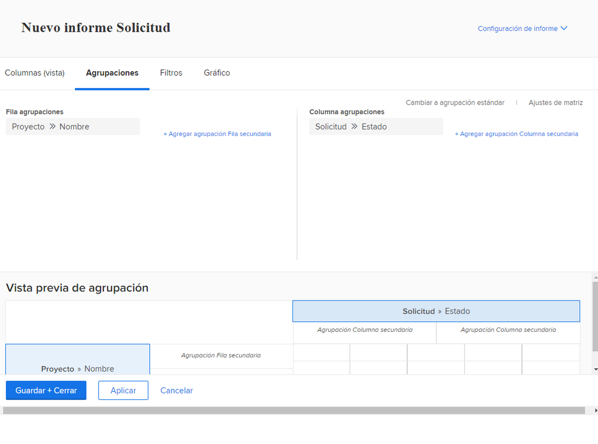
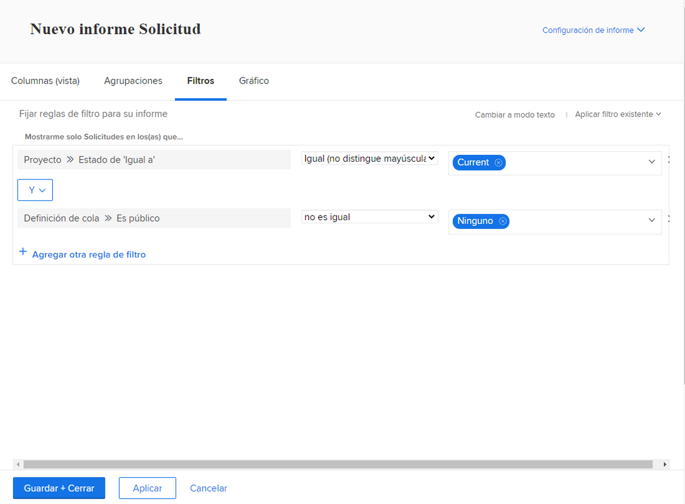

# Creación de un informe de matriz

Este vídeo contiene información sobre:

* Cuando un informe de matriz puede resultar útil
* Y cómo crear un informe de matriz

>[!VIDEO](https://video.tv.adobe.com/v/335156/?quality=12&learn=on&enablevpops=0)

## Principales conclusiones

* **Estructura de informe de matriz:** Los informes de matriz organizan los datos en filas y columnas, con totales automáticos de filas y columnas. Son ideales para rastrear métricas como horas trabajadas, costos e ingresos. &#x200B;
* **Configuración de filtros:** Use filtros para centrarse en datos específicos, como las horas trabajadas durante el último trimestre por usuarios de un equipo particular. La &quot;fuente del campo de propietario&quot; ayuda a identificar a los miembros relevantes del equipo. &#x200B;
* **Opciones de agrupación:** En nuestro ejemplo, las filas se agrupan por &quot;nombre de propietario&quot; (persona que trabajó las horas), mientras que las columnas se agrupan por &quot;fecha de entrada de hora&quot; (por mes y semana). &#x200B;
* **Datos resumidos:** Las columnas como horas, costos reales e ingresos se resumen de manera predeterminada, lo que garantiza que los totales se muestren en la matriz. Si lo desea, estos valores predeterminados se pueden desactivar. &#x200B;
* **Integración de gráficos:** Los informes de matriz se pueden complementar con gráficos para una visualización de datos alternativa, utilizando la misma información de agrupación. Puede establecer la pestaña Matriz o la pestaña Gráfico como la vista predeterminada. &#x200B;

## Actividades &quot;Crear un informe de matriz&quot;

### Actividad 1: Crear un informe de matriz

Cree un informe de matriz que muestre cuántas solicitudes hay en cada estado, ordenadas por la cola de solicitudes. Esto le proporciona una instantánea rápida de la cantidad de trabajo que ingresa y de lo bien que lo está llevando.

Quiere que las colas de solicitudes aparezcan en las agrupaciones de filas. El estado aparece como las agrupaciones de columnas. Asigne un nombre al informe &quot;Solicitudes por estado y colas de solicitudes&quot;.

### Respuesta 1

1. Seleccione **[!UICONTROL Informes]** desde el **[!UICONTROL Menú principal]**.
1. Haga clic en la opción **[!UICONTROL Nuevo informe]** y seleccione **[!UICONTROL Problema]**.
1. Vaya a la pestaña **[!UICONTROL Agrupaciones]** y haga clic en **[!UICONTROL Cambiar a agrupación de matriz]**.
1. Para [!UICONTROL Agrupaciones de filas], seleccione **[!UICONTROL Proyecto]** > **[!UICONTROL Nombre]**.
1. Para [!UICONTROL Agrupación de columnas], seleccione **[!UICONTROL Problema]** > **[!UICONTROL Estado]**.

   

1. Vaya a la pestaña **[!UICONTROL Filtros]**.
1. Para asegurarse de que solo vea solicitudes en colas de solicitudes activas, añada las siguientes reglas de filtro:

   * [!UICONTROL Proyecto] > [!UICONTROL Estado es igual a] > [!UICONTROL Igual] > [!UICONTROL Actual]
   * [!UICONTROL Definición de cola] > [!UICONTROL Es pública] > [!UICONTROL No igual a] > [!UICONTROL Ninguna] (así sabemos que un proyecto es en realidad una cola de solicitudes, ya que la Definición de cola se asigna a una de las opciones públicas).

1. Haga clic en **[!UICONTROL Guardar + Cerrar]**. Cuando se le pida un nombre de informe, escriba &quot;Solicitudes por estado y Cola de solicitudes&quot;.

   
