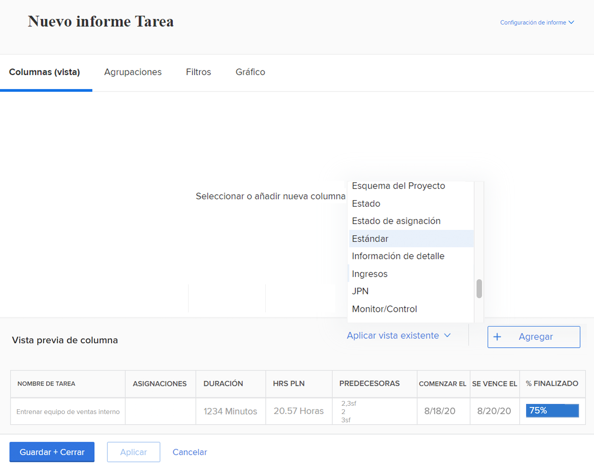
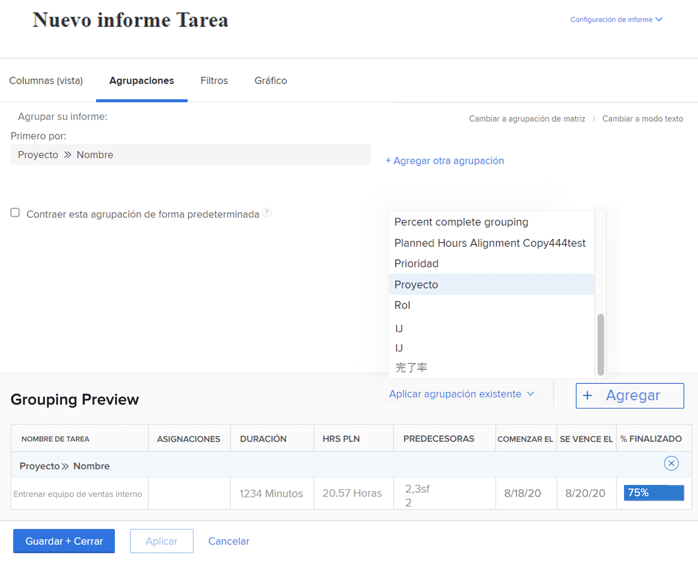
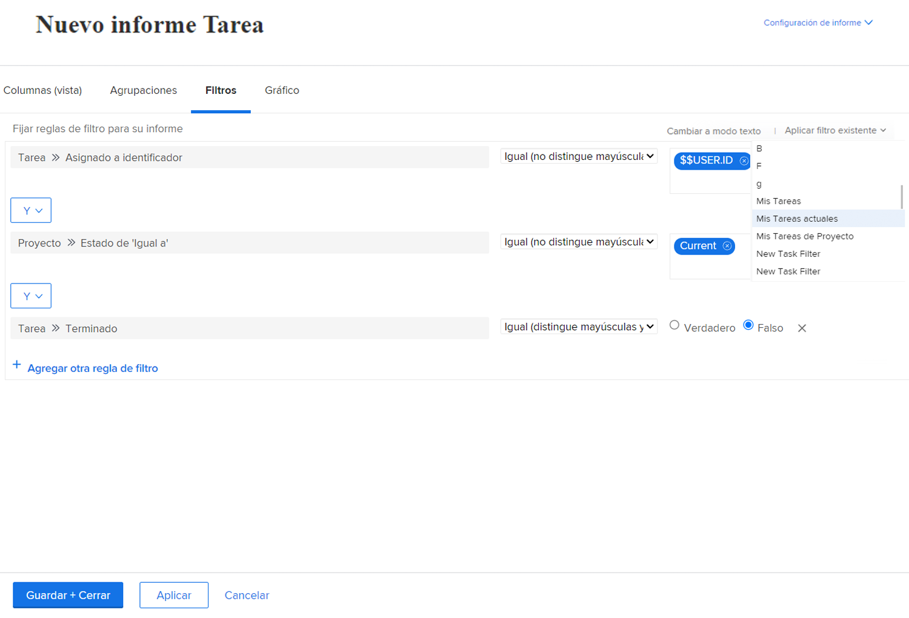
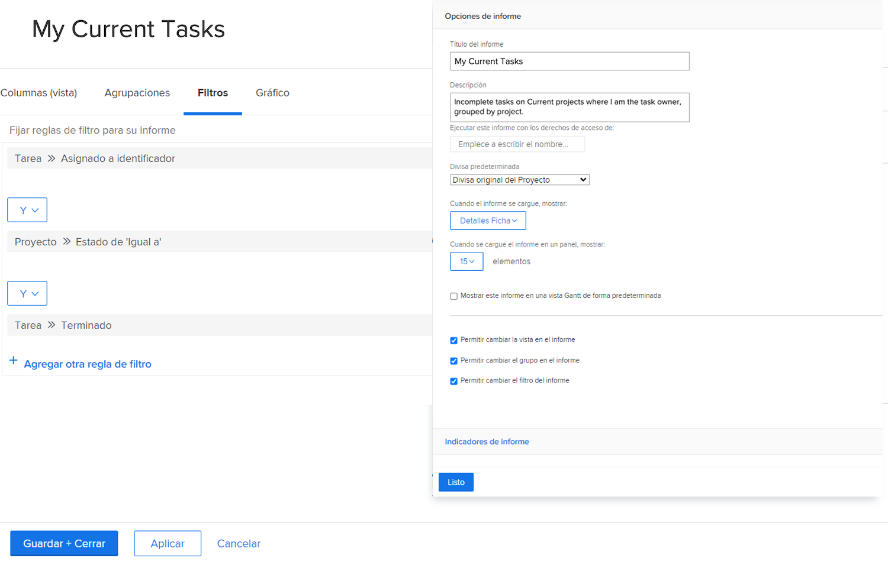

# Crear un informe simple

En este vídeo, aprenderá a:

* Creación de un informe sencillo mediante un filtro, una vista y una agrupación existentes

>[!VIDEO](https://video.tv.adobe.com/v/335153/?quality=12&learn=on)

## Actividad: Crear un informe de tarea simple

Desea rastrear todas las tareas activas en un solo informe. Cree un informe de tarea denominado &quot;Mis tareas actuales&quot; mediante el procedimiento siguiente:

* Columnas (Vista) = Estándar
* Agrupaciones = Proyecto
* Filtro = Mis tareas actuales
* Descripción = Tareas incompletas en proyectos actuales donde soy el propietario de la tarea, agrupadas por proyecto.

## Respuesta

1. Vaya a la **[!UICONTROL Menú principal]** y seleccione **[!UICONTROL Informes]**.
1. Haga clic en el **[!UICONTROL Nuevo informe]** menú desplegable y seleccione **[!UICONTROL Informe de tareas]**.
1. En [!UICONTROL Columnas (Vista)], haga clic en **[!UICONTROL Aplicar una vista existente]** y seleccione **[!UICONTROL Estándar]**.

   

1. En el **[!UICONTROL Agrupaciones]** , haga clic en la pestaña **[!UICONTROL Aplicar una agrupación existente]** y seleccione **[!UICONTROL Proyecto]**.

   

1. En el **[!UICONTROL Filtros]** , haga clic en la pestaña **[!UICONTROL Aplicar un filtro existente]** y seleccione Mis tareas actuales.

   

1. Apertura **[!UICONTROL Configuración de informes]** y asigne al informe el nombre &quot;Mis tareas actuales&quot;.
1. En el campo Descripción , introduzca &quot;Tareas incompletas en proyectos actuales donde soy el propietario de la tarea, agrupadas por proyecto&quot;.

   

1. Guarde y cierre el informe.
