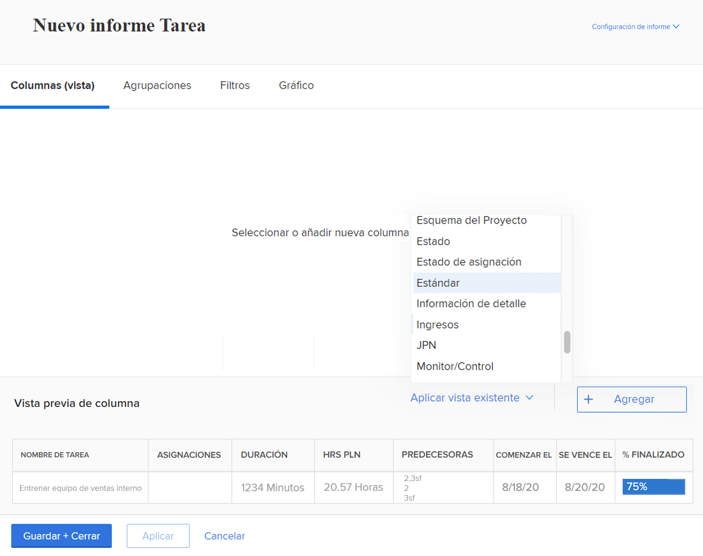
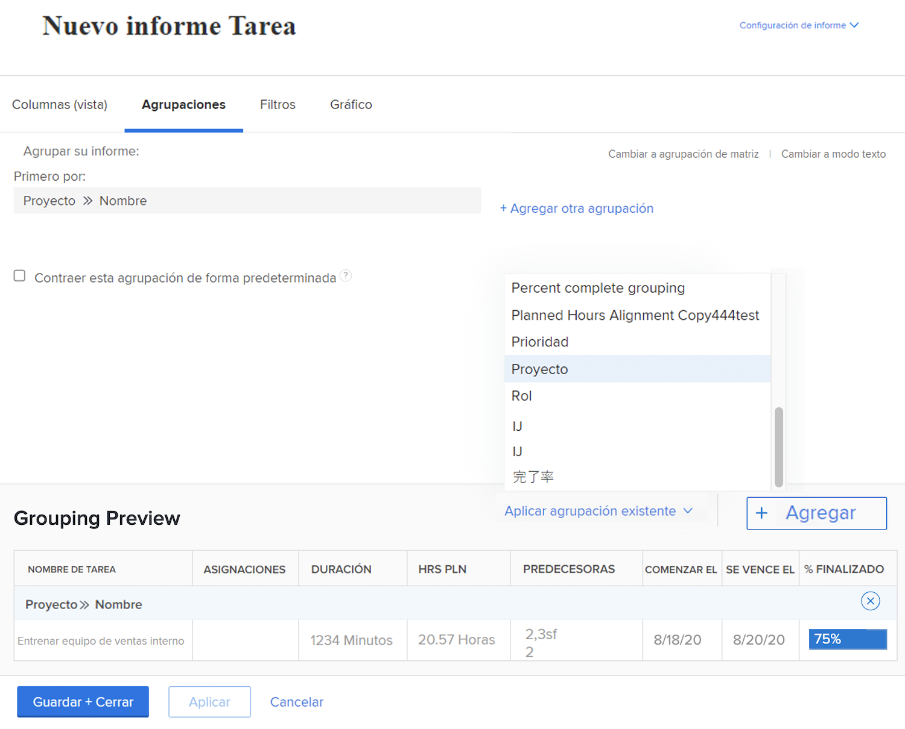
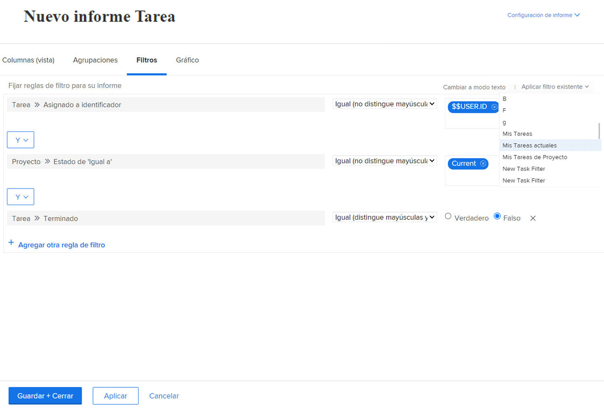
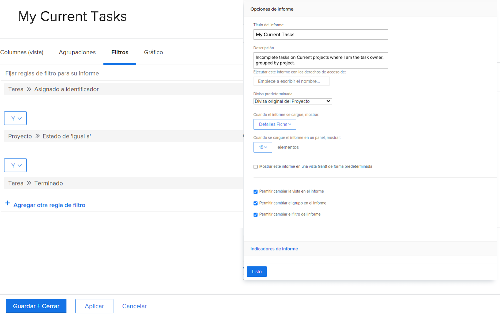

# Creación de un informe simple

En este vídeo se explica cómo crear y personalizar informes de proyectos para analizar datos de forma eficaz. Comienza destacando la importancia de los informes en el seguimiento del progreso del proyecto, la finalización de las tareas, el cumplimiento del presupuesto y la identificación de problemas. En el vídeo se muestra cómo empezar con un informe de lista de proyectos, ajustar filtros, vistas y agrupaciones y crear un informe personalizado para mayor comodidad. escanciado

El vídeo destaca que los informes personalizados conservan su configuración predeterminada, pero que se pueden realizar cambios temporales al verlos. Los informes se almacenan en la sección &quot;Mis informes&quot;, mientras que los informes compartidos aparecen en &quot;Compartido conmigo&quot;. Los informes usados con frecuencia se pueden anclar o marcar como favoritos para facilitar el acceso. &#x200B;

>[!VIDEO](https://video.tv.adobe.com/v/3413119/?captions=spa&quality=12&learn=on&enablevpops=0)

## Principales conclusiones

* **Propósito de los informes:** Los informes ayudan a seguir el progreso del proyecto, la finalización de tareas, el cumplimiento del presupuesto y a identificar problemas, lo que los hace esenciales para una administración eficaz del proyecto.
* **Creación personalizada de informes:** Los informes personalizados le permiten guardar filtros, vistas y agrupaciones específicos para facilitar el acceso, lo que elimina la necesidad de ajustar la configuración repetidamente. &#x200B;
* **Pasos para generar un informe:** Seleccione el tipo de objeto apropiado, asigne un nombre al informe, aplique filtros, vistas y agrupaciones, personalice columnas y guarde el informe. &#x200B;
* **Configuración temporal frente a&#x200B; predeterminada:** Aunque los visualizadores pueden cambiar temporalmente filtros, vistas y agrupaciones, el informe siempre volverá a su configuración predeterminada al volver a abrirlo. &#x200B;
* **Organización de informes:** Los informes personalizados se almacenan en &quot;Mis informes&quot;, los informes compartidos en &quot;Compartidos conmigo&quot; y los informes usados con frecuencia se pueden anclar o marcar como favoritos para acceder rápidamente a ellos. &#x200B;

## Actividades de &quot;Creación de un informe simple&quot;

### Actividad 1: Crear un informe de tareas simple

Desea rastrear todas las tareas activas en un solo informe. Cree un informe de tareas llamado &quot;Mis tareas actuales&quot; mediante lo siguiente:

* Columnas (Vista) = Estándar
* Agrupaciones = Proyecto
* Filtro = Mis tareas actuales
* Descripción = Tareas incompletas en proyectos actuales donde soy el propietario de la tarea, agrupadas por proyecto.

### Respuesta 1

1. Vaya al **[!UICONTROL Menú principal]** y seleccione **[!UICONTROL Informes]**.
1. Haga clic en el menú desplegable **[!UICONTROL Nuevo informe]** y seleccione **[!UICONTROL Informe de tareas]**.
1. En [!UICONTROL Columnas (Vista)], haga clic en el menú **[!UICONTROL Aplicar una vista existente]** y seleccione **[!UICONTROL Estándar]**.

   

1. En la pestaña **[!UICONTROL Agrupaciones]**, haga clic en el menú **[!UICONTROL Aplicar una agrupación existente]** y seleccione **[!UICONTROL Proyecto]**.

   

1. En la pestaña **[!UICONTROL Filtros]**, haga clic en el menú **[!UICONTROL Aplicar un filtro existente]** y seleccione Mis tareas actuales.

   

1. Abra **[!UICONTROL Configuración de informes]** y asigne al informe el nombre &quot;Mis tareas actuales&quot;.
1. En el campo Description, introduzca &quot;Incomplete&quot;
Tareas en proyectos actuales en los que soy la tarea
propietario, agrupado por proyecto&quot;.

   

1. Guarde y cierre el informe.
