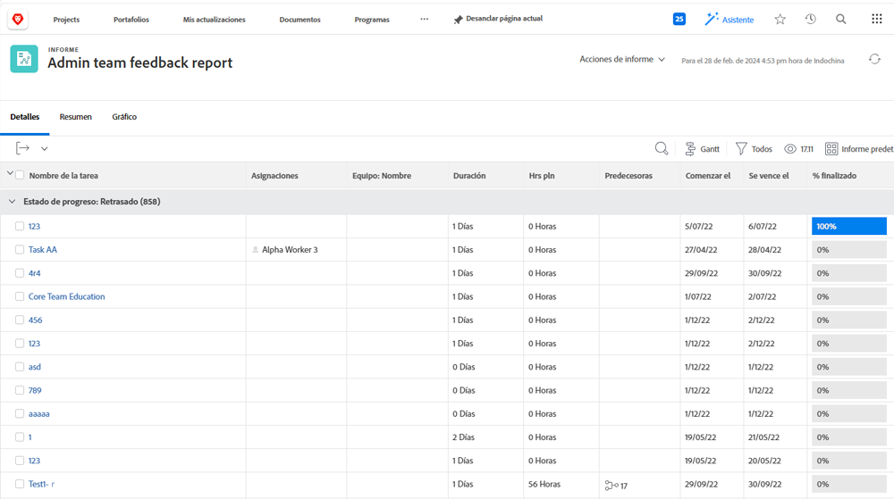
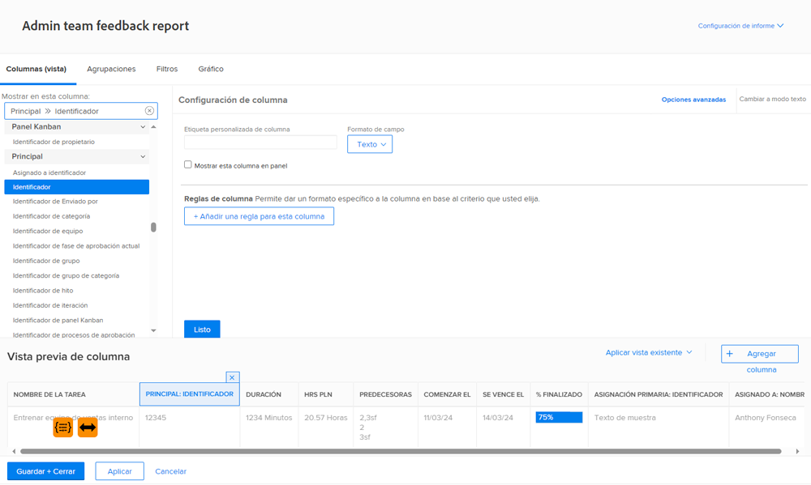
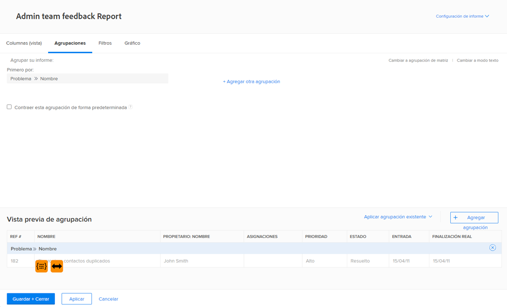
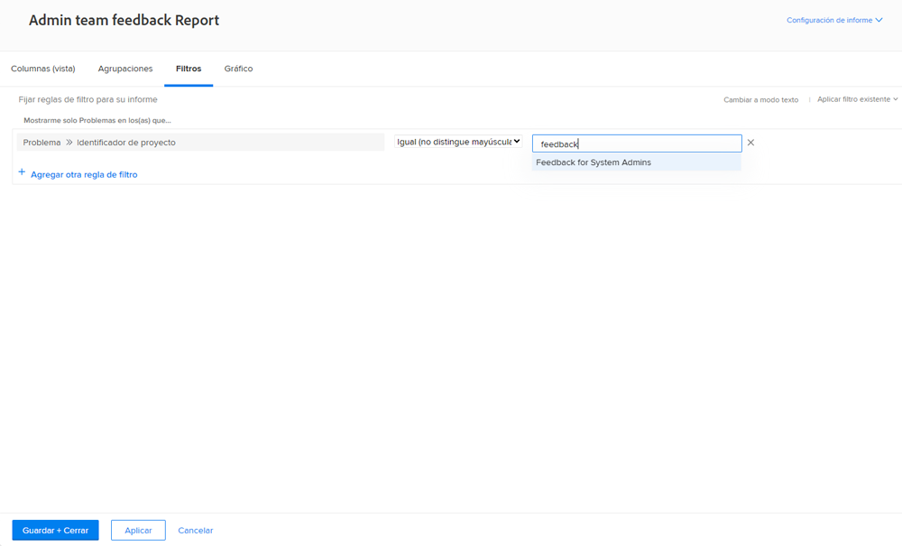

# Creación de un informe de tareas

El vídeo proporciona una guía paso a paso sobre la creación de un informe personalizado para realizar un seguimiento de las tareas atrasadas asignadas al usuario que ha iniciado sesión. Comienza explicando la necesidad de informes personalizados cuando los filtros, las vistas o los informes integrados existentes no cumplen con requisitos específicos. palo de golf El informe se denomina &quot;Tareas atrasadas asignadas a mí&quot; y se agrega una descripción para mayor claridad. palo de golf

El informe resultante ayuda a los usuarios a centrarse en tareas tardías, proporciona perspectivas sobre las dependencias y simplifica la navegación a los proyectos host. palo de golf

>[!VIDEO] (https://video.tv.adobe.com/v/3448345/?quality=12&learn=on&enablevpops=0&captions=spa

## Puntos clave

* **Creación de informes personalizados:** Cuando los filtros existentes y los informes integrados no satisfacen sus necesidades, puede crear un informe personalizado desde cero para centrarse en datos específicos, como las tareas tardías asignadas a usted. palo de golf
* **Configuración del filtro:** Use filtros para definir los criterios del informe, incluidas las tareas tardías, las tareas incompletas, los proyectos actuales y las tareas asignadas al usuario que ha iniciado sesión. palo de golf
* **Columnas para contexto:** Agregue columnas como &quot;Puede comenzar&quot; para identificar problemas de dependencia y &quot;Nombre de proyecto&quot; con hipervínculos para facilitar la navegación a proyectos relacionados. palo de golf
* **Orden de prioridad:** Ordene las tareas por la columna &quot;Vencimiento el&quot; en orden ascendente para priorizar las tareas más vencidas en la parte superior del informe. palo de golf
* **Accesibilidad:** Guarde el informe, ancle o márquelo como favorito para acceder rápidamente, lo que garantiza un seguimiento y una administración eficientes de las tareas tardías.

## Actividades &quot;Crear un informe de tareas&quot;

>[!TIP]
>
>Saque sus espátulas y los recipientes para mezclar y prepárese para probar las “recetas” en nuestro manual [Adobe Workfront Customer Reporting Cookbook](/help/assets/workfront-customer-reporting-cookbook.pdf). En el interior encontrará instrucciones paso a paso para 10 informes, listos para que pueda trabajar en su entorno hoy mismo.
>&#x200B;>Hemos recopilado los informes favoritos de los clientes y los hemos reunido en un libro de cocina fácil de digerir para que se lo lleve y lo pruebe en su propia cocina de Workfront.
>&#x200B;>Estos 10 informes proceden de clientes que son como usted. Repartidos por sectores, departamentos, equipos, cargos y todos en empresas diferentes, estamos muy agradecidos a los increíbles clientes que compartieron uno de sus informes favoritos. Algunos informes son simples (pero increíblemente útiles) y otros son más complejos para llevar los informes al siguiente nivel.

### Actividad 1: Creación de un informe de notas con instrucciones

Cree un informe de Notas que pueda usar para buscar notas del usuario (es decir, comentarios o actualizaciones) o notas del sistema basadas en el contenido, el autor, la fecha de entrada, el nombre del proyecto o el tipo de auditoría. Asigne al informe el nombre “Búsqueda de notas”.

Cuando se utiliza la instrucción Texto de nota, este informe buscará dentro de los hilos de actualización para extraer rápidamente cualquiera que cumpla los criterios especificados. Al ejecutar el informe, no es necesario rellenar todas las instrucciones, solo las que le interesen. Las que están en blanco se ignoran automáticamente.

La vista debe incluir columnas para lo siguiente:

* Texto de nota
* Auditar texto
* Fecha de entrada
* Propietario: Nombre
* Tipo de auditoría
* Nombre de la tarea
* Nombre del problema

Deje la pestaña Filtro en blanco.

Grupo en Nombre del proyecto.

Incluya instrucciones para lo siguiente:

* Auditar texto
* Texto de nota
* Nombre del propietario
* Fecha de entrada
* Nombre del proyecto
* Tipo de auditoría

### Respuesta 1

1. Seleccione **[!UICONTROL Informes]** desde el **[!UICONTROL Menú principal]**.
1. Haga clic en el menú **[!UICONTROL Nuevo informe]** y seleccione **[!UICONTROL Nota]**.
1. En **[!UICONTROL Columnas (Vista)]**, configure las columnas para incluir lo siguiente:

   

   * [!UICONTROL Nota] > [!UICONTROL Texto de nota]
   * [!UICONTROL Nota] > [!UICONTROL Texto de auditoría]
   * [!UICONTROL Nota] > [!UICONTROL Fecha de entrada]
   * [!UICONTROL Propietario] > [!UICONTROL Nombre]
   * [!UICONTROL Nota] > [!UICONTROL Tipo de auditoría]
   * [!UICONTROL Tarea] > [!UICONTROL Nombre]
   * [!UICONTROL Problema] > [!UICONTROL Nombre]

1. Seleccione la columna **[!UICONTROL Fecha de entrada]** y cambie a **[!UICONTROL Orden de bajada]**.
1. En la pestaña **[!UICONTROL Agrupaciones]**, configure el informe para agruparlo por [!UICONTROL Proyecto] > [!UICONTROL Nombre].

   

1. Deje [!UICONTROL Filtros] en blanco.
1. Abra **[!UICONTROL Configuración de los informes]** y asigne el nombre al informe “Búsqueda de notas”.
1. En el campo [!UICONTROL Descripción], escriba algo como “Buscar notas del sistema o del usuario según el tipo de auditoría seleccionado y otras instrucciones. Las notas del sistema aparecen en la columna Texto de auditoría y las del usuario aparecen en la columna Texto de nota”.

   

1. Seleccione la **[!UICONTROL pestaña Detalles]** para que se muestre cuando se cargue el informe.
1. Configure el informe para que muestre 200 elementos cuando se incluya en un tablero.
1. Haga clic en **[!UICONTROL Instrucciones del informe]** y añada lo siguiente:

   

   * [!UICONTROL Nota] > [!UICONTROL Texto de auditoría]
   * [!UICONTROL Nota] > [!UICONTROL Texto de nota]
   * [!UICONTROL Propietario] > [!UICONTROL Nombre]
   * [!UICONTROL Nota] > [!UICONTROL Fecha de entrada]
   * [!UICONTROL Proyecto] > [!UICONTROL Nombre]
   * [!UICONTROL Nota] > [!UICONTROL Tipo de auditoría]

1. Marque la casilla de verificación **[!UICONTROL Mostrar instrucciones en tableros]**.
1. Guarde y cierre el informe.

### Actividad 2: Crear un informe de comentarios del equipo de administración

Es un informe de problemas que muestra todos los problemas de una cola de solicitudes de comentarios creada para los administradores del sistema. Puede ver cómo crear esta cola de solicitudes en el tutorial [Creación de una cola de solicitudes de comentarios de administrador del sistema](https://experienceleague.adobe.com/docs/workfront-learn/tutorials-workfront/manage-work/request-queues/create-a-system-admin-feedback-request-queue.html?lang=es).

Este informe también utiliza un formulario personalizado. Para aprender a crear un formulario personalizado, consulte el tutorial [Crear y compartir un formulario personalizado](https://experienceleague.adobe.com/docs/workfront-learn/tutorials-workfront/custom-data/custom-forms/custom-forms-creating-and-sharing-a-custom-form.html?lang=es).

Este formulario personalizado debe utilizar los tipos de objeto Proyecto y Problema y debe crearse de la siguiente manera:

Nombre: Comentarios del proceso de administración

1. Tipo de proceso (campo desplegable de selección única)
   * niveles de acceso
   * proceso de aprobación (solo global)
   * notificaciones por correo electrónico
   * plantilla de diseño
   * ruta de hitos
   * plantilla de proyecto
   * notificaciones de recordatorio
   * cola de solicitudes
1. Nombre del proceso (campo de texto de una sola línea)
1. Grado de proceso (campo desplegable de selección única)
   * 1 - totalmente inútil
   * 2 - no es muy útil
   * 3 - bueno, pero podría ser mejor
   * 4 - excelente
1. Problema o buenas noticias (campo de texto de párrafo)

Cree un informe de problemas denominado **Informe de comentarios del equipo de administración**.

La vista debe contener las columnas siguientes:

* Problema: Nombre
* Contacto principal: Nombre
* Problema: Tipo de proceso
* Problema: Nombre del proceso
* Problema: Grado del proceso
* Problema: Problema o buenas noticias
* Problema: Fecha de entrada
* Problema: Edad
* Problema: Asignaciones
* Problema: Estado

Grupo en tipo de proyecto.

Filtre por el ID del proyecto de la cola de solicitudes donde residen los problemas de comentarios.

### Respuesta 2

1. Seleccione **[!UICONTROL Informes]** desde el **[!UICONTROL Menú principal]**.
1. Haga clic en el menú **[!UICONTROL Nuevo informe]** y seleccione **[!UICONTROL Problema]**.
1. En **[!UICONTROL Columnas (Vista)]**, configure las columnas para incluir lo siguiente:

   

   * [!UICONTROL Problema] > [!UICONTROL Nombre]
   * [!UICONTROL Contacto principal] > [!UICONTROL Nombre]
      * Nota: esto aparece con &quot;Propietario:Name&quot; como etiqueta de columna. Puede cambiarlo por “Notificado por” haciendo clic en Opciones avanzadas y escribiendo “Notificado por” en el campo **Etiqueta de columna personalizada**.
   * [!UICONTROL Problema] > [!UICONTROL Tipo de proceso]
   * [!UICONTROL Problema] > [!UICONTROL Nombre del proceso]
   * [!UICONTROL Problema] > [!UICONTROL Grado del proceso]
   * [!UICONTROL Problema] > [!UICONTROL Problema o buenas noticias]
   * [!UICONTROL Problema] > [!UICONTROL Fecha de entrada]
   * [!UICONTROL Problema] > [!UICONTROL Edad]
   * [!UICONTROL Problema] > [!UICONTROL Asignaciones]
   * [!UICONTROL Problema] > [!UICONTROL Estado]

1. Seleccione la columna **[!UICONTROL Fecha de entrada]** y cambie a **[!UICONTROL Orden de bajada]**.
1. En la pestaña **[!UICONTROL Agrupaciones]**, configure el informe para agruparlo por **[!UICONTROL Problema] > [!UICONTROL Tipo de proceso]**.

   

1. En la pestaña **[!UICONTROL Filtros]**, añada un filtro para que **[!UICONTROL Problema] > [!UICONTROL ID de proyecto]** sea igual al proyecto de la cola de solicitudes donde residen los problemas de comentarios.

   

1. Guarde y cierre el informe.
