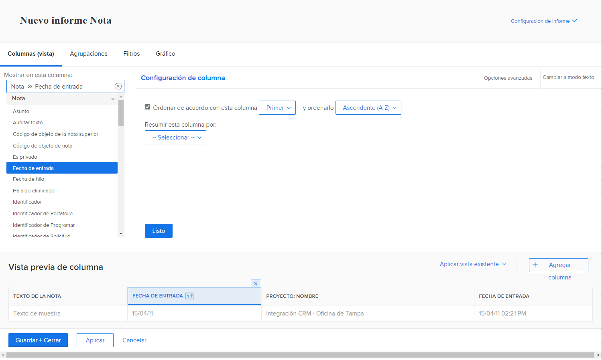
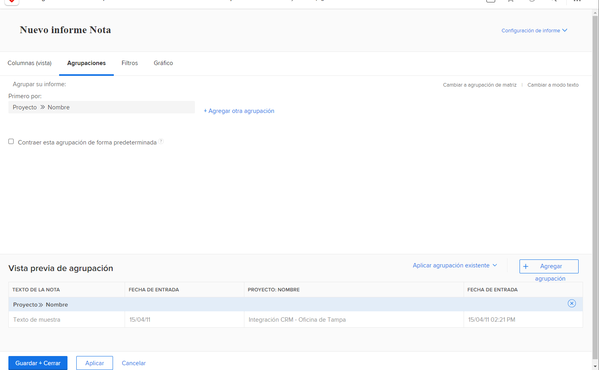
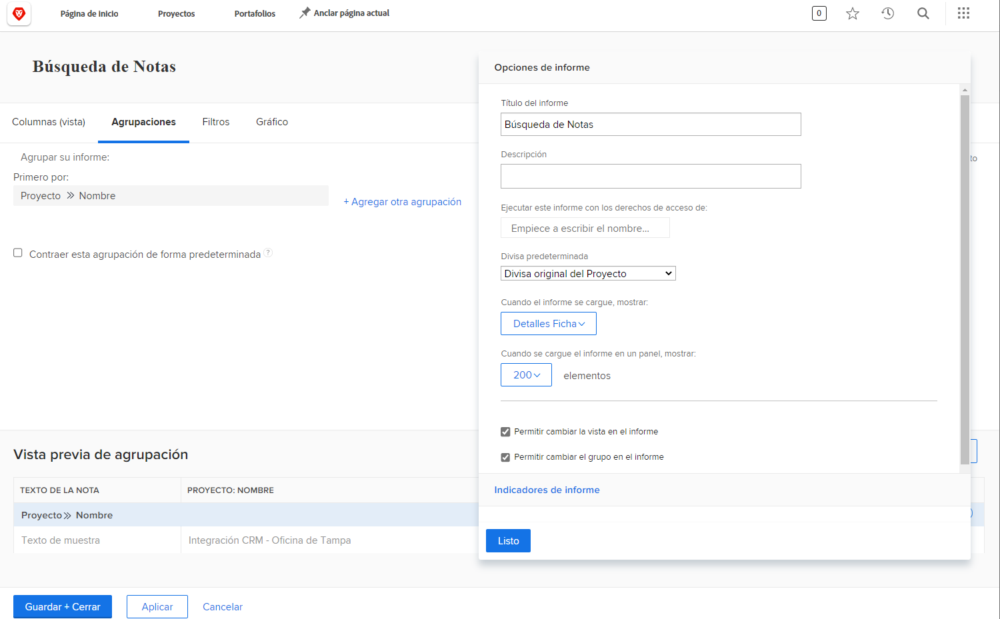
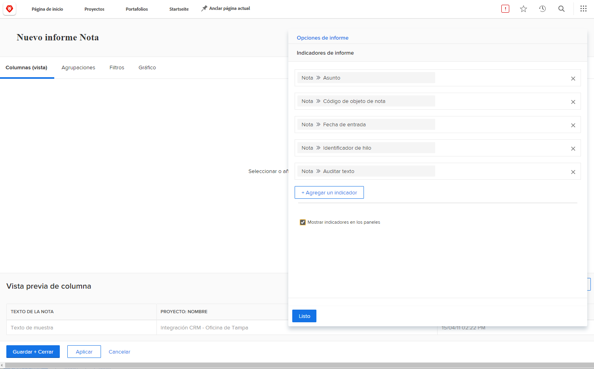

# Creación de un informe de tareas

En este vídeo, aprenderá:

* Creación de un informe de tareas con un filtro complejo
* Cómo encontrar los informes que crea

>[!VIDEO](https://video.tv.adobe.com/v/335154/?quality=12)

## Actividad: Creación de un informe de nota con mensajes

Cree un informe de Nota que puede usar para buscar notas del usuario (es decir, comentarios o actualizaciones) o notas del sistema basadas en el contenido de la nota, el autor, la fecha de entrada, el nombre del proyecto o el tipo de auditoría. Asigne al informe el nombre &quot;Búsqueda de notas&quot;.

Al utilizar el mensaje Texto de la nota , este informe buscará dentro de los subprocesos de actualización para extraer rápidamente cualquier elemento que cumpla los criterios especificados en los mensajes. Al ejecutar el informe, no es necesario rellenar todas las solicitudes, solo las que le interesen. Los que están en blanco se ignoran automáticamente.

La vista debe incluir columnas para:

* Texto de la nota
* Auditar texto
* Fecha de entrada
* Propietario: Nombre
* Tipo de auditoría
* Nombre de la tarea
* Nombre de problema

Deje la pestaña filter en blanco.

Grupo en nombre del proyecto.

Incluya las siguientes indicaciones:

* Auditar texto
* Texto de la nota
* Nombre del propietario
* Fecha de entrada
* Nombre del proyecto
* Tipo de auditoría

## Respuesta

1. Select **[!UICONTROL Informes]** de la variable **[!UICONTROL Menú principal]**.
1. Haga clic en el **[!UICONTROL Nuevo informe]** y seleccione **[!UICONTROL Nota]**.
1. En **[!UICONTROL Columnas (Vista)]** configure las columnas para incluir:

   

   * [!UICONTROL Nota] > [!UICONTROL Texto de la nota]
   * [!UICONTROL Nota] > [!UICONTROL Texto de auditoría]
   * [!UICONTROL Nota] > [!UICONTROL Fecha de entrada]
   * [!UICONTROL Propietario] > [!UICONTROL Nombre]
   * [!UICONTROL Nota] > [!UICONTROL Tipo de auditoría]
   * [!UICONTROL Tarea] > [!UICONTROL Nombre]
   * [!UICONTROL Problema] > [!UICONTROL Nombre]

1. Seleccione el **[!UICONTROL Fecha de entrada]** y cambie la **[!UICONTROL Ordenar a descendente]**.
1. En el **[!UICONTROL Agrupaciones]** , configure el informe para agruparlo por [!UICONTROL Proyecto] > [!UICONTROL Nombre].

   

1. Leave [!UICONTROL Filtros] en blanco.
1. Apertura **[!UICONTROL Configuración de informes]** y asigne al informe el nombre &quot;Búsqueda de notas&quot;.
1. En el [!UICONTROL Descripción] , escriba algo como &quot;Buscar notas del sistema o del usuario según el tipo de auditoría seleccionado y otras indicaciones. Las notas del sistema aparecen en la columna Texto de auditoría y las notas del usuario aparecen en la columna Texto de la nota.&quot;

   

1. Select **[!UICONTROL Ficha Detalles]** para que se muestre cuando se cargue el informe.
1. Configure el informe para que muestre 200 elementos cuando el informe se incluya en un tablero.
1. Haga clic en **[!UICONTROL Mensajes del informe]** y añada:

   

   * [!UICONTROL Nota] > [!UICONTROL Texto de auditoría]
   * [!UICONTROL Nota] > [!UICONTROL Texto de la nota]
   * [!UICONTROL Propietario] > [!UICONTROL Nombre]
   * [!UICONTROL Nota] > [!UICONTROL Fecha de entrada]
   * [!UICONTROL Proyecto] > [!UICONTROL Nombre]
   * [!UICONTROL Nota] > [!UICONTROL Tipo de auditoría]

1. Marque la casilla de verificación **[!UICONTROL Mostrar mensajes en tableros]**.
1. Guarde y cierre el informe.
