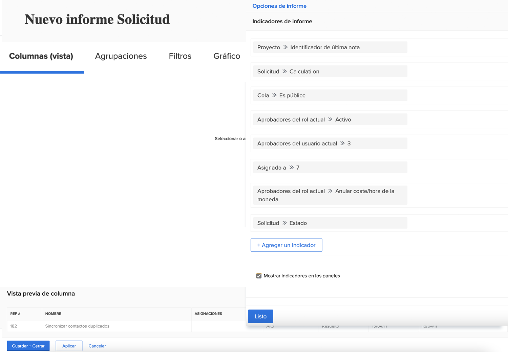
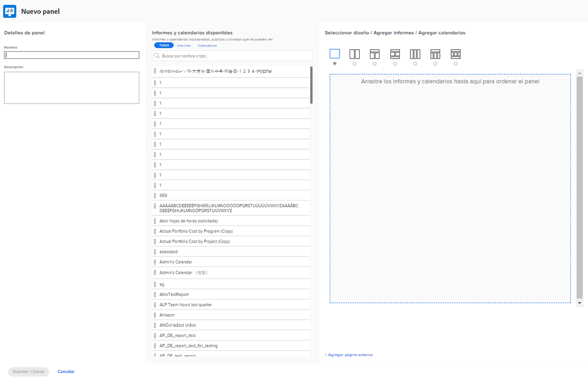
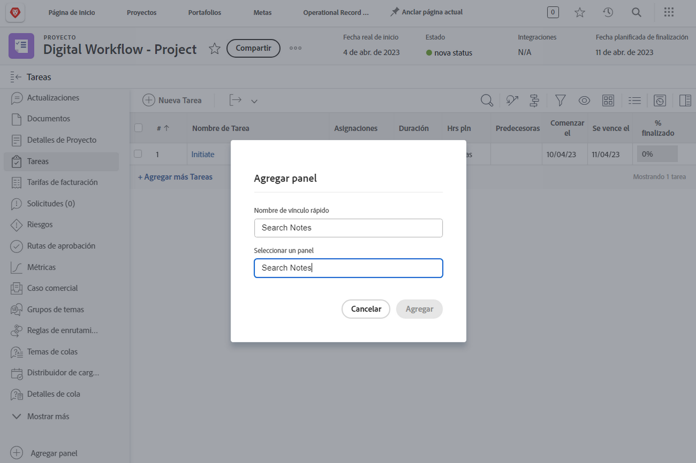

# Creación de paneles

El vídeo proporciona una guía completa para comprender y utilizar los paneles en Workfront.
palo de golfEn él se explica que un tablero es una colección de informes que permite a los usuarios organizar y mostrar los datos relacionados en un solo lugar.

>[!VIDEO](https://video.tv.adobe.com/v/335157/?quality=12&learn=on)

## Puntos clave

* **Paneles en Workfront:** Un panel es una colección de informes que permite a los usuarios organizar y mostrar datos relacionados, como proyectos, tareas y problemas, en una vista centralizada. palo de golf
* **Creación de paneles:** Los paneles se pueden personalizar seleccionando un diseño, agregando informes, calendarios personalizados o páginas externas y organizándolos para que tengan una visualización óptima. palo de golf Los usuarios también pueden personalizar qué columnas aparecen en informes en paralelo dentro del panel. palo de golf
* **Acceso a los paneles:** Los paneles se encuentran en &quot;Mis paneles&quot;, &quot;Paneles compartidos&quot; o &quot;Todos los paneles&quot; en el área de Paneles. palo de golf Los paneles que se utilizan con más frecuencia se pueden anclar o agregar a Favoritos para acceder rápidamente a ellos. palo de golf
* **Compartir tableros:** Los tableros se pueden compartir con otros usuarios de Workfront, incluidos todos los informes incluidos en el tablero, a través del menú &quot;Acciones de tablero&quot;. palo de golf
* **Impresión de paneles:** Los paneles se pueden imprimir directamente desde el menú &quot;Acciones de panel&quot;, lo que facilita el uso compartido de copias físicas de los datos. palo de golf

## Actividades &quot;Crear tablero&quot;

### Actividad 1: Crear un tablero

Crear un [!UICONTROL tablero] con un solo informe:&quot;Buscar notas en este proyecto&quot;. Esto es útil para encontrar rápidamente cualquier actualización realizada en un proyecto, incluso si hay miles de actualizaciones para buscar. Esto buscará en los subprocesos de actualización para extraer rápidamente cualquier actualización que cumpla los criterios especificados en los mensajes.

Cree este informe haciendo una copia del informe &quot;Notas de búsqueda&quot; que creó en la actividad &quot;Crear un informe de notas&quot;. ¿Aún no lo ha creado? Haga clic aquí para ver la actividad en el tutorial [Crear un informe de tareas](https://experienceleague.adobe.com/es/docs/workfront-learn/tutorials-workfront/reporting/basic-reporting/create-a-task-report#activity-1-create-a-note-report-with-prompts).

* Elimine el mensaje Nombre del proyecto de la copia y cambie el nombre del informe a &quot;Notas de búsqueda en este proyecto&quot;.
* Asigne un nombre al [!UICONTROL panel] &quot;Notas de búsqueda&quot;.
* Vaya a cualquier página de aterrizaje del proyecto y cree una sección personalizada para un [!UICONTROL panel].
* Tenga en cuenta que cuando busque notas en la sección personalizada, solo mostrará las notas contenidas en el proyecto en el que se encuentra actualmente.

### Respuesta 1

1. Ejecute el informe que ha creado en la actividad Crear un informe de notas. ¿Aún no lo ha creado? Haga clic aquí para ver la actividad en el tutorial [Crear un informe de tareas](https://experienceleague.adobe.com/es/docs/workfront-learn/tutorials-workfront/reporting/basic-reporting/create-a-task-report#activity-1-create-a-note-report-with-prompts).
1. Haga clic en **[!UICONTROL Acciones de informe]** y seleccione **[!UICONTROL Copiar]**. [!DNL Workfront] crea un nuevo informe denominado &quot;Búsqueda de notas (copia)&quot;.
1. Vaya a **[!UICONTROL Acciones de informe]** y seleccione **[!UICONTROL Editar]**. Haga clic en **[!UICONTROL Configuración de informes]** y cambie el nombre a &quot;Buscar notas en este proyecto&quot;.
1. Haga clic en [!UICONTROL Mensajes del informe] y elimine el mensaje [!UICONTROL Proyecto] > [!UICONTROL Nombre] de la lista.

   

1. Marque la casilla **[!UICONTROL Mostrar solicitudes en el panel]**.
1. Haga clic en **[!UICONTROL Listo]**, luego **[!UICONTROL Guardar + Cerrar]**. Ahora está viendo la pantalla [!UICONTROL Mensajes] del informe.

   A continuación, utilizará un acceso directo para crear un nuevo tablero y agregarle este informe.

1. Haga clic en **[!UICONTROL Acciones de informe]** y seleccione **[!UICONTROL Agregar al panel clásico]** > **[!UICONTROL Nuevo panel]**.
1. Arrastre el informe &quot;Notas de búsqueda en este proyecto&quot; al panel **[!UICONTROL Diseño]**.
1. Observe que el nombre del informe se convierte en el nombre del panel. Edite el nombre para que aparezca &quot;Notas de búsqueda&quot;.

   

1. Haga clic en **[!UICONTROL Guardar + Cerrar]**.

   Ahora, agregue el panel a una página de proyecto.

   

1. Vaya a cualquier proyecto. En el menú del panel izquierdo, haga clic en el botón **[!UICONTROL Agregar panel]**.
1. En el campo **[!UICONTROL Elegir un tablero]**, escriba &quot;Notas de búsqueda&quot; y seleccione [!UICONTROL tablero] de la lista.
1. En el campo **[!UICONTROL Nombre de vínculo rápido]**, escriba &quot;Notas de búsqueda&quot;.
1. Haga clic en **[!UICONTROL Add]**.
1. En el menú del panel izquierdo, busque Notas de búsqueda cerca de la parte inferior. Haga clic en los puntos a la izquierda del nombre y arrástrelo hacia arriba a la derecha debajo de Actualizaciones.
