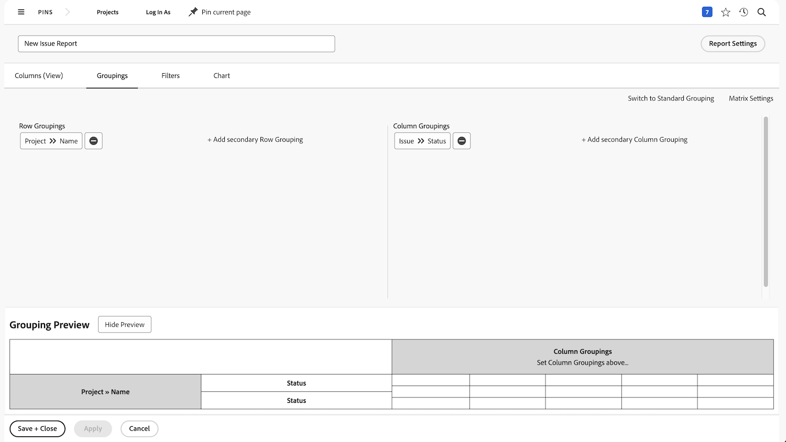

# Crear actividades de informe de matriz

Practique la creación de informes de matriz, con instrucciones paso a paso.

## Actividad 1: Crear un informe de matriz

Cree un informe de matriz que muestre cuántas solicitudes hay en cada estado, ordenadas por la cola de solicitudes. Esto le proporciona una instantánea rápida de la cantidad de trabajo que ingresa y de lo bien que lo está llevando.

Quiere que las colas de solicitudes aparezcan en las agrupaciones de filas. El estado aparece como las agrupaciones de columnas. Asigne un nombre al informe &quot;Solicitudes por estado y colas de solicitudes&quot;.

## Respuesta 1

1. Seleccione **[!UICONTROL Informes]** desde el **[!UICONTROL Menú principal]**.
1. Haga clic en la opción **[!UICONTROL Nuevo informe]** y seleccione **[!UICONTROL Problema]**.
1. Vaya a la pestaña **[!UICONTROL Agrupaciones]** y haga clic en **[!UICONTROL Cambiar a agrupación de matriz]**.
1. Para [!UICONTROL Agrupaciones de filas], seleccione **[!UICONTROL Proyecto]** > **[!UICONTROL Nombre]**.
1. Para [!UICONTROL Agrupación de columnas], seleccione **[!UICONTROL Problema]** > **[!UICONTROL Estado]**.

   

1. Vaya a la pestaña **[!UICONTROL Filtros]**.
1. Para asegurarse de que solo vea solicitudes en colas de solicitudes activas, añada las siguientes reglas de filtro:

   * [!UICONTROL Proyecto] > [!UICONTROL Estado es igual a] > [!UICONTROL Igual] > [!UICONTROL Actual]
   * [!UICONTROL Definición de cola] > [!UICONTROL Es pública] > [!UICONTROL No igual a] > [!UICONTROL Ninguna] (así sabemos que un proyecto es en realidad una cola de solicitudes, ya que la Definición de cola se asigna a una de las opciones públicas).

1. Haga clic en **[!UICONTROL Guardar + Cerrar]**. Cuando se le pida un nombre de informe, escriba &quot;Solicitudes por estado y Cola de solicitudes&quot;.

   
