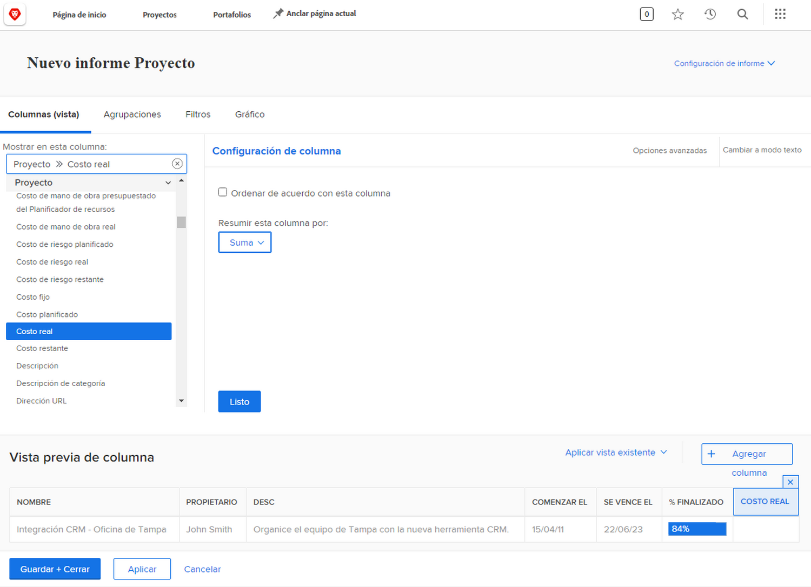
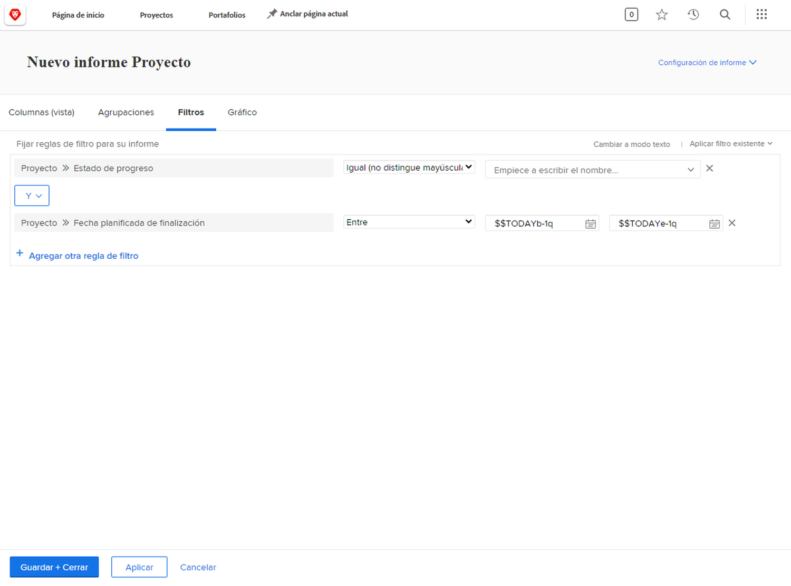
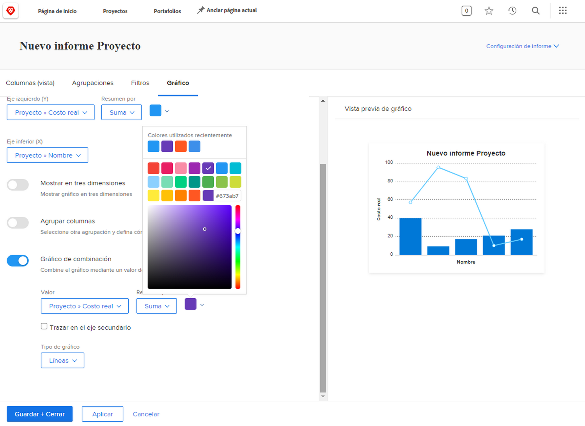

# Creación de informes con actividades de gráficos

Practique la creación de informes con gráficos, con instrucciones paso a paso.

## Actividad 1: Agregar un gráfico a un informe

Se acerca el final del trimestre y usted quiere ver cómo se han ajustado a sus presupuestos los proyectos finalizados recientemente. Cree un informe que muestre el coste planificado frente al coste real de los proyectos. Solo desea ver los proyectos completados en el último trimestre. Agregue un gráfico de columnas combinado con colores personalizados.

## Respuesta 1

1. Seleccione **[!UICONTROL Informes]** desde el **[!UICONTROL Menú principal]**.
1. Haga clic en el menú **[!UICONTROL Nuevo informe]** y seleccione **[!UICONTROL Proyecto]**.
1. En la pestaña **[!UICONTROL Columnas (Vista)]**, haga clic en **[!UICONTROL Agregar columna]**.
1. Seleccione [!UICONTROL Proyecto] > [!UICONTROL Coste planificado] y resuma esta columna mediante **[!UICONTROL Suma]**.
1. Haga clic en **[!UICONTROL Agregar columna]** de nuevo.
1. Seleccione [!UICONTROL Proyecto] > [!UICONTROL Coste real] y resuma esta columna mediante **[!UICONTROL Suma]**.

   

1. En la pestaña **[!UICONTROL Agrupaciones]**, configure el informe para agruparlo por [!UICONTROL Proyecto] > [!UICONTROL Nombre].

   

1. En la pestaña **[!UICONTROL Filtros]** agregue estas dos reglas de filtro:

   * [!UICONTROL Proyecto] > [!UICONTROL Estado equivale a] > [!UICONTROL Completar]
   * [!UICONTROL Proyecto] >[!UICONTROL  Fecha de finalización real] > [!UICONTROL Último trimestre]

   

1. En la pestaña **[!UICONTROL Gráfico]**, elija **[!UICONTROL Columna]** para el tipo de gráfico.
1. Para el [!UICONTROL Eje izquierdo (Y)], elija [!UICONTROL Proyecto] > [!UICONTROL Coste planificado].
1. Para el [!UICONTROL Eje inferior (X)], elija [!UICONTROL Proyecto] > [!UICONTROL Nombre].
1. Haga clic en el botón **[!UICONTROL Gráfico de combinación]** y seleccione [!UICONTROL Proyecto] > [!UICONTROL Coste real] en el campo **[!UICONTROL Valor]**.
1. Haga clic en la flecha situada junto a la casilla de color para cambiar el color del [!UICONTROL Coste real]. Seleccione uno de los colores que aparecen o haga clic en la casilla de la esquina inferior derecha para que aparezca la paleta de colores.
1. Haga clic en **[!UICONTROL Guardar + Cerrar]**. Cuando se le pida un nombre de informe, llámele &quot;Costo planificado contra costo real por proyecto completado el último trimestre&quot;.

   
