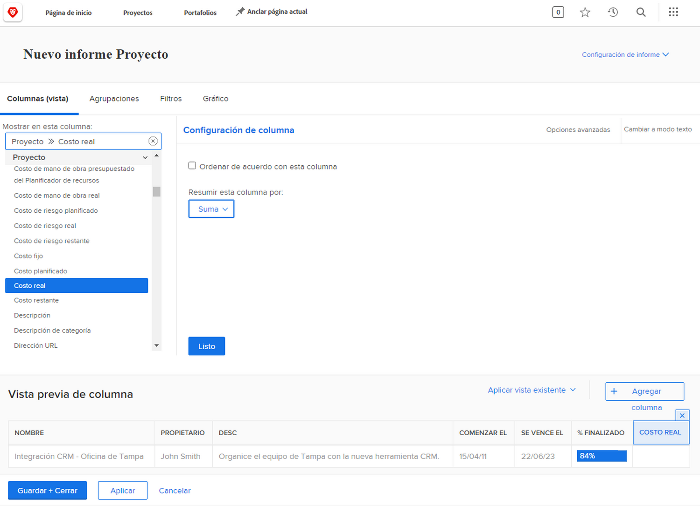
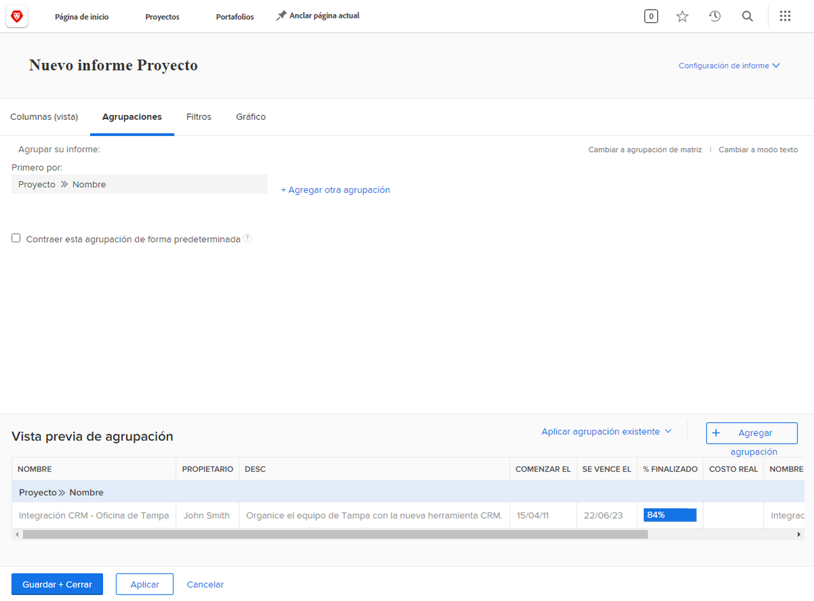
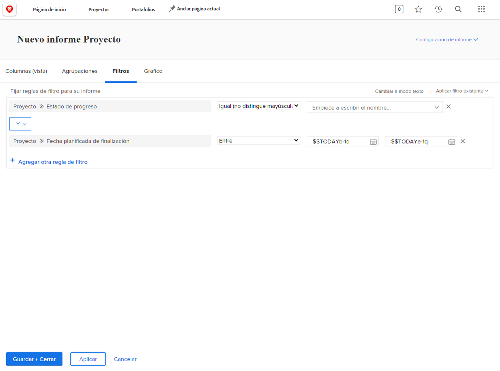
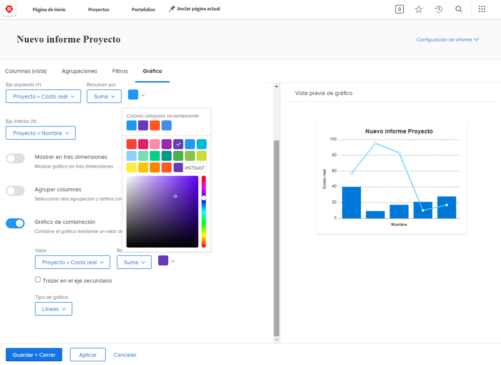

# Visualización de datos con gráficos en informes

En el vídeo se explica cómo utilizar gráficos para visualizar los datos de forma eficaz, especialmente para rastrear tareas de proyectos. Muestra la creación de dos tipos de informes en Workfront:

**Informe de tareas atrasadas por proyecto:**

* Comience con un informe de lista y aplique filtros para mostrar solo las tareas incompletas y tardías de los proyectos actuales. &#x200B;
* Agrupe las tareas por nombre de proyecto y cree un gráfico circular para visualizar la distribución de las tareas tardías entre los proyectos. &#x200B;
* Configure el gráfico como la pestaña predeterminada para facilitar el acceso. &#x200B;

**Informe de estado de tareas por proyecto y progreso:**

* Copie el primer informe y agregue otra agrupación para el estado del progreso de tareas.
* Elimine los filtros para incluir todas las tareas, mostrando su progreso durante la ejecución del proyecto.
* Utilice un gráfico de columnas apiladas para mostrar el número total de tareas por proyecto, con pilas que representan diferentes estados de progreso.
* Personalice los colores si es necesario y guarde el informe.

El vídeo resalta cómo los gráficos como los gráficos circulares y de columnas apiladas pueden proporcionar información sobre la distribución de tareas y el rendimiento del proyecto, lo que ayuda a los usuarios a comparar proyectos y comprender el progreso de las tareas visualmente. &#x200B;

>[!VIDEO](https://video.tv.adobe.com/v/335155/?quality=12&learn=on&enablevpops=0)

## Principales conclusiones

* **Los gráficos mejoran la claridad de los datos**: la visualización de datos con gráficos, como gráficos circulares o de columnas, facilita la comprensión de la distribución de tareas y el progreso del proyecto en comparación con los informes de lista. &#x200B;
* **Filtrado para datos específicos**: la aplicación de filtros (por ejemplo, tareas incompletas o tardías en proyectos actuales) ayuda a centrarse en datos relevantes para el análisis segmentado. &#x200B;
* **Agrupación para una mejor organización**: Agrupar tareas por nombre de proyecto o estado de progreso organiza los datos de forma eficaz, lo que permite realizar comparaciones significativas entre proyectos. &#x200B;
* **Opciones de personalización de gráficos**: los usuarios pueden seleccionar tipos de gráficos (por ejemplo, circulares, columnas o barras) y personalizar colores para alinearlos con las preferencias o la marca. &#x200B;
* **Gráficos de columnas apiladas para obtener información detallada**: los gráficos de columnas apiladas proporcionan una vista completa del progreso de las tareas dentro de los proyectos, mostrando tanto las tareas totales como sus estados en una sola visualización.

## Actividades &quot;Crear informes con gráficos&quot;

### Actividad 1: Agregar un gráfico a un informe

Se acerca el final del trimestre y usted quiere ver cómo se han ajustado a sus presupuestos los proyectos finalizados recientemente. Cree un informe que muestre el coste planificado frente al coste real de los proyectos. Solo desea ver los proyectos completados en el último trimestre. Agregue un gráfico de columnas combinado con colores personalizados.

### Respuesta 1

1. Seleccione **[!UICONTROL Informes]** desde el **[!UICONTROL Menú principal]**.
1. Haga clic en el menú **[!UICONTROL Nuevo informe]** y seleccione **[!UICONTROL Proyecto]**.
1. En la pestaña **[!UICONTROL Columnas (Vista)]**, haga clic en **[!UICONTROL Agregar columna]**.
1. Seleccione [!UICONTROL Proyecto] > [!UICONTROL Coste planificado] y resuma esta columna mediante **[!UICONTROL Suma]**.
1. Haga clic en **[!UICONTROL Agregar columna]** de nuevo.
1. Seleccione [!UICONTROL Proyecto] > [!UICONTROL Coste real] y resuma esta columna mediante **[!UICONTROL Suma]**.

   

1. En la pestaña **[!UICONTROL Agrupaciones]**, configure el informe para agruparlo por [!UICONTROL Proyecto] > [!UICONTROL Nombre].

   

1. En la pestaña **[!UICONTROL Filtros]** agregue estas dos reglas de filtro:

   * [!UICONTROL Proyecto] > [!UICONTROL Estado equivale a] > [!UICONTROL Completar]
   * [!UICONTROL Proyecto] >[!UICONTROL  Fecha de finalización real] > [!UICONTROL Último trimestre]

   

1. En la pestaña **[!UICONTROL Gráfico]**, elija **[!UICONTROL Columna]** para el tipo de gráfico.
1. Para el [!UICONTROL Eje izquierdo (Y)], elija [!UICONTROL Costo planificado].
1. Para el [!UICONTROL Eje inferior (X)], elija [!UICONTROL Nombre].
1. Haga clic en el botón **[!UICONTROL Gráfico combinado]** y seleccione [!UICONTROL Costo real] en el campo **[!UICONTROL Valor]**.
1. En el campo **[!UICONTROL Tipo de gráfico]**, seleccione Línea.
1. Haga clic en el cuadro de color para cambiar el color de [!UICONTROL Costo real]. Seleccione un color.
1. Haga clic en **[!UICONTROL Guardar + Cerrar]**. Cuando se le pida un nombre de informe, llámele &quot;Costo planificado contra costo real por proyecto completado el último trimestre&quot;.

   
