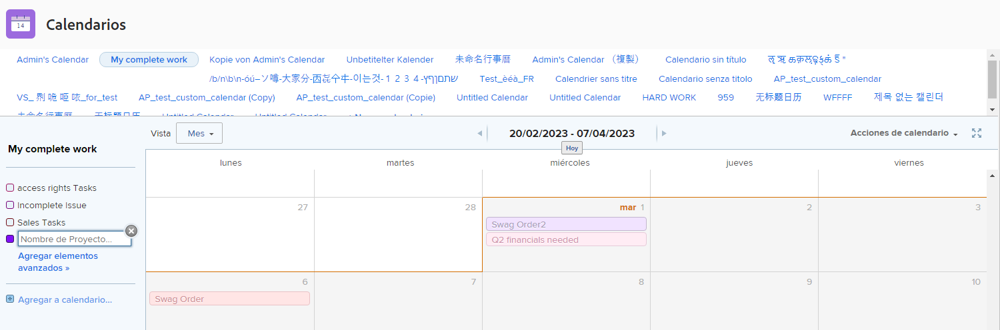
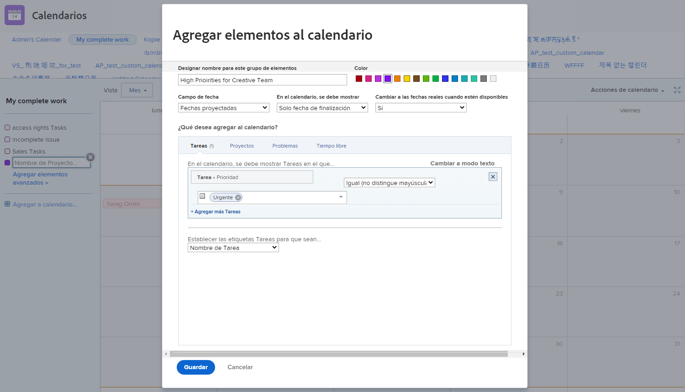
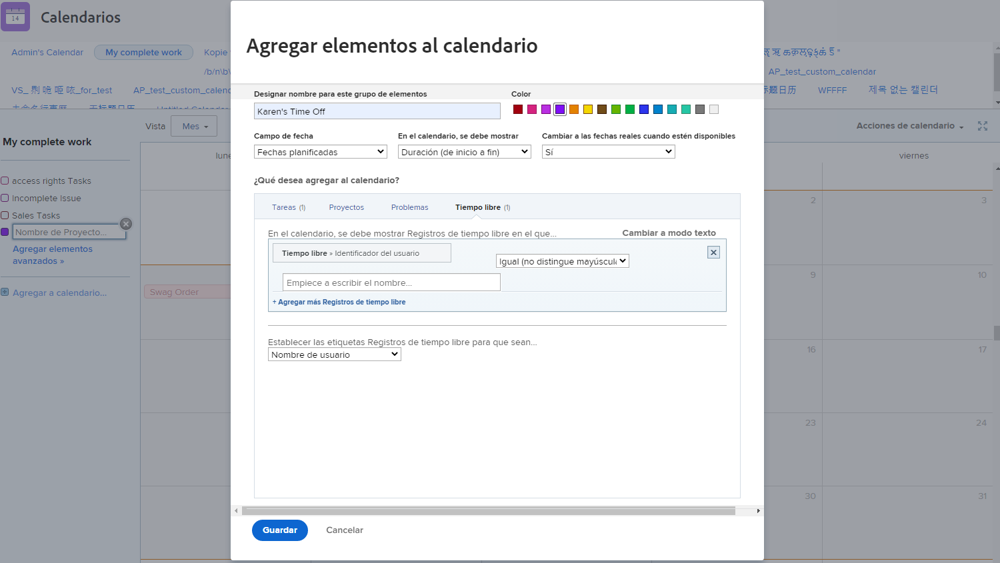

# Crear un calendario personalizado

En esta sección aprenderá a:

* Crear un calendario nuevo
* Crear una agrupación de calendario
* Agregar elementos de trabajo a la agrupación de calendario
* Crear una hora del calendario

Así es como crear su propio calendario personalizado.

## En primer lugar, agregue un nuevo calendario

1. En el **[!UICONTROL Menú principal]**, seleccione **[!UICONTROL Calendarios]** .
1. Haga clic en el **[!UICONTROL Nuevo calendario]** .
1. Escriba un nombre para el calendario y pulse **[!UICONTROL Devuelve]**.

## Segundo, agregue una agrupación de calendario

1. Para mostrar los elementos relacionados con un proyecto específico, introduzca el nombre del proyecto en el [!UICONTROL agrupación] (muestra todas las tareas relacionadas con ese proyecto).
1. O haga clic en el botón **[!UICONTROL Agregar elementos avanzados]** para incluir elementos de trabajo de varios proyectos del sistema.

## En tercer lugar, agregue elementos de trabajo a la agrupación de calendario

1. Asigne un nombre a la agrupación para que refleje lo que se va a mostrar.
1. Seleccione una designación de color para el grupo.
1. Seleccione el tipo de fecha que desea utilizar.[!UICONTROL Fechas previstas], [!UICONTROL Fechas planificadas]o [!UICONTROL Personalizado]. ([!UICONTROL Personalizado] las fechas son campos de fecha incluidos en [!UICONTROL formularios personalizados].)
1. Seleccione las fechas que se mostrarán en el calendario:[!UICONTROL Solo fecha final], [!UICONTROL Solo fecha de inicio]o [!UICONTROL Duración (de inicio a fin)].
1. Si desea mostrar [!UICONTROL Fechas reales] cuando esa información esté disponible, seleccione Yes en el menú . Seleccione No si siempre desea el tipo de fecha seleccionado ([!UICONTROL Proyectado], [!UICONTROL Planificado]o [!UICONTROL Personalizado]) para mostrar.
1. Seleccione el tipo de información del elemento que desee ver en el calendario—[!UICONTROL Tareas], [!UICONTROL Proyectos], [!UICONTROL Problemas]o [!UICONTROL Tiempo desactivado].
1. Configure los filtros para mostrar la información deseada.
1. Haga clic en **[!UICONTROL Guardar]**.

>[!NOTE]
>
>Se pueden agregar agrupaciones adicionales a un calendario existente mediante la opción Agregar a calendario .

## Crear un calendario que muestre el tiempo de espera personal

[!DNL Workfront] proporciona una forma de especificar el tiempo de espera con la función de tiempo de espera personal en su perfil de usuario. Esto advierte a los administradores de proyectos de que no está disponible y permite que las fechas de finalización planificadas se ajusten automática o manualmente, según sea necesario.

En el área Calendario, puede crear una vista de calendario que muestre estos tiempos de espera.

Para crear un calendario para una persona en particular:

1. Haga clic en **[!UICONTROL Agregar al calendario]** en el panel izquierdo.
1. Haga clic en **[!UICONTROL Agregar elementos avanzados]**.
1. Asigne un nombre a la agrupación para que refleje lo que se va a mostrar.
1. Seleccione una designación de color para la agrupación.
1. Configure las variables [!UICONTROL Campo de fecha] a [!UICONTROL Fechas planificadas].
1. Seleccione las fechas que se mostrarán en el calendario:[!UICONTROL Duración].
1. Ignore cómo se mostrará la información si las fechas reales no están disponibles. Esto no se aplica.
1. Select [!UICONTROL Tiempo desactivado] para el tipo de información que desea ver.
1. Para el filtro, establezca el ID de usuario en el nombre del miembro del equipo.
1. Haga clic en **[!UICONTROL Guardar]**.

