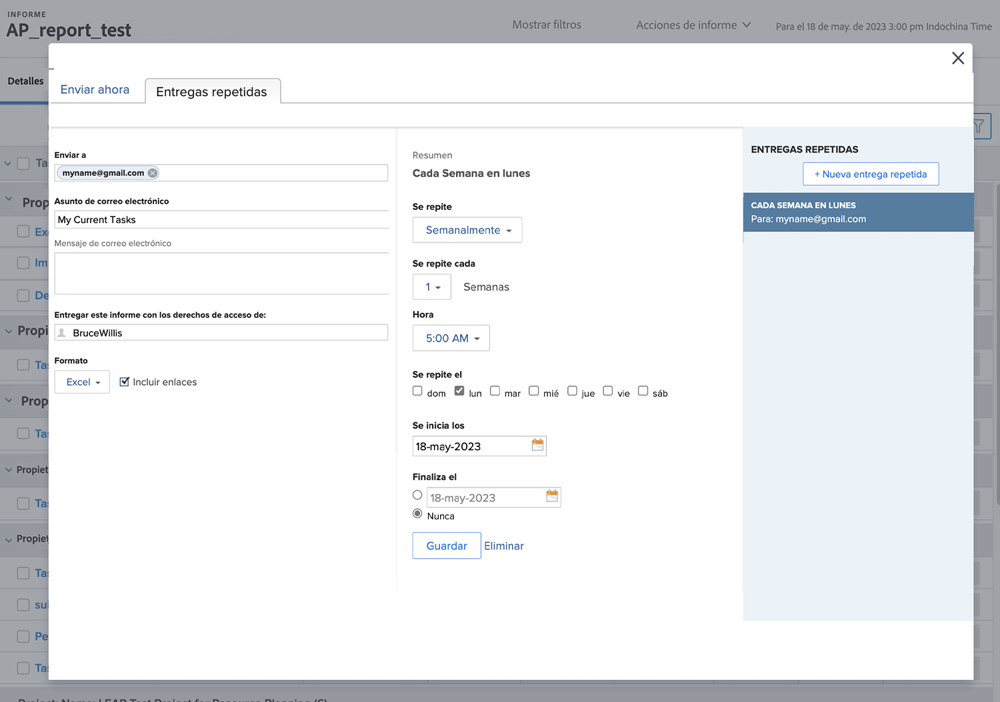

# Enviar y compartir informes

Este vídeo contiene información sobre:

* Envío de informes a usuarios, equipos o cualquier dirección de correo electrónico
* Cómo compartir informes con cualquier persona
* Qué pueden ver y hacer los destinatarios con un informe de Workfront

>[!VIDEO](https://video.tv.adobe.com/v/3447815/?quality=12&learn=on&captions=spa)

## Actividades de &quot;Envío y uso compartido de informes&quot;

### Actividad 1: Envío de un informe

Envíese un informe todos los lunes a las 5 a. m. como hoja de cálculo de Excel. Esta es una buena forma de recopilar automáticamente informes semanales que más adelante podrá utilizar para ver las tendencias.

### Respuesta 1

1. Vea cualquier informe que haya creado y elija **[!UICONTROL Enviar informe]** del menú **[!UICONTROL Acciones de informe]**.
1. Haga clic en la pestaña **[!UICONTROL Envíos repetitivos]**.
1. Escriba su dirección de correo electrónico en el campo **[!UICONTROL Enviar a]**.
1. Proporcione un asunto de correo electrónico.
1. Cambie el formato a Excel.
1. Establezca **[!UICONTROL Repeticiones]** a [!UICONTROL Semanalmente].
1. Configure la [!UICONTROL Hora] a las 5 a. m.
1. Establezca [!UICONTROL Se repite el] en lunes.
1. Haga clic en **[!UICONTROL Guardar]**.

>[!NOTE]
>
>Observe el nuevo Envío repetitivo en el panel [!UICONTROL Repetición de envíos], a la derecha. Puede configurar varias entregas para un informe y todas aparecen aquí.

**ELIMINACIÓN DE UN ENVÍO**

Seleccione el envío que acaba de crear y haga clic en Eliminar (junto al botón **[!UICONTROL Guardar]**).
