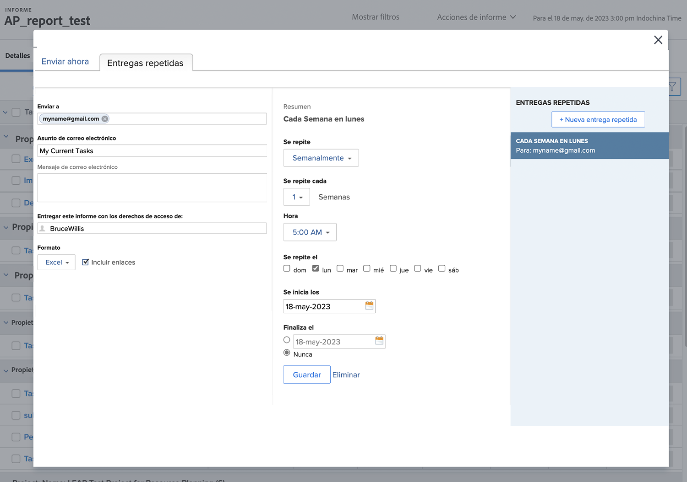

# Envíe y comparta informes de forma eficaz

Este vídeo contiene información sobre:

* Envío de informes a usuarios, equipos o cualquier dirección de correo electrónico
* Cómo compartir informes con cualquier persona
* Qué pueden ver y hacer los destinatarios con un informe de Workfront

>[!VIDEO](https://video.tv.adobe.com/v/335158/?quality=12&learn=on&enablevpops=0)

## Principales conclusiones

* **Envío de informes a usuarios externos:** Puede enviar informes a usuarios que no sean de Workfront introduciendo sus direcciones de correo electrónico, lo que facilita el uso compartido de datos fuera de su organización. &#x200B;
* **Visibilidad del control de derechos de acceso:** La vista del destinatario del informe depende de los derechos de acceso que establezca, lo que garantiza la seguridad de los datos y la visibilidad adecuada. &#x200B;
* **Entrega repetida para instantáneas:** Las entregas programadas proporcionan instantáneas inmovilizadas de datos en momentos específicos, útiles para rastrear tendencias y mantener un historial de datos de proyecto. &#x200B;
* **Compartir informes con equipos:** los informes se pueden compartir con personas, equipos o roles de trabajo, lo que otorga derechos de visualización o administración. Los informes compartidos aparecen en la sección Usuarios &quot;Compartidos conmigo&quot;. &#x200B;
* **Uso compartido público y en todo el sistema:** los informes se pueden compartir mediante vínculos públicos para usuarios externos o hacerse visibles en todo el sistema para todos los usuarios de Workfront, lo que ofrece flexibilidad para compartir datos.

## Actividades de &quot;Envío y uso compartido de informes&quot;

### Actividad 1: Envío de un informe

Envíese un informe todos los lunes a las 5 a. m. como hoja de cálculo de Excel. Esta es una buena forma de recopilar automáticamente informes semanales que más adelante podrá utilizar para ver las tendencias.

### Respuesta 1

1. Vea cualquier informe que haya creado y elija **[!UICONTROL Enviar informe]** del menú **[!UICONTROL Acciones de informe]**.
1. Haga clic en la pestaña **[!UICONTROL Envíos repetitivos]**.
1. Escriba su dirección de correo electrónico en el campo **[!UICONTROL Enviar a]**.
1. Proporcione un asunto de correo electrónico.
1. Cambie el formato a Excel.
1. Establezca **[!UICONTROL Repeticiones]** a [!UICONTROL Semanalmente].
1. Configure la [!UICONTROL Hora] a las 5 a. m.
1. Establezca [!UICONTROL Se repite el] en lunes.
1. Haga clic en **[!UICONTROL Guardar]**.

>[!NOTE]
>
>Observe el nuevo Envío repetitivo en el panel [!UICONTROL Repetición de envíos], a la derecha. Puede configurar varias entregas para un informe y todas aparecen aquí.

**ELIMINACIÓN DE UN ENVÍO**

Seleccione el envío que acaba de crear y haga clic en Eliminar (junto al botón **[!UICONTROL Guardar]**).
