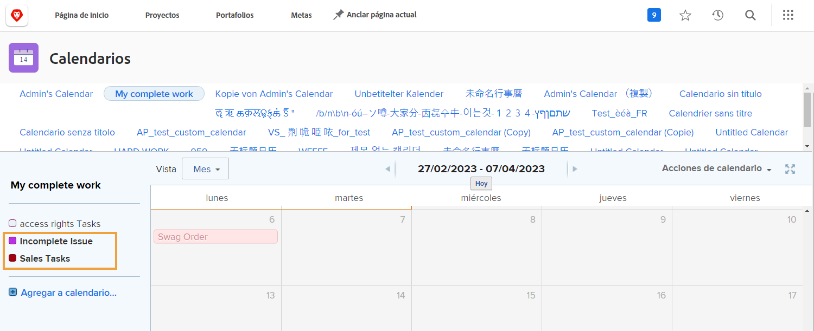
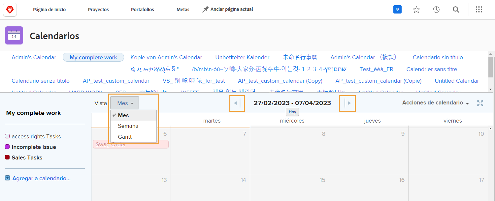
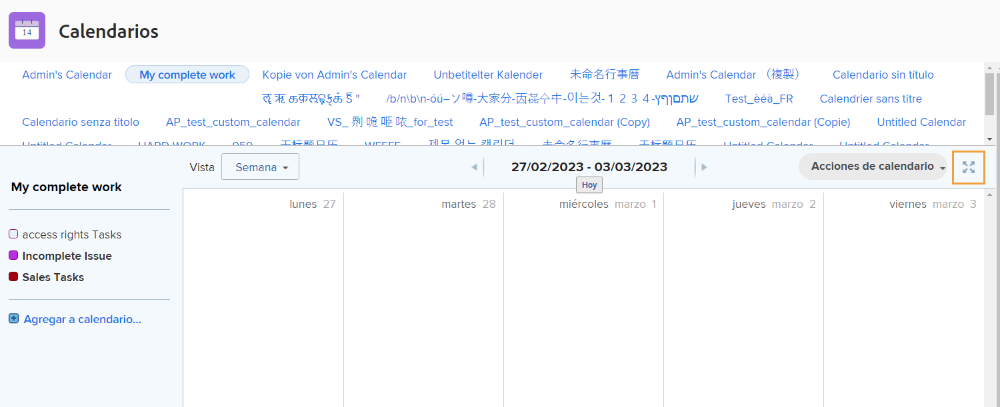
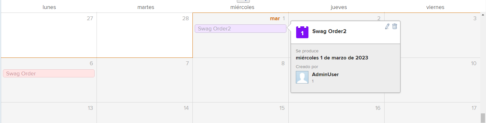
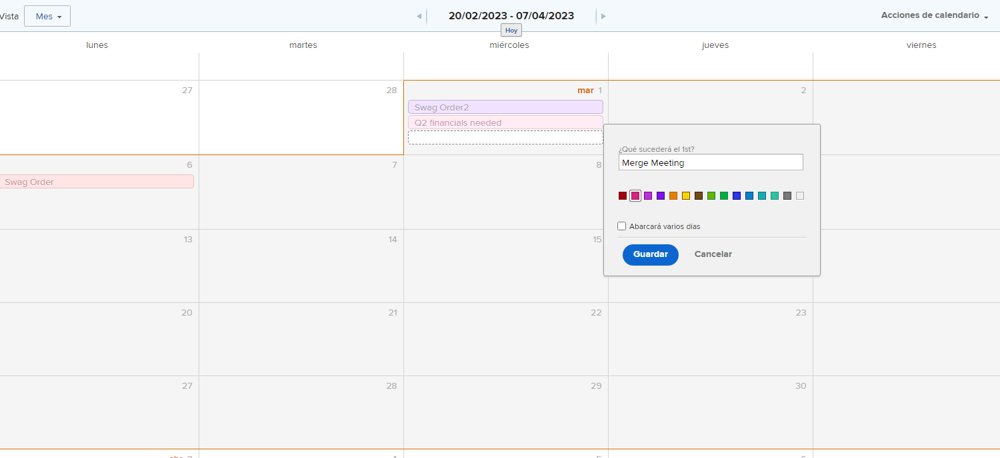

# Explicación de la interfaz del calendario

En esta sección aprenderá sobre:

* Agrupaciones de calendario
* Vistas del calendario
* Menú Acciones del calendario
* Y cómo crear un elemento de calendario ad-hoc

Antes de crear sus propios calendarios personalizados, vamos a observar las funciones básicas disponibles en los calendarios personalizados.

## Agrupaciones de calendario

Un solo calendario se puede organizar en diferentes grupos de elementos de trabajo. Cada grupo se puede activar y desactivar, lo que permite a los usuarios centrarse en los elementos de trabajo que más importan en cualquier momento.

## Vistas del calendario

El calendario se puede mostrar en mes, semana o [!UICONTROL Gantt] formato. Utilice la barra de desplazamiento del lateral o las flechas de la parte superior para desplazarse por el calendario. La variable [!UICONTROL Gantt] view permite ver el trabajo desde una perspectiva diferente. Encuentre la vista que mejor se adapte a sus necesidades.

![Una imagen de la pantalla del calendario en la [!UICONTROL Gantt] ver](assets/calendar-1-1bb.png)

## [!UICONTROL Acciones de calendario] menú

Al igual que otros elementos de trabajo, los calendarios tienen un [!UICONTROL Acciones] , lo que le permite ver los fines de semana de un calendario; eliminar o copiar un calendario; compartir un calendario con usuarios individuales de Workfront, usuarios de todo el sistema o usuarios externos; y añada el calendario a su [!UICONTROL Favoritos] para abrir el Navegador.

![Una imagen del [!UICONTROL Acciones de calendario] pantalla](assets/calendar-1-1c.png)

## Modo de pantalla completa

Para ver el calendario en modo de pantalla completa, haga clic en el icono de pantalla completa . Haga clic de nuevo para volver al tamaño original.

## Información de resumen

Seleccione un elemento del calendario para mostrar los detalles de resumen de ese elemento, como nombre, proyecto de origen, estado, asignación, estado de progreso y fecha de vencimiento.

## Eventos específicos

Haga doble clic para crear eventos ad hoc en un calendario que represente la programación u otros elementos de trabajo.

>[!NOTE]
>
>La creación de un evento ad hoc NO crea una tarea en Workfront.

