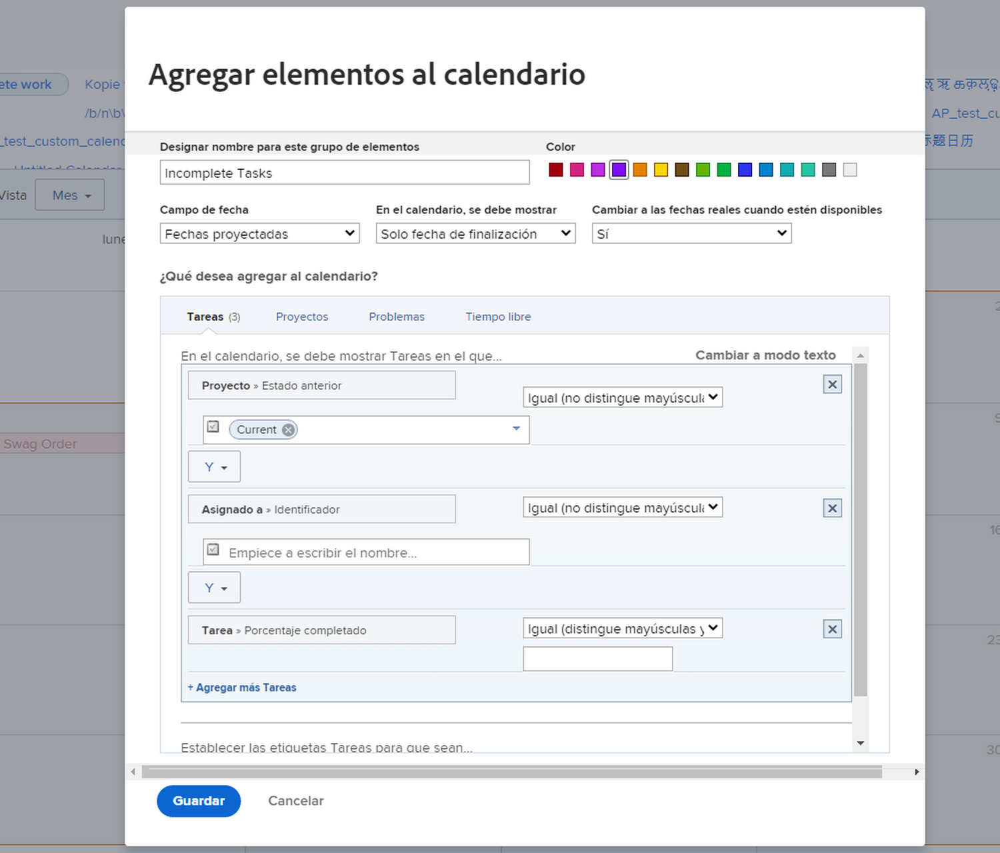
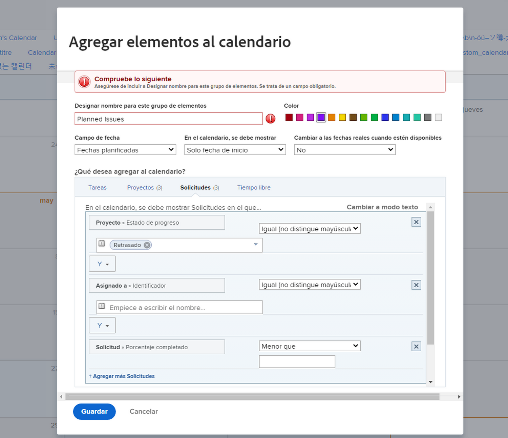
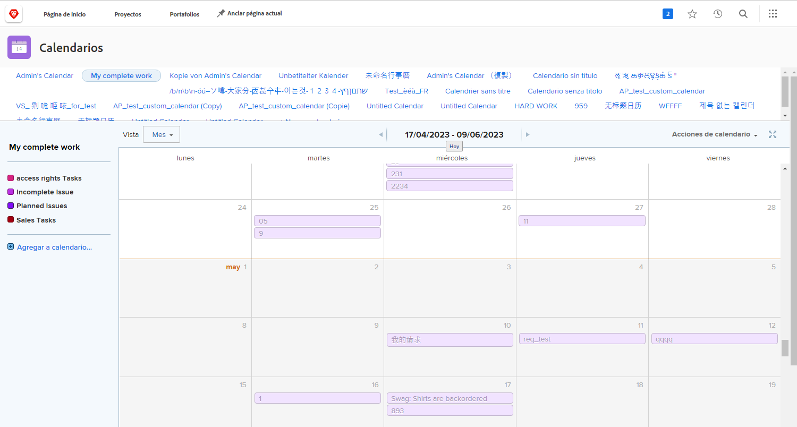

# Su turno para crear un calendario informe

En esta actividad adquirirá experiencia práctica elaborando su propio calendario.

## Actividad: elaborar un calendario

Cree un calendario de clientes llamado &quot;Mi trabajo incompleto&quot;.

Incluya un grupo de calendario llamado &quot;Tareas incompletas&quot; que muestre todas las tareas incompletas que se le han asignado en Proyectos actuales.

Seleccione el color rojo para estos elementos.

Incluya otro grupo de calendario llamado &quot;Problemas incompletos&quot; que muestre todos los problemas incompletos asignados a usted en Proyectos actuales. Seleccione el color azul para estos elementos.

## Respuesta

1. Vaya al área Calendarios en el menú principal.
1. Haga clic en el botón Nuevo calendario y asigne al calendario el nombre &quot;Mi trabajo incompleto&quot;.
1. En la primera agrupación, haga clic en Agregar elementos avanzados.
1. En la ventana Agregar elementos al calendario que aparece, asigne un nombre al grupo &quot;Tareas incompletas&quot;.
1. Seleccione rojo como color.
1. Cambie el campo Fecha a Fechas planificadas.
1. Establezca En el calendario, el campo Mostrar en Solo fecha de finalización.
1. Establezca el campo Cambiar a fechas reales cuando estén disponibles en No.

   

1. En la sección ¿Qué desea agregar al calendario?, seleccione Tareas.
1. Agregue tres reglas de filtro:

   * Proyecto > Estado Es Igual A > Igual > Actual
   * Usuarios de la asignación > ID > Igual > $$USER.ID
   * Tarea > Completada > Igual > Falso

1. Haga clic en Guardar.

   

1. Cree una segunda agrupación haciendo clic en Agregar al calendario.
1. En esta agrupación, haga clic en Agregar elementos avanzados.
1. En la ventana Agregar elementos al calendario que aparece, asigne un nombre al grupo &quot;Problemas incompletos&quot;.
1. Seleccione azul como color.
1. Cambie el campo Fecha a Fechas planificadas.
1. Establezca En el calendario, el campo Mostrar en Solo fecha de finalización.
1. Establezca el campo Cambiar a fechas reales cuando estén disponibles en No.
1. En la sección ¿Qué desea agregar al calendario?, , seleccione Problemas.
1. Agregue las tres reglas de filtro siguientes:

   * Proyecto > Estado Es Igual A > Igual > Actual
   * Usuarios de la asignación > ID > Igual > $$USER.ID
   * Problema > Completado > Igual > Falso

1. Haga clic en Guardar.

   

Como ha utilizado $$USER.ID en los filtros, puede compartir este calendario con otros y verán sus propias tareas y problemas incompletos.
