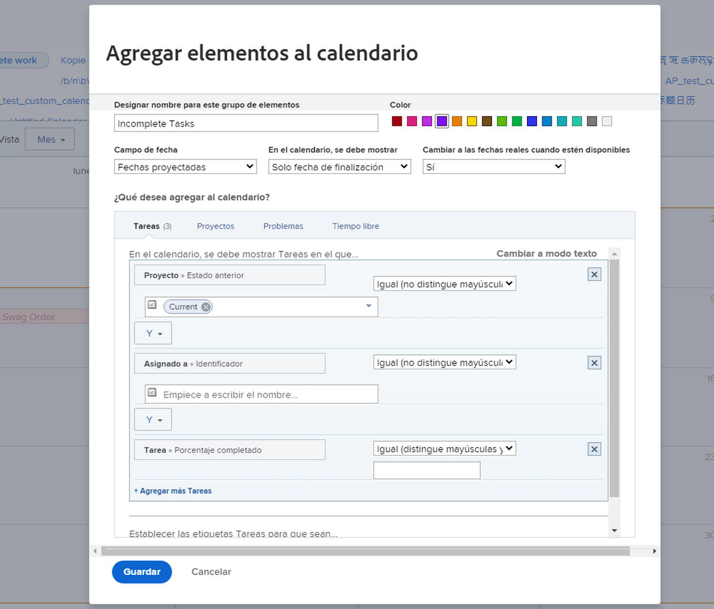
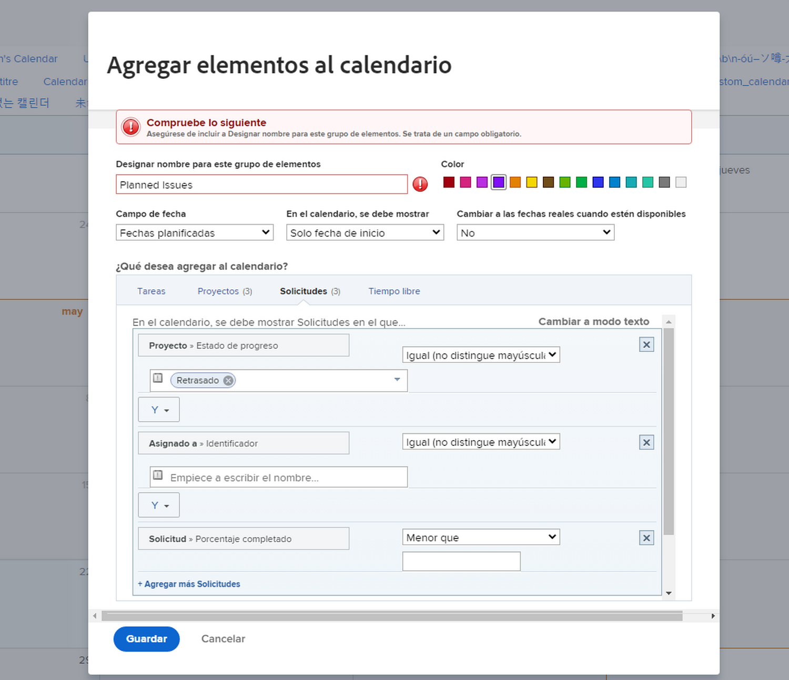

# Actividad: crear un informe de calendario

Confeccione un calendario de clientes llamado “Mi trabajo incompleto”.

Incluya un grupo de calendario llamado “Tareas incompletas” que muestre todas las tareas incompletas asignadas que tiene asignadas en Proyectos actuales.

Seleccione el color rojo para estos elementos.

Incluya otro grupo de calendario llamado “Problemas incompletos” que muestre todos los problemas incompletos que tiene asignados en Proyectos actuales. Seleccione el color azul para estos elementos.

## Respuesta

1. Vaya al área Calendarios en el menú principal.
1. Haga clic en el botón Nuevo calendario y llame al calendario “Mi trabajo incompleto”.
1. Haga clic en el botón Agregar al calendario y, a continuación, en Agregar elementos avanzados.
1. En la ventana emergente Agregar elementos al calendario, nombre el grupo “Tareas incompletas”.
1. Seleccione rojo como color.
1. Cambie el campo Fecha a Fechas planificadas.
1. Establezca En el calendario, el campo Mostrar en Solo fecha de finalización.
1. Establezca el campo Cambiar a fechas reales cuando estén disponibles en No.
1. En la sección ¿Qué desea agregar al calendario?, , seleccione Tareas. A continuación, haga clic en el botón Agregar tareas.
1. Agregue tres reglas de filtro:

   * Proyecto > Estado Es Igual A > Igual > Actual
   * Usuarios de la asignación > ID > Igual > $$USER.ID
   * Tarea > Completada > Igual > Falso

1. Haga clic en Guardar.

   

1. Cree una segunda agrupación haciendo clic en Agregar al calendario y, a continuación, en Agregar elementos avanzados.
1. En la ventana emergente Agregar elementos al calendario, llame al grupo “Problemas incompletos”.
1. Seleccione azul como color.
1. Cambie el campo Fecha a Fechas planificadas.
1. Establezca En el calendario, el campo Mostrar en Solo fecha de finalización.
1. Establezca el campo Cambiar a fechas reales cuando estén disponibles en No.
1. En la sección ¿Qué desea agregar al calendario?, , seleccione Problemas. A continuación, haga clic en el botón Agregar problemas.
1. Agregue las tres reglas de filtro siguientes:

   * Proyecto > Estado Es Igual A > Igual > Actual
   * Usuarios de la asignación > ID > Igual > $$USER.ID
   * Problema > Completado > Igual > Falso

1. Haga clic en Guardar.

   

Como ha utilizado $$USER.ID en los filtros, puede compartir este calendario con otros y verán sus propias tareas y problemas incompletos.
