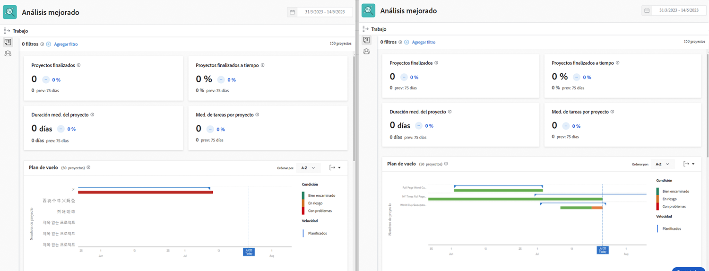

# Explicación de los KPI en [!UICONTROL Análisis mejorado]

En este vídeo, aprenderá lo siguiente:

* Cómo obtener valor de los datos de KPI

>[!VIDEO](https://video.tv.adobe.com/v/335046/?quality=12&learn=on)

## Comparar KPI

Los KPI no solo proporcionan información valiosa sobre lo que está sucediendo en el presente, sino que también proporcionan a los usuarios el poder de comparar los cambios en la actividad a lo largo del tiempo o la diferencia entre portafolios, programas, propietarios de proyectos o cualquier otro filtro utilizado.

Por ejemplo, puede extraer análisis en dos pestañas del explorador para comparar los KPI.
