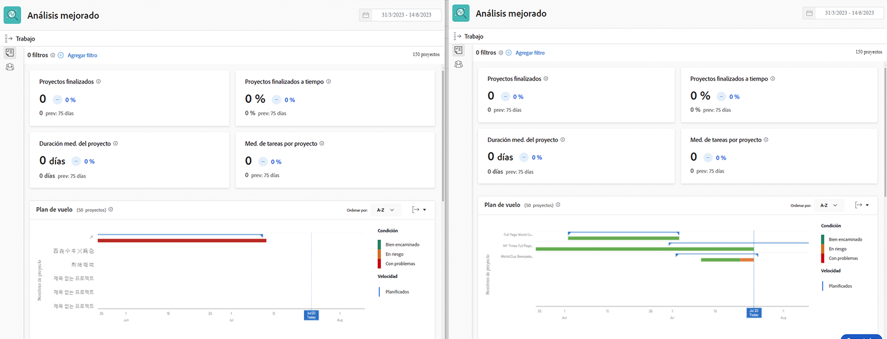

# Comprender los indicadores clave de rendimiento (KPI)

Este vídeo contiene información sobre:

* Cómo obtener valor a partir de los datos de los KPI

>[!VIDEO](https://video.tv.adobe.com/v/3445496/?captions=spa&quality=12&learn=on&enablevpops=1)

## Comparar los KPI

Los KPI no solo proporcionan información valiosa sobre lo que está sucediendo en el presente, sino que también permiten a los usuarios comparar los cambios en la actividad a lo largo del tiempo o la diferencia entre portafolios, programas, propietarios de proyectos o cualquier otro filtro utilizado.

Por ejemplo, puede extraer análisis en dos pestañas del navegador para comparar los KPI.
