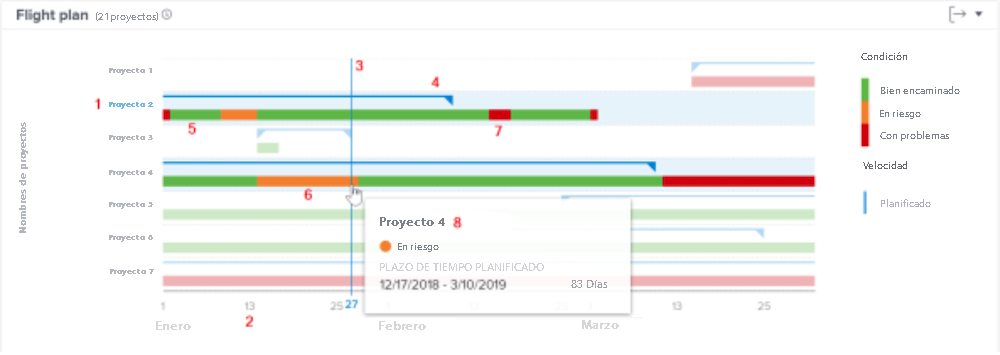

# Explicación de la navegación y revisión de proyectos

En este vídeo, aprenderá:

* Leer el gráfico del plan de vuelo

>[!VIDEO](https://video.tv.adobe.com/v/335047/?quality=12)

## Gráfico de plan de vuelo

En el gráfico, verá:

1. Los nombres de los proyectos están a la izquierda.
1. Las fechas se muestran en la parte inferior.
1. La línea vertical azul muestra la fecha específica en la que se mantiene el ratón sobre ella.
1. Las líneas azules horizontales muestran las fechas de inicio y finalización planeadas del proyecto.
1. Las líneas verdes indican que el proyecto está en Target.
1. Las líneas naranja indican que el proyecto está en riesgo.
1. Las líneas rojas indican que el proyecto está en problemas.

Ver esta información sobre sus proyectos le ayuda a determinar:

* Qué eventos extienden un proyecto más allá de la fecha de finalización planificada.
* Cuando un proyecto empieza a tener problemas.
* Cuántos proyectos están abiertos durante el mismo período de tiempo.
* ¿Cuántos proyectos están activos?
* Qué proyectos necesitan atención o apoyo extra.

## La condición se basa en el estado del progreso

La condición del proyecto es una representación visual del progreso del proyecto. Workfront determina la condición en función del estado de progreso de las tareas dentro del proyecto.

Se puede establecer la condición de un proyecto:

* **Manualmente**, por parte de los usuarios con acceso para administrar el proyecto, cuando el tipo de condición del proyecto está configurado en manual. Esto le permite establecer la condición del proyecto de forma independiente de la ruta crítica.
* **Automáticamente**, por Workfront, cuando el tipo de condición del proyecto se establece en Estado de progreso.

Workfront recomienda establecer el tipo de condición en Estado de progreso para que tenga una indicación clara del progreso real del proyecto, en función del progreso de las tareas.

En este caso, la condición del proyecto puede ser:

* **En Target**: cuando el estado del progreso de la última tarea en la ruta crítica es Tiempo activo, la condición del proyecto será En destino. El proyecto está en vías de finalizar según lo programado.
* **En riesgo**: cuando el estado de progreso de la última tarea en la ruta crítica está Detrás o En riesgo, la condición del proyecto está En riesgo. El proyecto está en camino de terminar tarde, pero aún no es tarde.
* **En problemas**: cuando el estado de progreso de la última tarea en la ruta crítica es Late, la condición del proyecto es In Trouble. La fecha de vencimiento es anterior y el proyecto ya está atrasado.

>[!NOTE]
>
>Las condiciones se pueden personalizar para su entorno, por lo que puede encontrar más de tres opciones o los nombres pueden ser diferentes a los anteriores. Para obtener información sobre las condiciones de personalización, consulte el artículo Crear o editar una condición personalizada.
