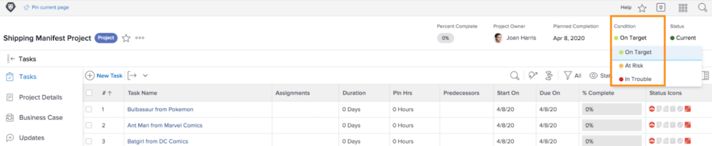
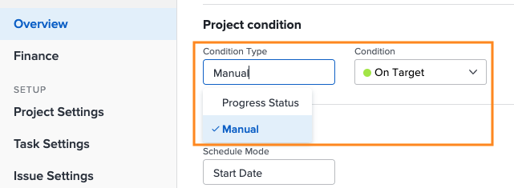

# Exploración y revisión de proyectos en [!UICONTROL Análisis mejorado]

En este vídeo, aprenderá lo siguiente:

* Cómo leer el plan de vuelo

>[!VIDEO](https://video.tv.adobe.com/v/335047/?quality=12&learn=on)

## Gráfico del plan de vuelo

En el gráfico verá lo siguiente:

1. Los nombres de los proyectos están a la izquierda.
1. Las fechas se muestran en la parte inferior.
1. La línea azul vertical muestra la fecha específica en la que se sitúa el ratón.
1. Las líneas azules horizontales muestran las fechas de inicio y finalización planificadas del proyecto.
1. Las líneas verdes indican que el proyecto está en el destino.
1. Las líneas naranjas indican que el proyecto está en riesgo.
1. Las líneas rojas indican que el proyecto está en problemas.

Ver esta información sobre sus proyectos le ayuda a determinar lo siguiente:

* Los eventos que extienden un proyecto más allá de la fecha planificada de finalización.
* Cuando un proyecto comienza a tener problemas.
* Cuántos proyectos se abren en el mismo período de tiempo.
* Cuántos proyectos hay activos.
* Qué proyectos necesitan atención o apoyo adicional.

## La condición se basa en el estado de progreso

La condición del proyecto es una representación visual de cómo avanza el proyecto. Workfront determina la condición en función del estado de progreso de las tareas dentro del proyecto.

Se puede establecer la condición de un proyecto:

* **Manualmente**, por parte de los usuarios con acceso para administrar el proyecto, cuando el tipo de condición del proyecto se establece en manual. Esto le permite establecer la condición del proyecto independientemente de la ruta crítica.
* **Automáticamente**, por Workfront, cuando el tipo de condición del proyecto se establece en Estado de progreso.

Workfront recomienda establecer el tipo de condición en Estado de progreso para que tenga una indicación clara del progreso real del proyecto, según el progreso de las tareas.

Cuando se establece en Progress Status, la condición del proyecto puede ser:

* **En Target**: cuando el estado de progreso de la última tarea en la ruta crítica es A tiempo, la condición del proyecto será En destino. El proyecto está en camino de finalizar según lo programado.
* **En riesgo**: cuando el estado de progreso de la última tarea en la ruta crítica es Retrasada o En riesgo, la condición del proyecto es En riesgo. El proyecto está en camino de terminar tarde, pero aún no es tarde.
* **Con problemas**: cuando el estado de progreso de la última tarea en la ruta crítica es Late, la condición del proyecto es In Trouble. La fecha límite se sitúa en el pasado y el proyecto está retrasado.

>[!NOTE]
>
>Las condiciones se pueden personalizar para su entorno, por lo que puede encontrar más de tres opciones o los nombres pueden ser diferentes de los anteriores. Para obtener información sobre cómo personalizar condiciones, consulte el artículo [Crear o editar una condición personalizada](https://experienceleague.adobe.com/docs/workfront/using/administration-and-setup/customize/custom-conditions/create-edit-custom-conditions.html?lang=en).
